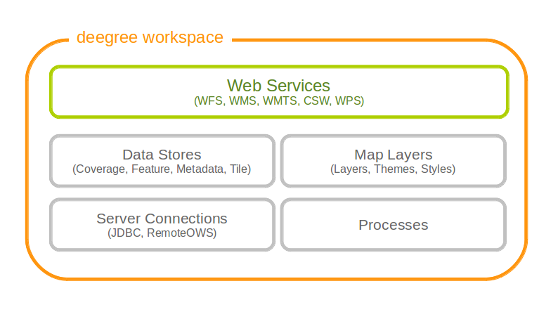
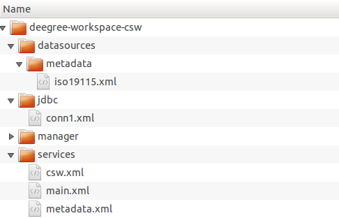

.. _anchor-configuration-basics:

====================
Configuration basics
====================

In the previous chapter, you learned how to access and log in to the deegree services console and how to download and activate example workspaces. In order to adapt an example workspace (or to create your own workspace from scratch), this chapter provides you with the basic concepts of deegree webservices configuration:

* The deegree workspace and the active workspace directory
* Workspace files and resources
* Workspace directories and resource types
* Resource identifiers and dependencies
* Capabilities and limitations of the services console

The final section of this chapter describes recommended practices for creating your own workspace. The remaining chapters of the documentation describe the individual workspace resource formats in detail.

---------------------
The deegree workspace
---------------------

.. tip::
  This documentation sometimes uses the term **the workspace** and sometimes the term **a workspace**. In conjunction with the definite article ("the"), workspace refers to the general concept or the active workspace configuration. When used with the indefinite article ("a workspace"), it refers to an instance of a workspace (e.g. the example workspaces described in chapter :ref:`anchor-lightly`).

The deegree workspace is the modular, resource-oriented and extensible configuration concept used by deegree webservices. The following diagram shows the different types of resources that it contains:

   Configuration aspects of deegree workspaces

The following table provides a short description of the different types of workspace resources:

.. table:: Workspace resource types

+---------------------------------+------------------------------------------------------------------------------+
| Configuration aspect            | Description                                                                  |
+=================================+==============================================================================+
| Web Services                    | Web services (WFS, WMS, WMTS, CSW, WPS)                                      |
+---------------------------------+------------------------------------------------------------------------------+
| Data Stores (Coverage)          | Coverage (raster) data access (GeoTIFFs, raster pyramids, etc.)              |
+---------------------------------+------------------------------------------------------------------------------+
| Data Stores (Feature)           | Feature (vector) data access (Shapefiles, PostGIS, Oracle Spatial, etc.)     |
+---------------------------------+------------------------------------------------------------------------------+
| Data Stores (Metadata)          | Metadata record access (ISO records stored in PostGIS, Oracle, etc.)         |
+---------------------------------+------------------------------------------------------------------------------+
| Data Stores (Tile)              | Pre-rendered map tiles (GeoTIFF, image hierarchies in the file system, etc.) |
+---------------------------------+------------------------------------------------------------------------------+
| Map Layers (Layer)              | Map layers based on data stores and styles                                   |
+---------------------------------+------------------------------------------------------------------------------+
| Map Layers (Style)              | Styling rules for features and converages                                    |
+---------------------------------+------------------------------------------------------------------------------+
| Map Layers (Theme)              | Layer trees based on individual layers                                       |
+---------------------------------+------------------------------------------------------------------------------+
| Processes                       | Geospatial processes for the WPS                                             |
+---------------------------------+------------------------------------------------------------------------------+
| Server connections (JDBC)       | Connections to SQL databases                                                 |
+---------------------------------+------------------------------------------------------------------------------+
| Server connections (remote OWS) | Connections to remote OGC web services                                       |
+---------------------------------+------------------------------------------------------------------------------+

---------------------------------
Location of the deegree workspace
---------------------------------

The active deegree workspace is part of the ``.deegree`` directory which stores some global configuration files along with the workspace. The location of this directory depends on your operating system.

^^^^^^^^^^^^^^^^^^^^^^
Linux/Solaris/Mac OS X
^^^^^^^^^^^^^^^^^^^^^^

On UNIX-like systems (Linux/Solaris/MacOS X), deegree's configuration files are located in folder ``$HOME/.deegree/``. Note that ``$HOME`` is determined by the user that started the web application container that runs deegree. If you started the ZIP version of deegree as user "kelvin", then the directory will be something like ``/home/kelvin/.deegree``.

.. tip::
  In order to use a different folder for deegree's configuration files, you can set the system environment variable ``DEEGREE_WORKSPACE_ROOT``. Note that the user running the web application container must have read/write access to this directory.

^^^^^^^
Windows
^^^^^^^

On Windows, deegree's configuration files are located in folder ``%USERPROFILE%/.deegree/``. Note that ``%USERPROFILE%`` is determined by the user that started the web application container that runs deegree. If you started the ZIP version of deegree as user "kelvin", then the directory will be something like ``C:\Users\kelvin\.deegree`` or ``C:\Dokumente und Einstellungen\kelvin\.deegree``.

.. tip::
  In order to use a different folder for deegree's configuration files, you can set the system environment variable ``DEEGREE_WORKSPACE_ROOT``.  Note that the user running the web application container must have read/write access to this directory.

^^^^^^^^^^^^^^^^^^^^^^^^^^^^^^^^^^^^^^^^^^^^^^^^^^^
Global configuration files and the active workspace
^^^^^^^^^^^^^^^^^^^^^^^^^^^^^^^^^^^^^^^^^^^^^^^^^^^

If you downloaded all four example workspaces (as described in :ref:`anchor-lightly`), set a console password and the proxy parameters, your ``.deegree`` directory will look like this:

.. figure:: images/workspace-root.png
   :target: _images/workspace-root.png

   Example ``.deegree`` directory

As you see, this ``.deegree`` directory contains four subdirectories. Every subdirectory corresponds to a deegree workspace. Besides the configuration files inside the workspace, a small number of global configuration files exist:

.. raw:: latex

   \begin{table}
   \begin{center}

.. table:: Global configuration files and workspace directories
+------------------------+------------------------------------------+
| File name              | Function                                 |
+========================+==========================================+
| <subdirectory>         | Workspace directory                      |
+------------------------+------------------------------------------+
| console.pw             | Password for services console            |
+------------------------+------------------------------------------+
| proxy.xml              | Proxy settings                           |
+------------------------+------------------------------------------+
| webapps.properties     | Selects the active workspace             |
+------------------------+------------------------------------------+

.. raw:: latex

   \end{center}
   \caption{Global configuration files and workspace directories}
   \end{table}

Note that only a single workspace can be active at a time. The information on the active one is stored in file ``webapps.properties``.

.. tip::
  Usually, you don't need to care about the three files that are located at the top level of this directory. The services console creates and modifies them as required (e.g. when switching to a different workspace). In order to adapt deegree webservices to your needs, create or edit configuration files in the active workspace directory. The remaining documentation will always refer to configuration files in the (active) workspace directory.

.. tip::
  If you are running multiple deegree webservices instances on one machine, every instance can use a different workspace. The file ``webapps.properties`` stores the active workspace for every instance separately.

--------------------------------------------
Structure of the deegree workspace directory
--------------------------------------------

The workspace directory organizes XML configuration files in a well-defined directory structure. When deegree starts up, the active workspace directory is determined and the following subdirectories are scanned for XML resource configuration files:

.. table:: Workspace resource directories
+------------------------+---------------------------------+
| Resource directory     | Configuration aspect            |
+========================+=================================+
| services/              | Web services                    |
+------------------------+---------------------------------+
| datasources/coverage/  | Coverage Stores                 |
+------------------------+---------------------------------+
| datasources/feature/   | Feature Stores                  |
+------------------------+---------------------------------+
| datasources/metadata/  | Metadata Stores                 |
+------------------------+---------------------------------+
| datasources/tile/      | Tile Stores                     |
+------------------------+---------------------------------+
| layers/                | Map Layers (Layer)              |
+------------------------+---------------------------------+
| styles/                | Map Layers (Style)              |
+------------------------+---------------------------------+
| themes/                | Map Layers (Theme)              |
+------------------------+---------------------------------+
| processes/             | Processes                       |
+------------------------+---------------------------------+
| jdbc/                  | Server Connections (JDBC)       |
+------------------------+---------------------------------+
| datasources/remoteows/ | Server Connections (Remote OWS) |
+------------------------+---------------------------------+

A workspace directory may contain additional directories to provide additional files along with the configuration. The major difference is that these directories are not scanned for resource files on startup. Some common ones are:

.. table:: Additional workspace directories
+-----------------------+-------------------------------------------+
| Directory             | Used for                                  |
+=======================+===========================================+
| appschemas/           | GML application schemas                   |
+-----------------------+-------------------------------------------+
| data/                 | Datasets (GML, GeoTIFF, ...)              |
+-----------------------+-------------------------------------------+
| manager/              | Example requests (for the generic client) |
+-----------------------+-------------------------------------------+

^^^^^^^^^^^^^^^^^^^^^^^^^^^^^
Workspace files and resources
^^^^^^^^^^^^^^^^^^^^^^^^^^^^^

In order to understand the relation between workspace files and resources, let's have a look at an example:

   Example workspace directory

As noted, deegree scans the well-known resource directories for XML files (``*.xml``) on startup (note that it will omit directory ``manager``, as it is not a well-known resource directory). For every file found, deegree will check the type of configuration format (by determining the root element name). If it is a supported format, a corresponding resource will be initialized. For the example, this results in the following setup:

* A JDBC connection pool with id ``conn1``
* A metadata store with id ``iso19115``
* A web service with id ``csw``

The individual configuration formats and their options are described in the later chapters of the documentation.

.. tip::
  You may wonder why the ``main.xml`` and ``metadata.xml`` files are not considered as web services. These filenames are not treated as resource files, but in a special manner. See :ref:`anchor-configuration-service` for details.

.. tip::
  The configuration format has to match the workspace subdirectory, e.g. metadata store configuration files are only considered when they are located in ``datasources/metadata``.

^^^^^^^^^^^^^^^^^^^^^^^^^^^^^^^^^^^^^
Resource identifiers and dependencies
^^^^^^^^^^^^^^^^^^^^^^^^^^^^^^^^^^^^^

It has already been hinted that resources have an identifier, e.g. for file ``jdbc/conn1.xml`` a JDBC connection pool with identifier ``conn1`` is created. You probably have guessed that the identifier is derived from the file name (file name minus suffix), but you may wonder what purpose the identifier serves. The identifier is used for wiring resources. For example, the ISO SQL metadata store requires a JDBC pool. Therefore, the corresponding configuration format has an element to specify it:

.. topic:: Example for wiring resources

   .. literalinclude:: xml/workspace_dependencies.xml
      :language: xml

In this example, the ISO SQL metadata store is wired to JDBC connection pool ``conn1``. Many deegree resource configuration files contain such references to dependent resources. Some resources offer auto-wiring. For example, every CSW instance needs to connect to a metadata store for data access. If the CSW configuration omits the reference to the metadata store, it is assumed that there's exactly one metadata store defined in the workspace and deegree will automatically connect the CSW to this store.

.. tip::
  The required dependencies are specific to every type of resource and are documented for every resource configuration format.

-------------------------------------------
Using the service console for configuration
-------------------------------------------

The service console has a corresponding menu entry for every type of workspace resource. For example, if you would like to add/remove/edit a coverage store, you would click on "data stores -> coverage". This opens a view with a list of all configured coverage stores. If you activated the Utah workspace (see :ref:`anchor-workspace-utah`), you should see the following list:

.. figure:: images/browser.png
   :figwidth: 60%
   :width: 50%
   :target: _images/browser.png

   Configuring coverage stores

As you can see, the Utah demo workspace defines three coverage stores in total. Each configured coverage store (and every deegree workspace resource in general) has a corresponding XML file, which you can edit by clicking the "Edit" button:

.. figure:: images/browser.png
   :figwidth: 60%
   :width: 50%
   :target: _images/browser.png

   Editing a coverage store configuration

The details of the individual configuration formats are described in the later chapters. The built-in XML editor allows to edit the contents of the configuration file, which controls the behaviour of th workspace resource. In the example, it describes the raster file that this coverage store accesses. You can save the changes ("Save") or discard them ("Cancel"). Additionally, you may turn on syntax highlighting and look at the XML schema of the configuration ("Display Schema").

Deleting a workspace resource is straight-forward ("Delete"). You can also turn off a workspace resource temporarily ("Deactivate").

In order to add a new workspace resource, use the "Create new" link. Note that you always have to specify an identifier for every new resource. 

.. figure:: images/browser.png
   :figwidth: 60%
   :width: 50%
   :target: _images/browser.png

   Adding a new WPS with identifier "mywps"

--------------------------------------
Best practices for creating workspaces
--------------------------------------

This section provides some hints for creating a deegree workspace.

^^^^^^^^^^^^^^^^^^^^^^^^^^^^^^^^^^
Start from example or from scratch
^^^^^^^^^^^^^^^^^^^^^^^^^^^^^^^^^^

For creating your own workspace, you have two options. Option 1 is to use an existing workspace as a template and adapt it to your needs. Option 2 is to start from scratch, using an empty workspace. Adapting an existing workspace makes a lot of sense if your use-case is close to the scenario of the workspace. For example, if you want to set up INSPIRE View and Download Services, it is a good option to use the inspire workspace as a starting point.

In order to create a new workspace, you will have to create a new directory in the ``.deegree`` workspace.

.. figure:: images/workspace-new.png
   :target: _images/workspace-new.png

   Creating the new workspace ``myscenario``

Afterwards, switch to the new workspace using the services console, as described in :ref:`anchor-downloading-workspaces`.

^^^^^^^^^^^^^^^^^^^^^^^^^^^^^^^^^
Find out which resources you need
^^^^^^^^^^^^^^^^^^^^^^^^^^^^^^^^^

The first step is to identify the types of workspace resources that you need for your use-case. You probably know already which types of services your setup requires. The next step is to identify the dependencies for every service by having a look at the respective chapter in the documentation.  Let's say you want a setup with a transactional WFS, a WMS and a CSW:

* A WFS instance requires 1..n feature stores
* A WMS instance requires 1..n themes
* A CSW instance requires a single metadata store

Now you have to dig deeper: What kinds of feature stores exist? Maybe you will find out that what you want is an SQL feature store. So you read the respective part of the documentation and see that an SQL feature store requires a JDBC connection pool resource. Do the same research for the WMS dependencies: What is a theme? In short, you have to answer the following questions for every encountered resource:

* What does this resource type do?
* How is it configured?
* On which resources does this resource depend?

At the end of this process you should know about the resources that you will have to configure for your setup.

.. tip::
  Alternatively, you can approach the resources question bottom-up. Let's say you have your data ready in a PostGIS database. You want to visualize it using a WMS. So you would require a JDBC resource pool that connects to your database. You need a simple SQL feature store (or an SQL feature store) that uses the new connection pool. You create one or more feature layers that are wired to the feature store and a theme based on the layers. At the end of the chain is the WMS resource which has to be configured to use the theme resource. Rendering styles can be created later (references have to be added to the layers configuration).

^^^^^^^^^^^^^^^^^^^^^^^^^^^
Use a validating XML editor
^^^^^^^^^^^^^^^^^^^^^^^^^^^

All deegree XML configuration files have a corresponding XML schema, which allows to detect syntactical errors easily. The editor built into the services console performs validation when you save a configuration file. If the contents is not valid according to the schema, the file will not be saved, but an error message will be displayed:

.. figure:: images/browser.png
   :figwidth: 60%
   :width: 50%
   :target: _images/browser.png

   The services console displays an XML syntax error

If you prefer to use another editor for editing deegree's configuration files, it is highly recommended to choose a validating XML editor. Successfully tested editors are Eclipse and Altova XML Spy, but any schema-aware editor should work.

.. tip::
  In case you are able to understand XML schema, you can also use the schema file to find out about the available config options. deegree's schema files are hosted at http://schemas.deegree.org.

^^^^^^^^^^^^^^^^^^^^^^^^^^^^^^^^^^^^^^^^^^^^
Check the resource status and error messages
^^^^^^^^^^^^^^^^^^^^^^^^^^^^^^^^^^^^^^^^^^^^

The services console has a very helpful feature: It displays an error if a resource cannot be initialized and provides an error message, if this is not the case. Here's an example:

.. figure:: images/browser.png
   :figwidth: 60%
   :width: 50%
   :target: _images/browser.png

   Adding a new WPS with identifier "mywps"

In this case, it was not possible to initialize the JDBC connection (and the resources that depend on it). You can spot resource classes and resources that have errors easily, as they have a red exclamation mark. Click on the respective resource level and on the "Errors" near the resource to see the error message. After fixing the error, click on "Reload" to re-initialize the workspace. If your fix was successful, the exclamation mark should be gone.

Additional information can be found in the deegree log. If you're running the ZIP version, switch to the terminal window. When initializing the workspace resources, information on every resource will be logged, along with error messages.

.. figure:: images/browser.png
   :figwidth: 60%
   :width: 50%
   :target: _images/browser.png

   Log messages in the terminal window

.. tip::
  If you deployed the WAR version, the location of the deegree log depends on your web application container. For Tomcat, you will find the deegree log in file ``catalina.out`` in the ``log/`` directory.

.. tip::
  More logging can be activated by adjusting file ``log4j.properties`` in the ``/WEB-INF/classes/`` directory of the deegree webapplication.

