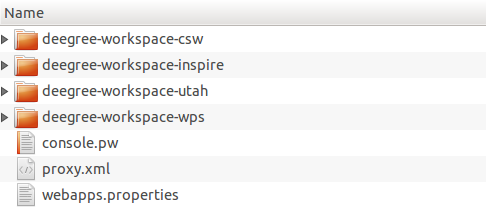
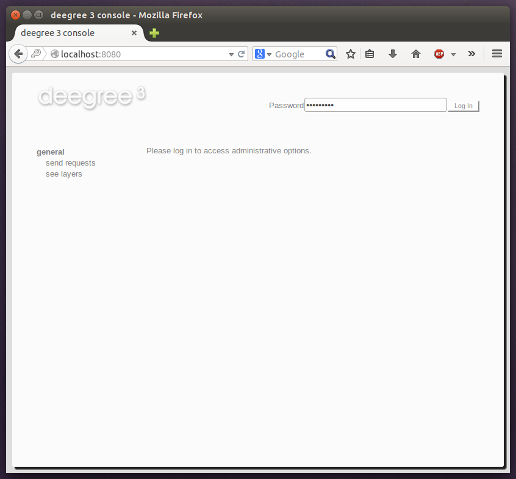

.. _anchor-configuration-basics:

====================
Configuration basics
====================

In the previous chapter, you learned how to access and log in to the deegree services console and how to download and activate example workspaces. In order to adapt an example workspace (or to create your own workspace from scratch), this chapter provides you with the basic concepts of deegree webservices configuration:

* The deegree workspace and the active workspace directory
* Workspace files and resources
* Workspace directories and resource types
* Resource identifiers and dependencies
* Capabilities and limitations of the services console

The final section of this chapter describes recommended practices for creating your own workspace. The remaining chapters of the documentation describe the individual workspace resource formats in detail.

---------------------
The deegree workspace
---------------------

.. tip::
  This documentation sometimes uses the term **the workspace** and sometimes the term **a workspace**. In conjunction with the definite article ("the"), workspace refers to the general concept or the active workspace configuration. When used with the indefinite article ("a workspace"), it refers to an instance of a workspace (e.g. the example workspaces described in chapter :ref:`anchor-lightly`).

The deegree workspace is the modular, resource-oriented and extensible configuration concept used by deegree webservices. The following diagram shows the different types of resources that it contains:

.. figure:: images/workspace-overview.png
   :target: _images/workspace-overview.png

   Configuration aspects of deegree workspaces

The following table provides a short description of the different types of workspace resources:

.. table:: Workspace resource types

+---------------------------------+------------------------------------------------------------------------------+
| Configuration aspect            | Description                                                                  |
+=================================+==============================================================================+
| Web Services                    | Web services (WFS, WMS, WMTS, CSW, WPS)                                      |
+---------------------------------+------------------------------------------------------------------------------+
| Data Stores (Coverage)          | Coverage (raster) data access (GeoTIFFs, raster pyramids, etc.)              |
+---------------------------------+------------------------------------------------------------------------------+
| Data Stores (Feature)           | Feature (vector) data access (Shapefiles, PostGIS, Oracle Spatial, etc.)     |
+---------------------------------+------------------------------------------------------------------------------+
| Data Stores (Metadata)          | Metadata record access (ISO records stored in PostGIS, Oracle, etc.)         |
+---------------------------------+------------------------------------------------------------------------------+
| Data Stores (Tile)              | Pre-rendered map tiles (GeoTIFF, image hierarchies in the file system, etc.) |
+---------------------------------+------------------------------------------------------------------------------+
| Map Layers (Layer)              | Map layers based on data stores and styles                                   |
+---------------------------------+------------------------------------------------------------------------------+
| Map Layers (Style)              | Styling rules for features and converages                                    |
+---------------------------------+------------------------------------------------------------------------------+
| Map Layers (Theme)              | Layer trees based on individual layers                                       |
+---------------------------------+------------------------------------------------------------------------------+
| Processes                       | Geospatial processes for the WPS                                             |
+---------------------------------+------------------------------------------------------------------------------+
| Server connections (JDBC)       | Connections to SQL databases                                                 |
+---------------------------------+------------------------------------------------------------------------------+
| Server connections (remote OWS) | Connections to remote OGC web services                                       |
+---------------------------------+------------------------------------------------------------------------------+

---------------------------------------
Where is the deegree workspace located?
---------------------------------------

The active deegree workspace is part of the ``.deegree`` directory which stores some global configuration files along with the workspace. The location of this directory depends on your operating system.

^^^^^^^^^^^^^^^^^^^^^^
Linux/Solaris/Mac OS X
^^^^^^^^^^^^^^^^^^^^^^

On UNIX-like systems (Linux/Solaris/MacOS X), deegree's configuration files are located in folder ``$HOME/.deegree/``. Note that ``$HOME`` is determined by the user that started the web application container that runs deegree. If you started the ZIP version of deegree as user "kelvin", then the directory will be something like ``/home/kelvin/.deegree``.

.. tip::
  In order to use a different folder for deegree's configuration files, you can set the system environment variable ``DEEGREE_WORKSPACE_ROOT``. Note that the user running the web application container must have read/write access to this directory.

^^^^^^^
Windows
^^^^^^^

On Windows, deegree's configuration files are located in folder ``%USERPROFILE%/.deegree/``. Note that ``%USERPROFILE%`` is determined by the user that started the web application container that runs deegree. If you started the ZIP version of deegree as user "kelvin", then the directory will be something like ``C:\Users\kelvin\.deegree`` or ``C:\Dokumente und Einstellungen\kelvin\.deegree``.

.. tip::
  In order to use a different folder for deegree's configuration files, you can set the system environment variable ``DEEGREE_WORKSPACE_ROOT``.  Note that the user running the web application container must have read/write access to this directory.

^^^^^^^^^^^^^^^^^^^^^^^^^^^^^^^^^^^^^^^^^^^^^^^^^^^
Global configuration files and the active workspace
^^^^^^^^^^^^^^^^^^^^^^^^^^^^^^^^^^^^^^^^^^^^^^^^^^^

If you downloaded all four example workspaces (as described in :ref:`anchor-lightly`), set a console password and the proxy parameters, your ``.deegree`` directory will look like this:

   Example ``.deegree`` directory

As you see, this ``.deegree`` directory contains four subdirectories. Every subdirectory corresponds to a deegree workspace. Besides the configuration files inside the workspace, a small number of global configuration files exist:

.. raw:: latex

   \begin{table}
   \begin{center}

.. table:: Global configuration files and workspace directories
+------------------------+------------------------------------------+
| File name              | Function                                 |
+========================+==========================================+
| <subdirectory>         | Workspace directory                      |
+------------------------+------------------------------------------+
| console.pw             | Password for services console            |
+------------------------+------------------------------------------+
| proxy.xml              | Proxy settings                           |
+------------------------+------------------------------------------+
| webapps.properties     | Selects the active workspace             |
+------------------------+------------------------------------------+

.. raw:: latex

   \end{center}
   \caption{Global configuration files and workspace directories}
   \end{table}

Note that only a single workspace can be active at a time. The information on the active one is stored in file ``webapps.properties``.

.. tip::
  Usually, you don't need to take care of the three files that are located at the top level of this directory. The services console creates and modifies them as required (e.g. when switching to a different workspace). In order to adapt deegree webservices to your needs, create or edit configuration files in the active workspace directory. The rest of the documentation will refer to configuration files in the (active) workspace directory.

.. tip::
  If you are running multiple deegree webservices instances on one machine, every instance can use a different workspace. The file ``webapps.properties`` stores the active workspace for every instance separately.

--------------------------------------------
Structure of the deegree workspace directory
--------------------------------------------

The workspace directory organizes XML configuration files in a well-defined directory structure. When deegree starts up, the active workspace directory is determined and the following subdirectories are scanned for XML resource configuration files:

.. table:: Workspace resource directories
+------------------------+---------------------------------+
| Resource directory     | Configuration aspect            |
+========================+=================================+
| services/              | Web services                    |
+------------------------+---------------------------------+
| datasources/coverage/  | Coverage Stores                 |
+------------------------+---------------------------------+
| datasources/feature/   | Feature Stores                  |
+------------------------+---------------------------------+
| datasources/metadata/  | Metadata Stores                 |
+------------------------+---------------------------------+
| datasources/tile/      | Tile Stores                     |
+------------------------+---------------------------------+
| layers/                | Map Layers (Layer)              |
+------------------------+---------------------------------+
| styles/                | Map Layers (Style)              |
+------------------------+---------------------------------+
| themes/                | Map Layers (Theme)              |
+------------------------+---------------------------------+
| processes/             | Processes                       |
+------------------------+---------------------------------+
| jdbc/                  | Server Connections (JDBC)       |
+------------------------+---------------------------------+
| datasources/remoteows/ | Server Connections (Remote OWS) |
+------------------------+---------------------------------+

Workspaces may contain additional directories. The major difference is that these directories are not scanned for resource files on startup. Some common ones are:

.. table:: Additional workspace directories
+-----------------------+-------------------------------------------+
| Directory             | Used for                                  |
+=======================+===========================================+
| appschemas/           | GML application schemas                   |
+-----------------------+-------------------------------------------+
| data/                 | Datasets (GML, GeoTIFF, ...)              |
+-----------------------+-------------------------------------------+
| manager/              | Example requests (for the generic client) |
+-----------------------+-------------------------------------------+

^^^^^^^^^^^^^^^^^^^^^^^^^^^^^
Workspace files and resources
^^^^^^^^^^^^^^^^^^^^^^^^^^^^^

In order to understand the relation between workspace files and resources, let's have a look at an example:

.. figure:: images/workspace-example.png
   :target: _images/workspace-example.png

   Example workspace directory

As noted, deegree scans the well-known resource directories for XML files (``*.xml``) on startup (note that it will omit directory ``manager``). For every file found, deegree will check the type of configuration format (by determining the root element name). If it is a known format, a corresponding resource will be initialized:

* A JDBC connection pool with id ``conn1``
* A metadata store with id ``iso19115``
* A web service with id ``csw``

The individual configuration formats and their options are described in the later chapters of the documentation.

.. tip::
  You may wonder why the ``main.xml`` and the ``metadata.xml`` files are not considered as web services. These filenames are not treated as resource files, but in a special manner. See :ref:`anchor-configuration-service` for details.

.. tip::
  The configuration format has to match the workspace subdirectory, e.g. only metadata store configuration files belong into ``datasources/metadata``.

^^^^^^^^^^^^^^^^^^^^^^^^^^^^^^^^^^^^^
Resource identifiers and dependencies
^^^^^^^^^^^^^^^^^^^^^^^^^^^^^^^^^^^^^

It has already been hinted that resources have an identifier, e.g. for file ``jdbc/conn1.xml`` a JDBC connection pool with identifier ``conn1`` is created. You probably have guessed that the identifier is derived from the file name (file name minus suffix), but you may wonder what purpose the identifier serves. The identifier is used for wiring resources. For example, the ISO SQL metadata store requires a JDBC pool. Therefore, the corresponding configuration format has an element to specify it:

.. topic:: Example for wiring resources

   .. literalinclude:: xml/workspace_dependencies.xml
      :language: xml

In this example, the ISO SQL metadata store is wired to JDBC connection pool ``conn1``. Many deegree resource configuration files contain such references to dependent resources. Some resources offer auto-wiring. For example, every CSW instance needs to connect to a metadata store for data access. If the CSW configuration omits the reference to the metadata store, it is assumed that there's exactly one metadata store defined in the workspace and deegree will automatically connect the CSW to this store.

.. tip::
  The required dependencies are specific to every type of resource and are documented for every resource configuration format.

-------------------------------------------------------
Using the service console to manage workspace resources
-------------------------------------------------------

The service console has a corresponding menu entry for every type of workspace resource. For example, if you would like to add/remove/edit a coverage store, you would click on "data stores -> coverage". This opens a view with a list of all configured coverage stores. If you activated the Utah workspace (see :ref:`anchor-workspace-utah`), you should see the following list:

   Configuring coverage stores

As you can see, the Utah demo workspace defines three coverage stores in total. Each configured coverage store (and every deegree workspace resource in general) has a corresponding XML file, which you can edit by clicking the "Edit" button:

   Editing a coverage store configuration

The details of the individual configuration formats are described in the later chapters. The built-in XML editor allows to edit the contents of the configuration file, which controls the behaviour of th workspace resource. In the example, it describes the raster file that this coverage store accesses. You can save the changes ("Save") or discard them ("Cancel"). Additionally, you may turn on syntax highlighting and look at the XML schema of the configuration ("Display Schema").

Deleting a workspace resource is straight-forward ("Delete"). You can also turn off a workspace resource temporarily ("Deactivate").

---------------------------------------------------------
Using the service console to add a new workspace resource
---------------------------------------------------------

In order to add a new workspace resource, use the "Create new" link. Note that you always have to specify an identifier for every new resource. 

   Adding a new WPS with identifier "mywps"

----------------------------------------
Creating your own workspace from scratch
----------------------------------------

You should have a basic understanding of the deegree workspace concepts now. If you want to configure deegree webservices for your own scenario, you will probably understand
Now you should know how to create and edit resources in the deegree workspace. But you may be wondering how to find out which exact workspace resources you need for a specific scenario.

TBD

