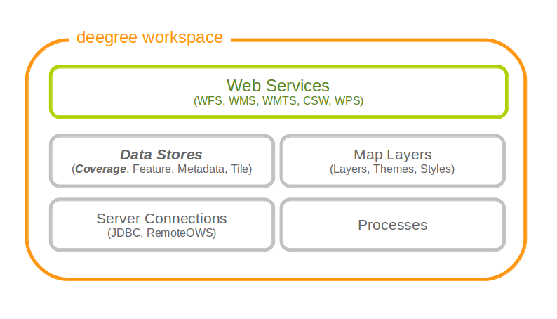

.. _anchor-configuration-coveragestore:

===============
Coverage stores
===============

Coverage stores are resources that provide access to raster data. The most common use case for coverage stores is to provide data for coverage layers. You can access this configuration level by clicking the **coverage stores** link in the service console. The corresponding resource configuration files are located in subdirectory **datasources/coverage/** of the active deegree workspace directory.

   Coverage store resources provide access to raster data

For raster data there are three different possible configurations. One is for <Raster> and one is for <MultiResolutionRaster>. The third possibility is for <Pyramid>. If you are not sure which one to use, you probably want the <Raster> configuration. 

------
Raster
------

The most common method to provide coverages with deegree, is to use Raster.
With the Raster configuration it is possible to provide single RasterFiles or a complete RasterDirectory directly.

Here are two examples showing RasterFile and RasterDirectory configuration:

.. code-block:: xml

  <Raster xmlns="http://www.deegree.org/datasource/coverage/raster" xmlns:xsi="http://www.w3.org/2001/XMLSchema-instance" xsi:schemaLocation="http://www.deegree.org/datasource/coverage/raster http://schemas.deegree.org/datasource/coverage/raster/3.0.0/raster.xsd" configVersion="3.0.0" originLocation="outer">
    <StorageCRS>EPSG:26912</StorageCRS>
    <RasterFile>../../../data/utah/raster/dem.tiff</RasterFile>
  </Raster>

.. code-block:: xml

  <Raster xmlns="http://www.deegree.org/datasource/coverage/raster" xmlns:xsi="http://www.w3.org/2001/XMLSchema-instance" xsi:schemaLocation="http://www.deegree.org/datasource/coverage/raster http://schemas.deegree.org/datasource/coverage/raster/3.0.0/raster.xsd" configVersion="3.0.0" originLocation="outer">
    <StorageCRS>EPSG:26912</StorageCRS>
    <RasterDirectory>../../../data/utah/raster/Satellite_Provo/</RasterDirectory>
  </Raster>

A Raster can have several attributes:

* The originLocation attribute can have the values center or outer to declare the pixel origin of the coverage.
* The nodata attribute can be optionally used to declare a nodata value.
* The readWorldFiles parameter can have the values true or false to indicate if worlfiles will be read. Default value is true.
* The StorageCRS paramter is optional but recommended. It contains the EPSG code of the coverage sources.
* The RasterFile and RasterDirectory parameters contain the path to your coverage sources. The RasterDirectory paramter can additionally have the recursive attribute with true and false as value to declare subdirectories to be included.

---------------------
MultiResolutionRaster
---------------------

A <MultiResolutionRaster> wraps single raster elements and adds a resolution for each raster. This means, depending on the resolution of the map a different raster source is used.

Here is an example for a MultiResolutionRaster:

.. code-block:: xml

  <MultiResolutionRaster xmlns="http://www.deegree.org/datasource/coverage/raster" xmlns:xsi="http://www.w3.org/2001/XMLSchema-instance" xsi:schemaLocation="http://www.deegree.org/datasource/coverage/raster http://schemas.deegree.org/datasource/coverage/raster/3.0.0/raster.xsd" configVersion="3.0.0" originLocation="outer">
    <StorageCRS>EPSG:26912</StorageCRS>
    <Resolution>
      <Raster configVersion="3.0.0" originLocation="outer" res="1.0">
        <StorageCRS>EPSG:26912</StorageCRS>
        <RasterFile>../../../data/utah/raster/dem.tiff</RasterFile>
      </Raster>
    </Resolution>
    <Resolution>
      <Raster configVersion="3.0.0" res="2.0">
        <StorageCRS>EPSG:26912</StorageCRS>
        <RasterDirectory>../../../data/utah/raster/Satellite_Provo/</RasterDirectory>
      </Raster>
    </Resolution>
  </MultiResolutionRaster>

* A MultiResolustionRaster contains at least one Resolution
* The Raster parameter has a res attribute. Its value is related to the provided resolution.
* The StorageCRS paramter is optional but recommended. It contains the EPSG code of the coverage sources.
* All elements and attributes from the Raster configuration can be used for the resolutions.
  
-------
Pyramid
-------

A <Pyramid> is used for deegree's support for raster pyramids. For this, it is required that the raster pyramid must be a GeoTIFF, containing the extent and coordinate system of the data. Overlays must be multiples of 2. This is best tested with source data being processed with GDAL.

^^^^^^^^^^^^^^^^^^^^^^^^^^^^
Prerequisities for Pyramids
^^^^^^^^^^^^^^^^^^^^^^^^^^^^

* Must be a GeoTiff as BigTiff
* Must be RGB or RGBA
* CRS must be contained
* Must be tiled
* Should have overviews where each overview must consist of 1/2 resolution

The following example shows, how to configure a coverage pyramid:

.. code-block:: xml

  <Pyramid xmlns="http://www.deegree.org/datasource/coverage/pyramid" xmlns:xsi="http://www.w3.org/2001/XMLSchema-instance" xsi:schemaLocation="http://www.deegree.org/datasource/coverage/pyramid http://schemas.deegree.org/datasource/coverage/raster/3.1.0/pyramid.xsd" configVersion="3.1.0">
      <PyramidFile>data/example.tif</PyramidFile>
      <CRS>EPSG:4326</CRS>
  </Pyramid>

* A Pyramid contains a PyramidFile parameter with the path to the pyramid as its value.
* A Pyramid contains a CRS parameter describing the source CRS of the pyramid as EPSG code.
=======
