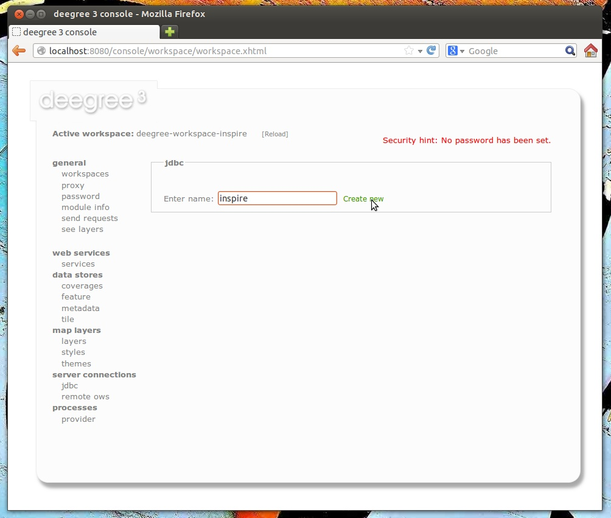
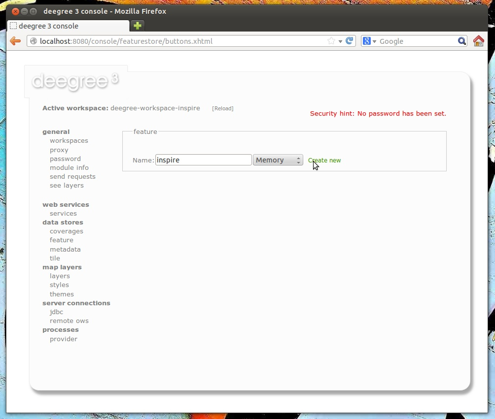
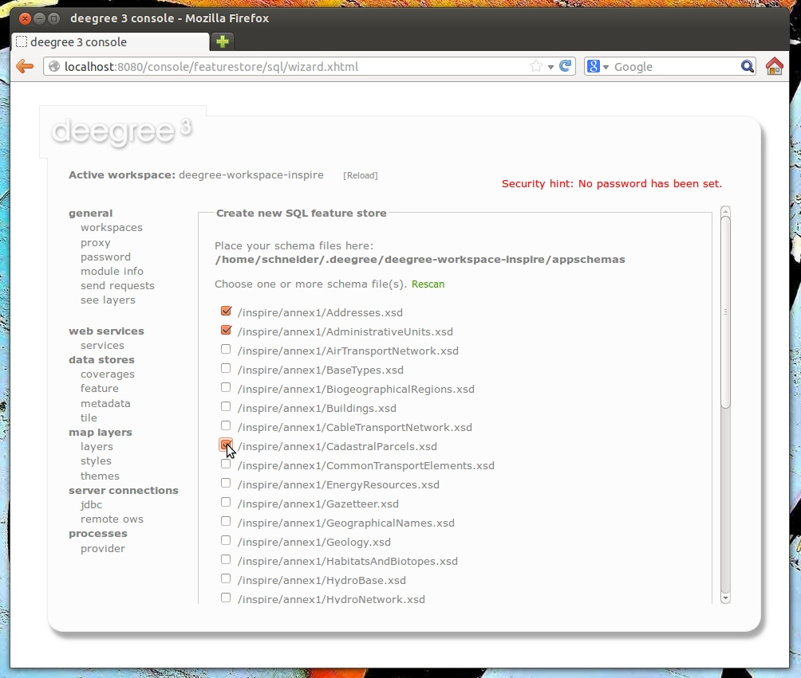
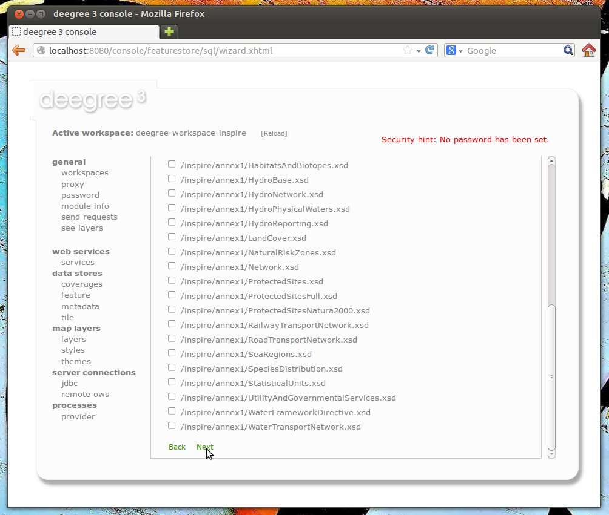
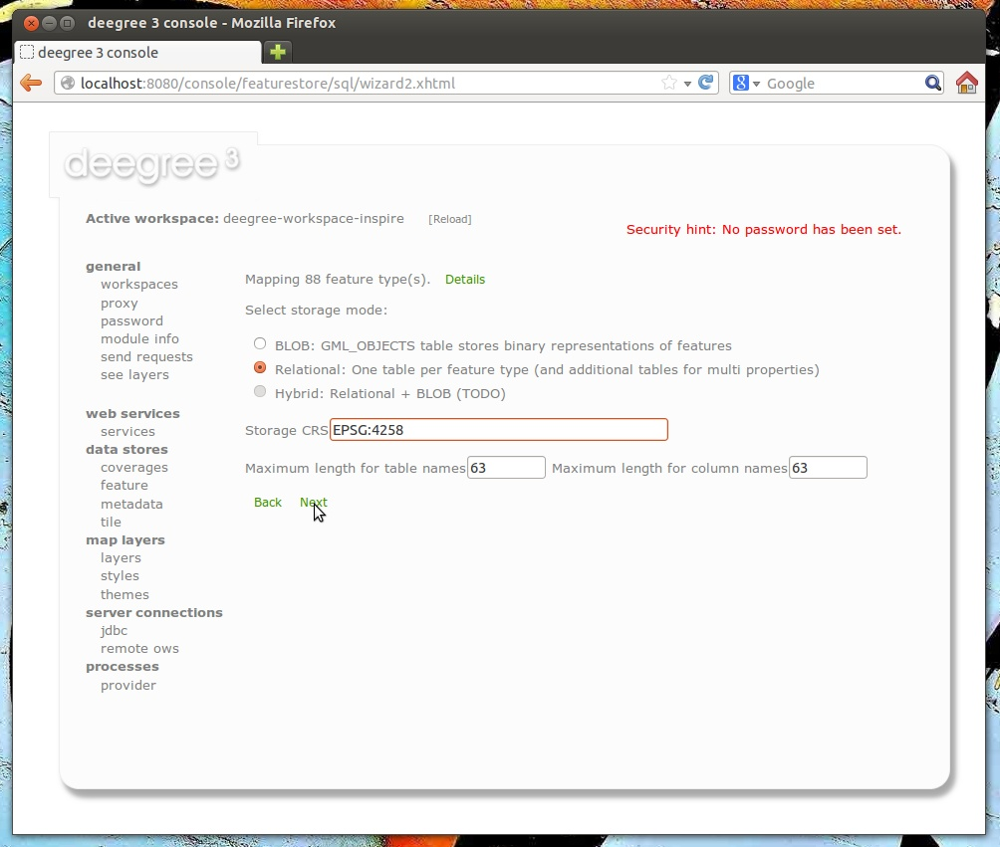
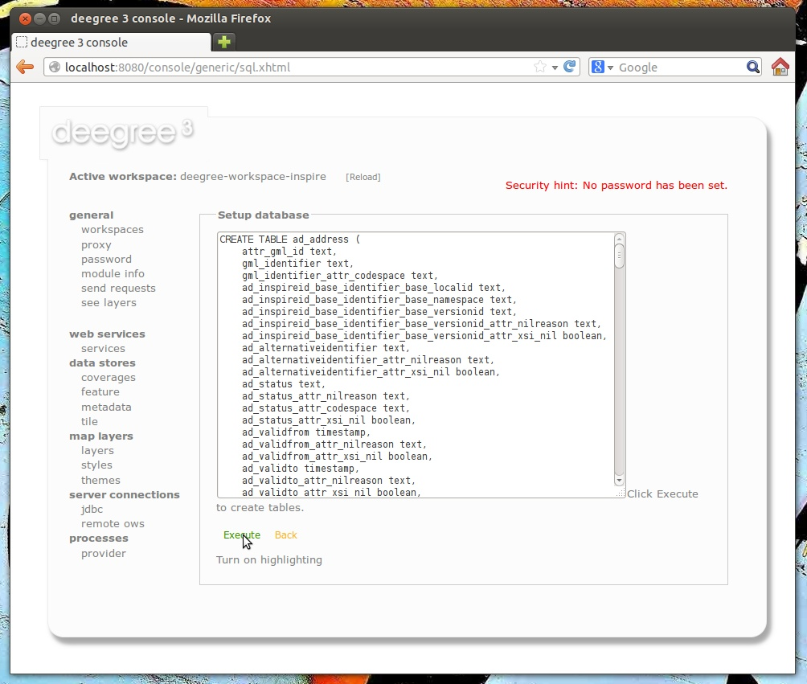
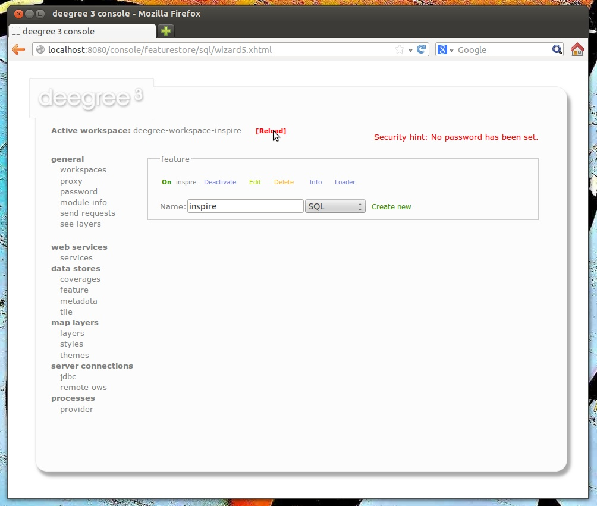
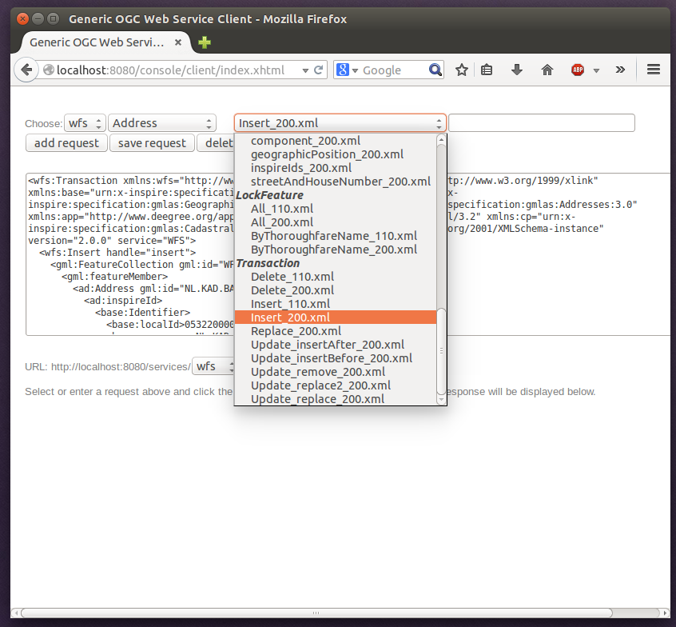
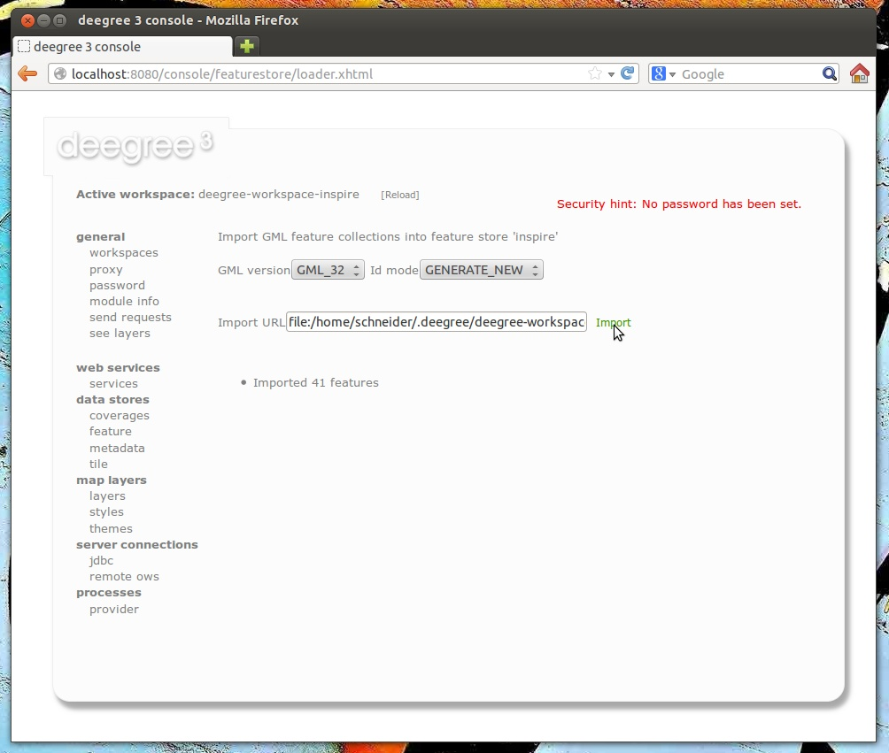

.. _anchor-configuration-featurestore:

==============
Feature stores
==============

Feature stores are workspace resources that provide access to stored features. The two most common use cases for feature stores are:

* Accessing via :ref:`anchor-configuration-wfs`
* Providing of data for :ref:`anchor-configuration-feature-layers`

The remainder of this chapter describes some relevant terms and the feature store configuration files in detail. You can access this configuration level by clicking **feature stores** in the service console. The corresponding resource configuration files are located in subdirectory ``datasources/feature/`` of the active deegree workspace directory.

.. figure:: images/workspace-overview-feature.png
   :figwidth: 80%
   :width: 80%
   :target: _images/workspace-overview-feature.png

   Feature store resources provide access to geo objects

-----------------------------------------------
Features, feature types and application schemas
-----------------------------------------------

Features are abstractions of real-world objects, such as rivers, buildings, streets or state boundaries. They are the geo objects of a particular application domain.

A feature types defines the data model for a class of features. For example, a feature type ``River`` could define a class of river features that all have the same properties.

^^^^^^^^^^^^^^^^^^^^^^^^^^^^^^^^^^^^^^^^^^
Simple vs. rich features and feature types
^^^^^^^^^^^^^^^^^^^^^^^^^^^^^^^^^^^^^^^^^^

Some feature types have a more complex structure than others. Traditionally, GIS software copes with "simple" feature types:

* Every property is either simple (string, number, date, etc.) or a geometry
* Only a single property with one name is allowed

Basically, a simple feature type is everything that can be represented using a single database table or a single shape file. In contrast, "rich" feature types additionally allow the following:

* Multiple properties with the same name
* Properties that contain other features
* Properties that reference other features or GML objects
* Properties that contain GML core datatypes which are not geometries (e.g. code types or units of measure)
* Properties that contain generic XML

.. topic:: Example of a rich feature instance encoded in GML

   .. literalinclude:: xml/feature_complex.xml
      :language: xml

.. hint::
   All deegree feature stores support simple feature types, but only the SQL feature store and the memory feature store support rich feature types.

^^^^^^^^^^^^^^^^^^^
Application schemas
^^^^^^^^^^^^^^^^^^^

An application schema defines a number of feature types for a particular application domain. When referring to an application schema, one usually means a GML application schema that defines a hierarchy of rich feature types. Examples for GML application schemas are:

* INSPIRE Data Themes (Annex I, II and III)
* GeoSciML
* CityGML
* XPlanung
* AAA

The following diagram shows a part of the INSPIRE Annex I application schema in UML form:

.. figure:: images/address_schema.png
   :figwidth: 60%
   :width: 50%
   :target: _images/address_schema.png

.. hint::
   The SQL feature store or the memory feature store can be used with GML application schemas.

-------------------
Shape feature store
-------------------

The shape feature store serves a feature type from an ESRI shape file. It is currently not transaction capable and only supports simple feature types.

^^^^^^^^^^^^^^^^^^^^^^^^^^^^^
Minimal configuration example
^^^^^^^^^^^^^^^^^^^^^^^^^^^^^

The only mandatory element is ``File``. A minimal valid configuration example looks like this:

.. topic:: Shape Feature Store config (minimal configuration example)

   .. literalinclude:: xml/shapefeaturestore_minimal.xml
      :language: xml

This configuration will set up a feature store based on the shape file ``/tmp/rivers.shp`` with the following settings:

* The feature store offers the feature type ``app:rivers`` (``app`` bound to ``http://www.deegree.org/app``)
* SRS information is taken from file ``/tmp/rivers.prj`` (if it does not exist, ``EPSG:4326`` is assumed)
* The geometry is added as property ``app:GEOMETRY``
* All data columns from file ``/tmp/rivers.dbf`` are used as properties in the feature type
* Encoding of text columns in ``/tmp/rivers.dbf`` is guessed based on actual contents
* An alphanumeric index is created for the dbf to speed up filtering based on non-geometric constraints

^^^^^^^^^^^^^^^^^^^^^^^^^^^^^^^^^^
More complex configuration example 
^^^^^^^^^^^^^^^^^^^^^^^^^^^^^^^^^^

A more complex example that uses all available configuration options:

.. topic:: Shape Feature Store config (more complex configuration example)

   .. literalinclude:: xml/shapefeaturestore_complex.xml
      :language: xml

This configuration will set up a feature store based on the shape file ``/tmp/rivers.shp`` with the following settings:

* SRS of stored geometries is ``EPSG:4326`` (no auto-detection)
* The feature store offers the shape file contents as feature type ``app:River`` (``app`` bound to ``http://www.deegree.org/app``)
* Encoding of text columns in ``/tmp/rivers.dbf`` is ``ISO-8859-1`` (no auto-detection)
* No alphanumeric index is created for the dbf (filtering based on non-geometric constraints has to be performed in-memory)
* The mapping between the shape file columns and the feature type properties is customized.
* Property ``objectid`` corresponds to column ``OBJECTID`` of the shape file
* Property ``geometry`` corresponds to the geometry of the shape file

^^^^^^^^^^^^^^^^^^^^^
Configuration options
^^^^^^^^^^^^^^^^^^^^^

The configuration format for the deegree shape feature store is defined by schema file http://schemas.deegree.org/datasource/feature/shape/3.1.0/shape.xsd. The following table lists all available configuration options. When specifiying them, their order must be respected.

.. table:: Options for ``ShapeFeatureStore`` configuration files

+-----------------------------+-------------+---------+------------------------------------------------------------------------------+
| Option                      | Cardinality | Value   | Description                                                                  |
+=============================+=============+=========+==============================================================================+
| StorageCRS                  | 0..1        | String  | CRS of stored geometries                                                     |
+-----------------------------+-------------+---------+------------------------------------------------------------------------------+
| FeatureTypeName             | 0..n        | String  | Local name of the feature type (defaults to base name of shape file)         |
+-----------------------------+-------------+---------+------------------------------------------------------------------------------+
| FeatureTypeNamespace        | 0..1        | String  | Namespace of the feature type (defaults to "http://www.deegree.org/app")     |
+-----------------------------+-------------+---------+------------------------------------------------------------------------------+
| FeatureTypePrefix           | 0..1        | String  | Prefix of the feature type (defaults to "app")                               |
+-----------------------------+-------------+---------+------------------------------------------------------------------------------+
| File                        | 1..1        | String  | Path to shape file (can be relative)                                         |
+-----------------------------+-------------+---------+------------------------------------------------------------------------------+
| Encoding                    | 0..1        | String  | Encoding of text fields in dbf file                                          |
+-----------------------------+-------------+---------+------------------------------------------------------------------------------+
| GenerateAlphanumericIndexes | 0..1        | Boolean | Set to true, if an index for alphanumeric fields should be generated         |
+-----------------------------+-------------+---------+------------------------------------------------------------------------------+
| Mapping                     | 0..1        | Complex | Customized mapping between dbf column names and property names               |
+-----------------------------+-------------+---------+------------------------------------------------------------------------------+

--------------------
Memory feature store
--------------------

The memory feature store serves feature types that are defined by a GML application schema and are stored in memory. It is transaction capable and supports rich GML application schemas.

^^^^^^^^^^^^^^^^^^^^^^^^^^^^^
Minimal configuration example
^^^^^^^^^^^^^^^^^^^^^^^^^^^^^

The only mandatory element is ``GMLSchema``. A minimal valid configuration example looks like this:

.. topic:: Memory Feature Store config (minimal configuration example)

   .. literalinclude:: xml/memoryfeaturestore_minimal.xml
      :language: xml

This configuration will set up a memory feature store with the following settings:

* The GML 3.2 application schema from file ``../../appschemas/inspire/annex1/addresses.xsd`` is used as application schema (i.e. scanned for feature type definitions)
* No GML datasets are loaded on startup, so the feature store will be empty unless an insertion is performed (e.g. via WFS-T)

^^^^^^^^^^^^^^^^^^^^^^^^^^^^^^^^^^
More complex configuration example 
^^^^^^^^^^^^^^^^^^^^^^^^^^^^^^^^^^

A more complex example that uses all available configuration options:

.. topic:: Memory Feature Store config (more complex configuration example)

   .. literalinclude:: xml/memoryfeaturestore_complex.xml
      :language: xml

This configuration will set up a memory feature store with the following settings:

* Directory ``../../appschemas/inspire/annex1/`` is scanned for ``*.xsd`` files. All found files are loaded as a GML 3.2 application schema (i.e. analyzed for feature type definitions).
* Dataset file ``../../data/gml/address.gml`` is loaded on startup. This must be a GML 3.2 file that contains a feature collection with features that validates against the application schema.
* Dataset file ``../../data/gml/parcels.gml`` is loaded on startup. This must be a GML 3.2 file that contains a feature collection with features that validates against the application schema.
* The geometries of loaded features are converted to ``urn:ogc:def:crs:EPSG::4258``.

^^^^^^^^^^^^^^^^^^^^^
Configuration options
^^^^^^^^^^^^^^^^^^^^^

The configuration format for the deegree memory feature store is defined by schema file http://schemas.deegree.org/datasource/feature/memory/3.0.0/memory.xsd. The following table lists all available configuration options (the complex ones contain nested options themselves). When specifiying them, their order must be respected.

.. table:: Options for ``Memory Feature Store`` configuration files

+-----------------------------+-------------+---------+------------------------------------------------------------------------------+
| Option                      | Cardinality | Value   | Description                                                                  |
+=============================+=============+=========+==============================================================================+
| StorageCRS                  | 0..1        | String  | CRS of stored geometries                                                     |
+-----------------------------+-------------+---------+------------------------------------------------------------------------------+
| GMLSchema                   | 1..n        | String  | Path/URL to GML application schema files/dirs to read feature types from     |
+-----------------------------+-------------+---------+------------------------------------------------------------------------------+
| GMLFeatureCollection        | 0..n        | Complex | Path/URL to GML feature collections documents to read features from          |
+-----------------------------+-------------+---------+------------------------------------------------------------------------------+

------------------------
Simple SQL feature store
------------------------

The simple SQL feature store serves simple feature types that are stored in a spatially-enabled database, such as PostGIS. However, it's not suited for mapping rich GML application schemas and does not support transactions. If you need these capabilities, use the SQL feature store instead.

.. tip::
  If you want to use the simple SQL feature store with Oracle or Microsoft SQL Server, you will need to add additional modules first. This is described in :ref:`anchor-db-libraries`.

^^^^^^^^^^^^^^^^^^^^^^^^^^^^^
Minimal configuration example
^^^^^^^^^^^^^^^^^^^^^^^^^^^^^

There are three mandatory elements: ``JDBCConnId``, ``SQLStatement`` and ``BBoxStatement``. A minimal configuration example looks like this:

.. topic:: Simple SQL feature store config (minimal configuration example)

   .. literalinclude:: xml/simplesqlfeaturestore_minimal.xml
      :language: xml

^^^^^^^^^^^^^^^^^^^^^^^^^^^^^^^^^^
More complex configuration example 
^^^^^^^^^^^^^^^^^^^^^^^^^^^^^^^^^^

.. topic:: Simple SQL feature store config (more complex configuration example)

   .. literalinclude:: xml/simplesqlfeaturestore_complex.xml
      :language: xml

^^^^^^^^^^^^^^^^^^^^^
Configuration options
^^^^^^^^^^^^^^^^^^^^^

The configuration format is defined by schema file http://schemas.deegree.org/datasource/feature/simplesql/3.0.1/simplesql.xsd. The following table lists all available configuration options (the complex ones contain nested options themselves). When specifiying them, their order must be respected.

.. table:: Options for ``Simple SQL feature store`` configuration files

+-----------------------------+-------------+---------+------------------------------------------------------------------------------+
| Option                      | Cardinality | Value   | Description                                                                  |
+=============================+=============+=========+==============================================================================+
| StorageCRS                  | 0..1        | String  | CRS of stored geometries                                                     |
+-----------------------------+-------------+---------+------------------------------------------------------------------------------+
| FeatureTypeName             | 0..n        | String  | Local name of the feature type (defaults to table name)                      |
+-----------------------------+-------------+---------+------------------------------------------------------------------------------+
| FeatureTypeNamespace        | 0..1        | String  | Namespace of the feature type (defaults to "http://www.deegree.org/app")     |
+-----------------------------+-------------+---------+------------------------------------------------------------------------------+
| FeatureTypePrefix           | 0..1        | String  | Prefix of the feature type (defaults to "app")                               |
+-----------------------------+-------------+---------+------------------------------------------------------------------------------+
| JDBCConnId                  | 1..1        | String  | Identifier of the database connection                                        |
+-----------------------------+-------------+---------+------------------------------------------------------------------------------+
| SQLStatement                | 1..1        | String  | SELECT statement that defines the feature type                               |
+-----------------------------+-------------+---------+------------------------------------------------------------------------------+
| BBoxStatement               | 1..1        | String  | SELECT statement for the bounding box of the feature type                    |
+-----------------------------+-------------+---------+------------------------------------------------------------------------------+
| LODStatement                | 0..n        | Complex | Statements for specific WMS scale ranges                                     |
+-----------------------------+-------------+---------+------------------------------------------------------------------------------+

.. _anchor-configuration-sqlfeaturestore:

-----------------
SQL feature store
-----------------

The SQL feature store allows to configure highly flexible mappings between feature types and database tables. It can be used for simple mapping tasks (mapping a single database table to a feature type) as well as sophisticated ones (mapping a complete INSPIRE Data Theme to dozens or hundreds of database tables). As an alternative to relational mapping, it additionally offers so-called BLOB mapping which stores any kind of rich feature using a fixed and very simple database schema. In contrast to the simple SQL feature store, the SQL feature store is transaction capable (even for complex mappings) and ideally suited for mapping rich GML application schemas. It currently supports the following databases:

* PostgreSQL (8.3, 8.4, 9.0, 9.1, 9.2) with PostGIS extension (1.4, 1.5, 2.0, 2.1)
* Oracle Spatial (10g, 11g)
* Microsoft SQL Server (2008, 2012)

.. tip::
  If you want to use the SQL feature store with Oracle Spatial or Microsoft SQL Server, you will need to add additional modules first. This is described in :ref:`anchor-db-libraries`.

^^^^^^^^^^^^^^^^^^^^^^^^^^^^^
Minimal configuration example
^^^^^^^^^^^^^^^^^^^^^^^^^^^^^

A very minimal valid configuration example looks like this:

.. topic:: SQL feature store: Minimal configuration

   .. literalinclude:: xml/sqlfeaturestore_tabledriven1.xml
      :language: xml

This configuration defines a SQL feature store resource with the following properties:

* JDBC connection resource with identifier ``postgis`` is used to connect to the database
* A single table (``country``) is mapped
* Feature type is named ``app:country`` (app=http://www.deegree.org/app)
* Properties of the feature type are automatically derived from table columns
* Every primitive column (number, string, date) is used as a primitive property
* Every geometry column is used as a geometry property (storage CRS is determined automatically, inserted geometries are transformed by deegree, if necessary)
* Feature id (``gml:id``) is based on primary key column, prefixed by ``COUNTRY_``
* For insert transactions, it is expected that the database generates new primary keys value automatically (primary key column must have a trigger or a suitable type such as SERIAL in PostgreSQL)

^^^^^^^^^^^^^^^^^^^^^^^^^^^^^^^^^^
More complex configuration example
^^^^^^^^^^^^^^^^^^^^^^^^^^^^^^^^^^

A more complex example:

.. topic:: SQL feature store: More complex configuration

   .. literalinclude:: xml/sqlfeaturestore_complex.xml
      :language: xml

This configuration snippet defines a SQL feature store resource with the following properties:

* JDBC connection resource with identifier ``inspire`` is used to connect to the database
* Storage CRS is ``EPSG:4258``, database srid is ``-1`` (inserted geometries are transformed by deegree to the storage CRS, if necessary)
* Feature types are read from three GML schema files
* A single feature type ``ad:Address`` (ad=urn:x-inspire:specification:gmlas:Addresses:3.0) is mapped
* The root table of the mapping is ``ad_address``
* Feature type is mapped to several tables
* Feature id (``gml:id``) is based on column ``attr_gml_id``, prefixed by ``AD_ADDRESS__``
* For insert transactions, new values for column ``attr_gml_id`` in the root table are created using the UUID generator. For the joined tables, the database has to create new primary keys value automatically (primary key columns must have a trigger or a suitable type such as SERIAL in PostgreSQL)

^^^^^^^^^^^^^^^^^^^^^^^^^^^^^^^^^
Overview of configuration options
^^^^^^^^^^^^^^^^^^^^^^^^^^^^^^^^^

The SQL feature store configuration format is defined by schema file http://schemas.deegree.org/datasource/feature/sql/3.4.0/sql.xsd. The following table lists all available configuration options (the complex ones contain nested options themselves). When specifying them, their order must be respected:

.. table:: Options for ``SQL feature store`` resource configuration files

+----------------------------------+-------------+---------+------------------------------------------------------------------------------+
| Option                           | Cardinality | Value   | Description                                                                  |
+==================================+=============+=========+==============================================================================+
| ``<JDBCConnId>``                 | 1           | String  | Identifier of the database connection                                        |
+----------------------------------+-------------+---------+------------------------------------------------------------------------------+
| ``<DisablePostFiltering>``       | 0..1        | Empty   | If present, queries that require in-memory filtering are rejected            |
+----------------------------------+-------------+---------+------------------------------------------------------------------------------+
| ``<StorageCRS>``                 | 0..1        | Complex | CRS of stored geometries                                                     |
+----------------------------------+-------------+---------+------------------------------------------------------------------------------+
| ``<GMLSchema>``                  | 0..n        | String  | Path/URL to GML application schema files/dirs to read feature types from     |
+----------------------------------+-------------+---------+------------------------------------------------------------------------------+
| ``<NullEscalation>``             | 0..1        | Boolean | Controls the handling of NULL values on reconstruction from the DB           |
+----------------------------------+-------------+---------+------------------------------------------------------------------------------+
| ``<BLOBMapping>``                | 0..1        | Complex | Activates a special mapping mode that uses BLOBs for storing features        |
+----------------------------------+-------------+---------+------------------------------------------------------------------------------+
| ``<FeatureTypeMapping>``         | 0..n        | Complex | Mapping between a feature type and a database table                          |
+----------------------------------+-------------+---------+------------------------------------------------------------------------------+

The usage of these options and their sub-options is explained in the remaining sections.

.. _anchor-configuration-tabledriven:

^^^^^^^^^^^^^^^^^^^^^^^^^^^^^^^^^^^^^^
Mapping tables to simple feature types
^^^^^^^^^^^^^^^^^^^^^^^^^^^^^^^^^^^^^^

This section describes how to define the mapping of database tables to simple feature types. Each ``<FeatureTypeMapping>`` defines the mapping between one table and one feature type:

.. topic:: SQL feature store: Mapping a single table

   .. literalinclude:: xml/sqlfeaturestore_tabledriven1.xml
      :language: xml

This example assumes that the database contains a table named ``country`` within the default database schema (for PostgreSQL ``public``). Alternatively, you can qualify the table name with the database schema, such as ``public.country``. The feature store will try to automatically determine the columns of the table and derive a suitable feature type:

* Feature type name: ``app:country`` (app=http://www.deegree.org/app)
* Feature id (``gml:id``) based on primary key column of table ``country``
* Every primitive column (number, string, date) is used as a primitive property
* Every geometry column is used as a geometry property

A single configuration file may map more than one table. The following example defines two feature types, based on tables ``country`` and ``cities``.

.. topic:: SQL feature store: Mapping two tables

   .. literalinclude:: xml/sqlfeaturestore_tabledriven2.xml
      :language: xml

There are several options for ``<FeatureTypeMapping>`` that give you more control over the derived feature type definition. The following table lists all available options (the complex ones contain nested options themselves):

.. table:: Options for ``<FeatureTypeMapping>``

+------------------+-------------+---------+------------------------------------------------------------------------------+
| Option           | Cardinality | Value   | Description                                                                  |
+==================+=============+=========+==============================================================================+
| ``table``        | 1           | String  | Name of the table to be mapped (can be qualified with database schema)       |
+------------------+-------------+---------+------------------------------------------------------------------------------+
| ``name``         | 0..1        | QName   | Name of the feature type                                                     |
+------------------+-------------+---------+------------------------------------------------------------------------------+
| ``<FIDMapping>`` | 0..1        | Complex | Defines the mapping of the feature id                                        |
+------------------+-------------+---------+------------------------------------------------------------------------------+
| ``<Primitive>``  | 0..n        | Complex | Defines the mapping of a primitive-valued column                             |
+------------------+-------------+---------+------------------------------------------------------------------------------+
| ``<Geometry>``   | 0..n        | Complex | Defines the mapping of a geometry-valued column                              |
+------------------+-------------+---------+------------------------------------------------------------------------------+

.. hint::
  The order of child elements ``<Primitive>`` and ``<Geometry>`` is not restricted. They may appear in any order.

These options and their sub-options are explained in the following subsections.

"""""""""""""""""""""""""""""""""
Customizing the feature type name
"""""""""""""""""""""""""""""""""

By default, the name of a mapped feature type will be derived from the table name. If the table is named ``country``, the feature type name will be ``app:country`` (app=http://www.deegree.org/app). The ``name`` attribute allows to set the feature type name explicity. In the following example, it will be ``app:Land`` (Land is German for country).

.. topic:: SQL feature store: Customizing the feature type name

   .. literalinclude:: xml/sqlfeaturestore_tabledriven3.xml
      :language: xml

The name of a feature type is always a qualified XML name. You can use standard XML namespace binding mechanisms to control the namespace and prefix of the feature type name:

.. topic:: SQL feature store: Customizing the feature type namespace and prefix

   .. literalinclude:: xml/sqlfeaturestore_tabledriven4.xml
      :language: xml

""""""""""""""""""""""""""
Customizing the feature id
""""""""""""""""""""""""""

By default, values for the feature id (``gml:id`` attribute in GML) will be based on the primary key column of the mapped table. Values from this column will be prepended with a prefix that is derived from the feature type name. For example, if the feature type name is ``app:Country``, the prefix is ``APP_COUNTRY``. The feature instance that is built from the table row with primary key ``42`` will have  feature id ``APP_COUNTRY42``.

If this is not what you want, or automatic detection of the primary key column fails, customize the feature id mapping using the ``<FIDMapping>`` option:

.. topic:: SQL feature store: Customizing the feature id mapping

   .. literalinclude:: xml/sqlfeaturestore_fidmapping1.xml
      :language: xml

Here are the options for ``<FIDMapping>``:

.. table:: Options for ``<FIDMapping>``

+------------------+-------------+---------+------------------------------------------------------------------------------+
| Option           | Cardinality | Value   | Description                                                                  |
+==================+=============+=========+==============================================================================+
| ``prefix``       | 0..1        | String  | Feature id prefix, default: derived from feature type name                   |
+------------------+-------------+---------+------------------------------------------------------------------------------+
| ``<Column>``     | 1..n        | Complex | Column that stores (a part of) the feature id                                |
+------------------+-------------+---------+------------------------------------------------------------------------------+

As ``<Column>`` may occur more than once, you can define that the feature id is constructed from multiple columns:

.. topic:: SQL feature store: Customizing the feature id mapping

   .. literalinclude:: xml/sqlfeaturestore_fidmapping2.xml
      :language: xml

Here are the options for ``<Column>``:

.. table:: Options for ``<Column>``

+------------------+-------------+---------+------------------------------------------------------------------------------+
| Option           | Cardinality | Value   | Description                                                                  |
+==================+=============+=========+==============================================================================+
| ``name``         | 1           | String  | Name of the database column                                                  |
+------------------+-------------+---------+------------------------------------------------------------------------------+
| ``type``         | 0..1        | String  | Column type (string, boolean, decimal, double or integer), default: auto     |
+------------------+-------------+---------+------------------------------------------------------------------------------+

.. hint::
  Technically, the feature id prefix is important to determine the feature type when performing queries by feature id. Every ``<FeatureTypeMapping>`` must have a unique feature id prefix.

""""""""""""""""""""""""""""""""""""""""""""""""""""""
Customizing the mapping between columns and properties
""""""""""""""""""""""""""""""""""""""""""""""""""""""

By default, the SQL feature store will try to automatically determine the columns of the table and derive a suitable feature type:

* Every primitive column (number, string, date) is used as a primitive property
* Every geometry column is used as a geometry property

If this is not what you want, or automatic detection of the column types fails, use ``<Primitive>`` and ``<Geometry>`` to control the property definitions of the feature type and the column-to-property mapping:

.. topic:: SQL feature store: Customizing property definitions and the column-to-property mapping

   .. literalinclude:: xml/sqlfeaturestore_tabledriven5.xml
      :language: xml

This example defines a feature type with three properties:

* ``property1``, type: primitive (string), mapped to column ``prop1``
* ``property2``, type: geometry (point), mapped to column ``the_geom``, storage CRS is ``EPSG:4326``, database srid is ``-1``
* ``property3``, type: primitive (integer), mapped to column ``prop2``

The following table lists all available configuration options for ``<Primitive>`` and ``<Geometry>``:

.. table:: Options for ``<Primitive>`` and ``<Geometry>``

+-----------------------+-------------+---------+------------------------------------------------------------------------------+
| Option                | Cardinality | Value   | Description                                                                  |
+=======================+=============+=========+==============================================================================+
| ``path``              | 1           | QName   | Name of the property                                                         |
+-----------------------+-------------+---------+------------------------------------------------------------------------------+
| ``mapping``           | 1           | String  | Name of the database column                                                  |
+-----------------------+-------------+---------+------------------------------------------------------------------------------+
| ``type``              | 1           | String  | Property/column type                                                         |
+-----------------------+-------------+---------+------------------------------------------------------------------------------+
| ``<Join>``            | 0..1        | Complex | Defines a change in the table context                                        |
+-----------------------+-------------+---------+------------------------------------------------------------------------------+
| ``<CustomConverter>`` | 0..1        | Complex | Plugs-in a specialized DB-to-ObjectModel converter implementation            |
+-----------------------+-------------+---------+------------------------------------------------------------------------------+
| ``<StorageCRS>``      | 0..1        | Complex | CRS of stored geometries and database srid (only for ``<Geometry>``)         |
+-----------------------+-------------+---------+------------------------------------------------------------------------------+

^^^^^^^^^^^^^^^^^^^^^^^^^^^^^^^
Mapping GML application schemas
^^^^^^^^^^^^^^^^^^^^^^^^^^^^^^^

The former section assumed a mapping configuration that didn't use a given GML application schema. If a GML application schema is available and specified using ``<GMLSchema>``, the mapping possibilities and available options are extended. We refer to these two modes as **table-driven mode** (without GML schema) and **schema-driven mode** (with GML schema).

Here's a comparison of table-driven and schema-driven mode:

.. table:: SQL feature store mapping modes (with and without GML application schema)

+------------------------------+------------------------------+---------------------------------+
|                              | Table-driven mode            | Schema-driven mode              |
+==============================+==============================+=================================+
| GML application schema       | Derived from tables          | Must be provided                |
+------------------------------+------------------------------+---------------------------------+
| Data model (feature types)   | Derived from tables          | Derived from GML app schema     |
+------------------------------+------------------------------+---------------------------------+
| GML version                  | Any (GML 2, 3.0, 3.1, 3.2)   | Fixed to version of app schema  |
+------------------------------+------------------------------+---------------------------------+
| Mapping principle            | Property to table column     | XPath-based or BLOB-based       |
+------------------------------+------------------------------+---------------------------------+
| Supported mapping complexity | Low                          | Very high                       |
+------------------------------+------------------------------+---------------------------------+

.. hint::
  If you want to create a relational mapping for an existing GML application schema (e.g. INSPIRE Data Themes, GeoSciML, CityGML, XPlanung, AAA), always copy the schema files into the ``appschemas/`` directory of your workspace and reference the schema in your configuration.

In schema-driven mode, the SQL feature store extracts detailed feature type definitions and property declarations from GML application schema files. A basic configuration for schema-driven mode defines the JDBC connection id, the general CRS of the stored geometries and one or more GML application schema files:

.. topic:: SQL FeatureStore (schema-driven mode): Skeleton config

   .. literalinclude:: xml/sqlfeaturestore_schemadriven1.xml
      :language: xml

""""""""""""""""""""
Recommended workflow
""""""""""""""""""""

.. hint::
  This section assumes that you already have an existing database that you want to map to a GML application schema. If you want to derive a database model from a GML application schema, see :ref:`anchor-mapping-wizard`.

Manually creating a mapping for a rich GML application schema may appear to be a dauting task at first sight. Especially when you are still trying to figure out how the configuration concepts work, you will be using a lot of trial-and-error. Here are some general practices to make this as painless as possible.

* Map one property of a feature type at a time.
* Use the **Reload** link in the services console to activate changes. 
* After changing the configuration file, make sure that the status of the feature store stays green (in the console). If an exclamation mark occurs, you have an error in your configuration. Check the error message and fix it.
* Check the results of your change (see below)
* Once you're satisfied, move on to the next property (or feature type)

Set up a WFS configuration, so you can use WFS GetFeature-requests to check whether your feature mapping works as expected. You can use your web browser for that. After each configuration change, perform a GetFeature-request to see the effect. Suitable WFS requests depend on the WFS version, the GML version and the name of the feature type. Here are some examples:

* WFS 1.0.0 (GML 2): http://localhost:8080/services?service=WFS&version=1.0.0&request=GetFeature&typeName=ad:Address&maxFeatures=1
* WFS 1.1.0 (GML 3.1): http://localhost:8080/services?service=WFS&version=1.1.0&request=GetFeature&typeName=ad:Address&maxFeatures=1
* WFS 2.0.0 (GML 3.2): http://localhost:8080/services?service=WFS&version=2.0.0&request=GetFeature&typeName=ad:Address&count=1

In order to successfully create a mapping for a feature type from a GML application schema, you have to know the structure and the data types of the feature type. For example, if you want to map feature type ``ad:Address`` from INSPIRE Annex I, you have to know that it has a required property called ``ad:inspireId`` that has a child element with name ``base:Identifier``. Here's a list of possible options to learn the data model of an application schema:

* Manually (or with the help of a generic XML tool such as XMLSpy) analyze the GML application schema to determine the feature types and understand their data model
* Use the services console to auto-generate a mapping configuration (see :ref:`anchor-mapping-wizard`). It should reflect the structure and datatypes correctly. Auto-generate the mapping, create a copy of the file and start with a minimal version (``FeatureTypeMapping`` by ``FeatureTypeMapping``, property by property). Adapt it to your own database tables and columns and remove optional elements and attributes that you don't want to map.
* Use the deegree support options (mailing lists, commercial support) to get help.

.. hint::
   The deegree project aims for a user-interface to help with all steps of creating mapping configurations. If you are interested in working on this (or funding it), don't hesitate to contact the project bodies.

""""""""""""""""""""""""""
Mapping rich feature types
""""""""""""""""""""""""""

In schema-driven mode, the ``<FeatureTypeMapping>`` element basically works as in table-driven mode (see :ref:`anchor-configuration-tabledriven`). It defines a mapping between a table in the database and a feature type. However, there are additional possibilities and it's usually more suitable to focus on feature types and XML nodes instead of tables and table columns. Here's an overview of the ``<FeatureTypeMapping>`` options and their meaning in schema-driven mode:

.. table:: Options for ``<FeatureTypeMapping>`` (schema-driven mode)

+------------------+-------------+---------+------------------------------------------------------------------------------+
| Option           | Cardinality | Value   | Description                                                                  |
+==================+=============+=========+==============================================================================+
| ``table``        | 1           | String  | Name of the table to be mapped (can be qualified with database schema)       |
+------------------+-------------+---------+------------------------------------------------------------------------------+
| ``name``         | 0..1        | QName   | Name of the feature type                                                     |
+------------------+-------------+---------+------------------------------------------------------------------------------+
| ``<FIDMapping>`` | 1           | Complex | Defines the mapping of the feature id                                        |
+------------------+-------------+---------+------------------------------------------------------------------------------+
| ``<Primitive>``  | 0..n        | Complex | Defines the mapping of a primitive-valued node                               |
+------------------+-------------+---------+------------------------------------------------------------------------------+
| ``<Geometry>``   | 0..n        | Complex | Defines the mapping of a geometry-valued node                                |
+------------------+-------------+---------+------------------------------------------------------------------------------+
| ``<Complex>``    | 0..n        | Complex | Defines the mapping of a complex-valued node                                 |
+------------------+-------------+---------+------------------------------------------------------------------------------+
| ``<Feature>``    | 0..n        | Complex | Defines the mapping of a feature-valued node                                 |
+------------------+-------------+---------+------------------------------------------------------------------------------+

.. hint::
  The order of child elements ``<Primitive>``, ``<Geometry>``, ``<Complex>`` and ``<Feature>`` is not restricted. They may appear in any order.

We're going to explore the additional options by describing the necessary steps for mapping  feature type ``ad:Address`` (from INSPIRE Annex I) to an example database. Start with a single ``<FeatureTypeMapping>``. Provide the table name and the mapping for the feature identifier. The example uses a table named ``ad_address`` and a key column named ``fid``:

.. topic:: SQL feature store (schema-driven mode): Start configuration

   .. literalinclude:: xml/sqlfeaturestore_schemadriven2.xml
      :language: xml

.. tip::
  In schema-driven mode, there is no automatic detection of columns, column types or primary keys. You always have to specify ``<FIDMapping>``.

.. tip::
  If this configuration matches your database and you have a working WFS resource, you should be able to query the feature type (although no properties will be returned): http://localhost:8080/services?service=WFS&version=2.0.0&request=GetFeature&typeName=ad:Address&count=1

Mapping rich feature types works by associating XML nodes of a feature instance with rows and columns in the database. The table context (the current row) is changed when necessary. In the beginning of a ``<FeatureTypeMapping>``, the current context node is an ``ad:Address`` element and the current table context is a row of table ``ad_address``. The first (required) property that we're going to map is ``ad:inspireId``. The schema defines that ``ad:inspireId`` has as child element named ``base:Identifier`` which in turn has two child elements named ``base:localId`` and ``base:namespace``. Lets's assume that we have a column ``localid`` in our table, that we want to map to ``base:localId``, but for ``base:namespace``, we don't have a corresponding column. We want this element to have the fixed value ``NL.KAD.BAG`` for all instances of ``ad:Address``. Here's how to do it:

.. topic:: SQL feature store (schema-driven mode): Complex elements and constant mappings

   .. literalinclude:: xml/sqlfeaturestore_schemadriven3.xml
      :language: xml

There are several things to observe here. The ``Complex`` element occurs twice. In the ``path`` attribute of the first occurrence, we specified the qualified name of the (complex) property we want to map (``ad:inspireId``). The nested ``Complex`` targets child element ``base:Identifier`` of ``ad:inspireId``. And finally, the ``Primitive`` elements specify that child element ``base:localId`` is mapped to column ``localid`` and element ``base:namespace`` is mapped to constant ``NL.KAD.BAG`` (note the single quotes around ``NL.KAD.BAG``).

To summarize:

* ``Complex`` is used to select a (complex) child element to be mapped. It is a container for child mapping elements (``Primitive``, ``Geometry``, ``Complex`` or ``Feature``)
* In the ``mapping`` attribute of ``Primitive``, you can also use constants, not only column names

The next property we want to map is ``ad:position``. It contains the geometry of the address, but the actual GML geometry is nested on a deeper level and the property can occur multiple times. In our database, we have a table named ``ad_address_ad_position`` with columns ``fk`` (foreign key to ad_address) and ``value`` (geometry). Here's the extended mapping:

.. topic:: SQL feature store (schema-driven mode): Join elements and XPath expressions

   .. literalinclude:: xml/sqlfeaturestore_schemadriven4.xml
      :language: xml

Again, the ``Complex`` element is used to drill into the XML structure of the property and several elements are mapped to constant values. But there are also new things to observe:

* The first child element of a ``<Complex>`` (or ``<Primitive>``, ``<Geometry>`` or ``<Feature>``) can be ``<Join>``. ``<Join>`` performs a table change: table rows corresponding to ``ad:position`` are not stored in the root feature type table (``ad_address``), but in a joined table. All siblings of ``<Join>`` (or their children) refer to this joined table (``ad_address_ad_position``). The join condition that determines the related rows in the joined table is ``ad_address.fid=ad_address_ad_position.fk``. ``<Join>`` is described in detail in the next section.
* Valid expressions for ``path`` can also be ``.`` (current node) and ``text()`` (primitive value of the current node).

Let's move on to the mapping of property ``ad:component``. This property can occur multiple times and contains (a reference to) another feature.

.. topic:: SQL feature store (schema-driven mode): Feature elements

   .. literalinclude:: xml/sqlfeaturestore_schemadriven5.xml
      :language: xml

As in the mapping of ``ad:position``, a ``<Join>`` is used to change the table context. The table that stores the information for ``ad:component`` properties is ``ad_address_ad_component``. The ``<Feature>`` declares that we want to map a feature-valued node and it's ``<Href>`` sub-element defines that column ``href`` stores the value of the ``xlink:href`` attribute.

Here is an overview of all options for ``<Complex>`` elements:

.. table:: Options for ``<Complex>``

+-----------------------+-------------+---------+------------------------------------------------------------------------------+
| Option                | Cardinality | Value   | Description                                                                  |
+=======================+=============+=========+==============================================================================+
| ``path``              | 1           | QName   | Name/XPath-expression that determines the element to be mapped               |
+-----------------------+-------------+---------+------------------------------------------------------------------------------+
| ``<Join>``            | 0..1        | Complex | Defines a change in the table context                                        |
+-----------------------+-------------+---------+------------------------------------------------------------------------------+
| ``<CustomConverter>`` | 0..1        | Complex | Plugs-in a specialized DB-to-ObjectModel converter implementation            |
+-----------------------+-------------+---------+------------------------------------------------------------------------------+
| ``<Primitive>``       | 0..n        | Complex | Defines the mapping of a primitive-valued node                               |
+-----------------------+-------------+---------+------------------------------------------------------------------------------+
| ``<Geometry>``        | 0..n        | Complex | Defines the mapping of a geometry-valued node                                |
+-----------------------+-------------+---------+------------------------------------------------------------------------------+
| ``<Complex>``         | 0..n        | Complex | Defines the mapping of a complex-valued node                                 |
+-----------------------+-------------+---------+------------------------------------------------------------------------------+
| ``<Feature>``         | 0..n        | Complex | Defines the mapping of a feature-valued node                                 |
+-----------------------+-------------+---------+------------------------------------------------------------------------------+

.. hint::
  The order of child elements ``<Primitive>``, ``<Geometry>``, ``<Complex>`` and ``<Feature>`` is not restricted. They may appear in any order.

Here is an overview on all options for ``<Feature>`` elements:

.. table:: Options for ``<Feature>``

+-----------------------+-------------+---------+------------------------------------------------------------------------------+
| Option                | Cardinality | Value   | Description                                                                  |
+=======================+=============+=========+==============================================================================+
| ``path``              | 1           | QName   | Name/XPath-expression that determines the element to be mapped               |
+-----------------------+-------------+---------+------------------------------------------------------------------------------+
| ``<CustomConverter>`` | 0..1        | Complex | Plugs-in a specialized DB-to-ObjectModel converter implementation            |
+-----------------------+-------------+---------+------------------------------------------------------------------------------+
| ``<Href>``            | 0..1        | Complex | Defines the column that stores the value for ``xlink:href``                  |
+-----------------------+-------------+---------+------------------------------------------------------------------------------+

""""""""""""""""""""""""""
Changing the table context
""""""""""""""""""""""""""

At the beginning of a ``<FeatureTypeMapping>``, the current table context is the one specified by the ``table`` attribute. In the following example snippet, this would be table ``ad_address``.

.. topic:: SQL feature store: Initial table context

   .. literalinclude:: xml/sqlfeaturestore_tablecontext.xml
      :language: xml

Note that all mapped columns stem from table ``ad_address``. This is fine, as each feature can only have a single ``gml:identifier`` property. However, when mapping a property that may occur any number of times, we will have to access the values for this property in a separate table.

.. topic:: SQL feature store: Changing the table context

   .. literalinclude:: xml/sqlfeaturestore_join1.xml
      :language: xml

In this example, property ``gml:identifier`` is mapped as before (the data values stem from table ``ad_address``). In contrast to that, property ``ad:position`` can occur any number of times for a single ``ad_address`` feature instance. In order to reflect that in the relational model, the values for this property have to be taken from/stored in a separate table. The feature type table (``ad_address``) must have a 1:n relation to this table.

The ``<Join>`` element is used to define such a change in the table context (in other words: a relation/join between two tables). A ``<Join>`` element may only occur as first child element of any of the mapping elements (``<Primitive>``, ``<Geometry>``, ``<Feature>`` or ``<Complex>``). It changes from the current table context to another one. In the example, the table context in the mapping of property ``ad:position`` is changed from ``ad_address`` to ``ad_address_ad_position``. All mapping instructions that follow the ``<Join>`` element refer to the new table context. For example, the geometry value is taken from ``ad_address_ad_position.ad_geographicposition_ad_geometry_value``.

The following table lists all available options for ``<Join>`` elements:

.. table:: Options for ``<Join>`` elements

+---------------------+-------------+---------+---------------------------------------------------------------------------------------------------+
| Option              | Cardinality | Value   | Description                                                                                       |
+=====================+=============+=========+===================================================================================================+
| ``table``           | 1..1        | String  | Name of the target table to change to.                                                            |
+---------------------+-------------+---------+---------------------------------------------------------------------------------------------------+
| ``fromColumns``     | 1..1        | String  | One or more columns that define the join key in the source table.                                 |
+---------------------+-------------+---------+---------------------------------------------------------------------------------------------------+
| ``toColumns``       | 1..1        | String  | One or more columns that define the join key in the target table.                                 |
+---------------------+-------------+---------+---------------------------------------------------------------------------------------------------+
| ``orderColumns``    | 0..1        | String  | One or more columns hat define the order of the joined rows.                                      |
+---------------------+-------------+---------+---------------------------------------------------------------------------------------------------+
| ``numbered``        | 0..1        | Boolean | Set to true, if orderColumns refers to a single column that contains natural numbers [1,2,3,...]. |
+---------------------+-------------+---------+---------------------------------------------------------------------------------------------------+
| ``<AutoKeyColumn>`` | 0..n        | Complex | Columns in the target table that store autogenerated keys (only required for transactions).       |
+---------------------+-------------+---------+---------------------------------------------------------------------------------------------------+

Attributes ``fromColumns``, ``toColumns`` and ``orderColumns`` may each contain one or more columns. When specifying multiple columns, they must be given as a whitespace-separated list. ``orderColumns`` is used to force a specific ordering on the joined table rows. If this attribute is omitted, the order of joined rows is not defined and reconstructed feature instances may vary each time they are fetched from the database. In the above example, this would mean that the multiple ``ad:position`` properties of an ``ad:Address`` feature may change their order.

In case that the order column stores the child index of the XML element, the ``numbered`` attribute should be set to ``true``. In this special case, filtering on property names with child indexes will be correctly mapped to SQL WHERE clauses as in the following WFS example request.

.. topic:: SQL feature store: WFS query with child index

   .. literalinclude:: xml/sqlfeaturestore_indexquery.xml
      :language: xml

In the above example, only those ``ad:Address`` features will be returned where the geometry in the third ``ad:position`` property has an intersection with the specified bounding box. If only other ``ad:position`` properties (e.g. the first one) matches this constraint, they will not be included in the output.

The ``<AutoKeyColumn>`` configuration option is only required when you want to use transactions on your feature store and your relational model is non-canonical. Ideally, the mapping will only change the table context in case the feature type model allows for multiple child elements at that point. In other words: if the XML schema has ``maxOccurs`` set to ``unbounded`` for an element, the relational model should have a corresponding 1:n relation. For a 1:n relation, the target table of the context change should have a foreign key column that points to the primary key column of the source table of the context change. This is important, as the SQL feature store has to propagate keys from the source table to the target table and store them there as well.

If the joined table is the origin of other joins, than it is important that the SQL feature store can generate primary keys for the join table. If not configured otherwise, it is assumed that column ``id`` stores the primary key and that the database will auto-generate values on insert using database mechanisms such as sequences or triggers.

If this is not the case, use the ``AutoKeyColumn`` options to define the columns that make up the primary key in the join table and how the values for these columns should be generated on insert. Here's an example:

.. topic:: SQL feature store: Key propagation for transactions

   .. literalinclude:: xml/sqlfeaturestore_join2.xml
      :language: xml

In this example snippet, the primary key for table ``B`` is stored in column ``pk1`` and values for this column are generated using the UUID generator. There's another change in the table context from B to C. Rows in table C have a key stored in column ``parentfk`` that corresponds to the ``B.pk1``. On insert, values generated for ``B.pk1`` will be propagated and stored for new rows in this table as well. The following table lists the options for ``<AutoKeyColumn>`` elements.

Inside a ``<AutoKeyColumn>``, you may use the same key generators that are available for feature id generation (see above).

.. _anchor-null-handling:

"""""""""""""""""""""""
Handling of NULL values
"""""""""""""""""""""""

By default, a ``NULL`` value in a mapped database column means that just the mapped particle is omitted from the reconstructed feature. However, if the corresponding element/attribute or text node is required according to the GML application schema, this will lead to invalid feature instances. In order to deal with this, the global option ``<NullEscalation>`` should be set to ``true`` after the mapping configuration has been finished.

.. topic:: SQL feature store: Activating NULL value escalation

   .. literalinclude:: xml/sqlfeaturestore_nullescalation1.xml
      :language: xml

If this option is turned on and a ``NULL`` value is found in a mapped column, the following strategy is applied:

* If the corresponding particle is not required according to the GML application schema, just this particle is omitted.
* If the container element of the particle is nillable according to the GML application schema, the ``xsi:nil`` attribute of the element is set to ``true``.
* In all other cases, the ``NULL`` is escalated to the container element using the same strategy (until the feature level has been reached).

This works well most of the times, but sometimes, it can be handy to override this behaviour. For that, each ``<Primitive>``, ``<Complex>``, ``<Geometry>`` or ``<Feature>`` configuration element supports the optional attribute ``nullEscalation``. The following config snippet demonstrates a custom ``NULL`` escalation for element ``gml:endPosition``. By default, the content of this element is required, but by setting it to ``false``, ``NULL`` escalation can be manually switched off for this very particle.

.. topic:: SQL feature store: Customizing NULL value escalation

   .. literalinclude:: xml/sqlfeaturestore_nullescalation2.xml
      :language: xml

The following values are supported for attribute ``nullEscalation`` on ``<Primitive>``, ``<Complex>``, ``<Geometry>`` or ``<Feature>`` elements:

* ``auto``: Handling of NULL values is derived from the GML application schema. Same as omitting the ``nullEscalation`` attribute.
* ``true``: ``NULL`` values are escalated to the container element.
* ``false``: ``NULL`` values are not escalated to the container element.

.. _anchor-blob-mode:

""""""""""""
BLOB mapping
""""""""""""

An alternative approach to mapping each feature type from an application schema using ``<FeatureTypeMapping>`` is to specify a single ``<BLOBMapping>`` element. This activates a different storage strategy based on a fixed database schema. Central to this schema is a table that stores every feature instance (and all of it's properties) as a BLOB (binary large object).

Here is an overview on all options for ``<BLOBMapping>`` elements:

.. table:: Options for ``<BLOBMapping>``

+------------------------+-------------+---------+------------------------------------------------------------------------------+
| Option                 | Cardinality | Value   | Description                                                                  |
+========================+=============+=========+==============================================================================+
| ``<BlobTable>``        | 0..1        | String  | Database table that stores features, default: ``gml_objects``                |
+------------------------+-------------+---------+------------------------------------------------------------------------------+
| ``<FeatureTypeTable>`` | 0..1        | String  | Database table that stores feature types, default: ``feature_types``         |
+------------------------+-------------+---------+------------------------------------------------------------------------------+

The central table (controlled by ``<BlobTable>``) uses the following columns:

.. table:: Columns in blob table

+--------------------+----------------+-------------------------------------------------------------------------+
| Column             | PostGIS type   | Used for                                                                |
+====================+================+=========================================================================+
| ``id``             | serial         | Primary key                                                             |
+--------------------+----------------+-------------------------------------------------------------------------+
| ``gml_id``         | text           | Feature identifier (used for id queries and resolving xlink references) |
+--------------------+----------------+-------------------------------------------------------------------------+
| ``gml_bounded_by`` | geometry       | Bounding box (used for spatial queries)                                 |
+--------------------+----------------+-------------------------------------------------------------------------+
| ``ft_type``        | smallint       | Feature type identifier (used to narrow the result set)                 |
+--------------------+----------------+-------------------------------------------------------------------------+
| ``binary_object``  | bytea          | Encoded feature instance                                                |
+--------------------+----------------+-------------------------------------------------------------------------+

The other table (controlled by ``<FeatureTypeTable>``) stores a mapping of feature type names to feature type identifiers:

.. table:: Columns in feature type table

+-----------+----------------+-------------------------------------------------------------------------+
| Column    | PostGIS type   | Used for                                                                |
+===========+================+=========================================================================+
| ``id``    | smallint       | Primary key                                                             |
+-----------+----------------+-------------------------------------------------------------------------+
| ``qname`` | text           | Name of the feature type                                                |
+-----------+----------------+-------------------------------------------------------------------------+
| ``bbox``  | geometry       | Aggregated bounding box for all features of this type                   |
+-----------+----------------+-------------------------------------------------------------------------+

.. hint::
  In order for ``<BLOBMapping>`` to work, you need to have the correct tables in your database and initialize the feature type table with the names of all feature types you want to use. We recommend not to do this manually, see :ref:`anchor-mapping-wizard`. The wizard will also create suitable indexes to speed up queries.

.. hint::
  You may wonder how to get data into the database in BLOB mode. As for standard mapping, you can do this by executing WFS-T requests or by using the feature store loader. Its usage is described in the last steps of :ref:`anchor-mapping-wizard`.

.. hint::
  In BLOB mode, only spatial and feature id queries can be mapped to SQL WHERE-constraints. All other kinds of filter conditions are performed in memory. See :ref:`anchor-filtering` for more information.

^^^^^^^^^^^^^^^^^^^^^^^^^^^^^^^^^^^^^^
Transactions and feature id generation
^^^^^^^^^^^^^^^^^^^^^^^^^^^^^^^^^^^^^^

The mapping defined by a ``<FeatureTypeMapping>`` element generally works in both directions:

* **Table-to-feature-type (query)**: Feature instances are created from table rows
* **Feature-type-to-table (insert)**: New table rows are created for inserted feature instances

However, there's a caveat for inserts: The SQL feature store has to know how to obtain new and unique feature ids.

When features are inserted into a SQL feature store (for example via a WFS transaction), the client can choose between different id generation modes. These modes control whether feature ids (the values in the gml:id attribute) have to be re-generated. There are three id generation modes available, which directly relate to the WFS 1.1.0 specification:

* ``UseExisting``: The feature store will use the original gml:id values that have been provided in the input. This may lead to errors if the provided ids are already in use or if the format of the id does not match the configuration.
* ``GenerateNew``: The feature store will discard the original gml:id values and use the configured generator to produce new and unique identifiers. References in the input (xlink:href) that point to a feature with an reassigned id are fixed as well, so reference consistency is ensured.
* ``ReplaceDuplicate``: The feature store will try to use the original gml:id values that have been provided in the input. If a certain identifier already exists in the database, the configured generator is used to produce a new and unique identifier. NOTE: Support for this mode is not implemented yet.

.. hint::
   In a WFS 1.1.0 insert request, the id generation mode is controlled by attribute ``idGenMode``. WFS 1.0.0 and WFS 2.0.0 don't support to specify it on a request basis. However, in the deegree WFS configuration you can control it in the option ``EnableTransactions``.

In order to generate the required ids for ``GenerateNew``, you can choose between different generators. These are configured in the ``<FIDMapping>`` child element of ``<FeatureTypeMapping>``:

"""""""""""""""""
Auto id generator
"""""""""""""""""

The auto id generator depends on the database to provide new values for the feature id column(s) on insert. This requires that the used feature id columns are configured appropriately in the database (e.g. that they have a trigger or a suitable column type such as ``SERIAL`` in PostgreSQL).

.. topic:: SQL feature store: Auto id generator example

   .. literalinclude:: xml/sqlfeaturestore_idgenerator1.xml
      :language: xml

This snippet defines the feature id mapping and the id generation behaviour for a feature type called ``ad:Address``

* When querying, the prefix ``AD_ADDRESS_`` is prepended to column ``attr_gml_id`` to create the exported feature id. If ``attr_gml_id`` contains the value ``42`` in the database, the feature instance that is created from this row will have the value ``AD_ADDRESS_42``.
* On insert (mode=UseExisting), provided gml:id values must have the format ``AD_ADDRESS_$``. The prefix ``AD_ADDRESS_`` is removed and the remaining part of the identifier is stored in column ``attr_gml_id``.
* On insert (mode=GenerateNew), the database must automatically create a new value for column ``attr_gml_id`` which will be the postfix of the newly assigned feature id.

""""""""""""""
UUID generator
""""""""""""""

The UUID generator generator uses Java's UUID implementation to generate new and unique identifiers. This requires that the database column for the id is a character column that can store strings with a length of 36 characters and that the database does not perform any kind of insertion value generation for this column (e.g triggers).

.. topic:: SQL feature store: UUID generator example

   .. literalinclude:: xml/sqlfeaturestore_idgenerator2.xml
      :language: xml

This snippet defines the feature id mapping and the id generation behaviour for a feature type called ``ad:Address``

* When querying, the prefix ``AD_ADDRESS_`` is prepended to column ``attr_gml_id`` to create the exported feature id. If ``attr_gml_id`` contains the value ``550e8400-e29b-11d4-a716-446655440000`` in the database, the feature instance that is created from this row will have the value ``AD_ADDRESS_550e8400-e29b-11d4-a716-446655440000``.
* On insert (mode=UseExisting), provided gml:id values must have the format ``AD_ADDRESS_$``. The prefix ``AD_ADDRESS_`` is removed and the remaining part of the identifier is stored in column ``attr_gml_id``.
* On insert (mode=GenerateNew), a new UUID is generated and stored in column ``attr_gml_id``.

"""""""""""""""""""""
Sequence id generator
"""""""""""""""""""""

The sequence id generator queries a database sequence to generate new and unique identifiers. This requires that the database column for the id is compatible with the values generated by the sequence and that the database does not perform any kind of automatical value insertion for this column (e.g triggers).

.. topic:: SQL feature store: Database sequence generator example

   .. literalinclude:: xml/sqlfeaturestore_idgenerator3.xml
      :language: xml

This snippet defines the feature id mapping and the id generation behaviour for a feature type called ``ad:Address``

* When querying, the prefix ``AD_ADDRESS_`` is prepended to column ``attr_gml_id`` to create the exported feature id. If ``attr_gml_id`` contains the value ``42`` in the database, the feature instance that is created from this row will have the value ``AD_ADDRESS_42``.
* On insert (mode=UseExisting), provided gml:id values must have the format ``AD_ADDRESS_$``. The prefix ``AD_ADDRESS_`` is removed and the remaining part of the identifier is stored in column ``attr_gml_id``.
* On insert (mode=GenerateNew), the database sequence ``SEQ_FID`` is queried for new values to be stored in column ``attr_gml_id``.

.. _anchor-filtering:

^^^^^^^^^^^^^^^^^^^^^^^^^^^
Evaluation of query filters
^^^^^^^^^^^^^^^^^^^^^^^^^^^

The SQL feature store always tries to map filter conditions (e.g. from WFS ``GetFeature`` requests or when accessed by the WMS) to SQL-WHERE conditions. However, this is not possible in all cases. Sometimes a filter uses an expression that does not have an equivalent SQL-WHERE clause. For example when using :ref:`anchor-blob-mode` and the filter is not based on a feature id or a spatial constraint.

In such cases, the SQL feature store falls back to in-memory filtering. It will reconstruct feature by feature from the database and evaluate the filter in memory. If the filter matches, it will be included in the result feature stream. If not, it is skipped.

The downside of this strategy is that it can put a serious load on your server. If you want to turn off in-memory filtering completely, use ``<DisablePostFiltering>``. If this option is specified and a filter requires in-memory filtering, the query will be rejected.

.. _anchor-mapping-wizard:

^^^^^^^^^^^^^^^^^^^^^^^^^^^^^^^^^^^^^^^^^^^^^^^^^^
Auto-generating a mapping configuration and tables
^^^^^^^^^^^^^^^^^^^^^^^^^^^^^^^^^^^^^^^^^^^^^^^^^^

Although this functionality is still in beta stage, the services console can be used to automatically derive an SQL feature store configuration and set up tables from an existing GML application schema. If you don't have an existing database structure that you want to use, you can use this option to create a working database set up very quickly. And even if you have an existing database you need to map manually, this functionality can be prove very helpful to generate a valid mapping configuration to start with.

.. hint::
   As every (optional) attribute and element will be considered in the mapping, you may easily end up with hundreds of tables or columns.

This walkthrough is based on the INSPIRE Annex I schemas, but you should be able to use these instructions with other GML application schemas as well. Make sure that the INSPIRE workspace has been downloaded and activated as described in :ref:`anchor-workspace-inspire`. As another prerequisite, you will have to create an empty, spatially-enabled PostGIS database that you can connect to from your deegree installation.

.. tip::
  Instead of PostGIS, you can also use an Oracle Spatial or an Microsoft SQL Server database. In order to enable support for these databases, see :ref:`anchor-db-libraries`.

As a first step, create a JDBC connection to your database. Click **server connections -> jdbc** and enter **inspire** (or an other identifier) as connection id:

   Creating a JDBC connection

Afterwards, click **Create new** and enter the connection details to your database:

.. figure:: images/console_featurestore_mapping2.jpg
   :figwidth: 60%
   :width: 50%
   :target: _images/console_featurestore_mapping2.jpg

   Creating a JDBC connection

By clicking **Test connection**, you can ensure that deegree can connect to your database:

.. figure:: images/console_featurestore_mapping3.jpg
   :figwidth: 60%
   :width: 50%
   :target: _images/console_featurestore_mapping3.jpg

   Testing the JDBC connection

If everything works, click **Create** to finish the creation of your JDBC resource:

.. figure:: images/console_featurestore_mapping4.jpg
   :figwidth: 60%
   :width: 50%
   :target: _images/console_featurestore_mapping4.jpg

   Testing the JDBC connection

Now, change to **data stores -> feature**. We will have to delete the existing (memory-based) feature store first. Click **Delete**:

.. figure:: images/console_featurestore_mapping5.jpg
   :figwidth: 60%
   :width: 50%
   :target: _images/console_featurestore_mapping5.jpg

   Deleting the memory-based feature store

Enter "inspire" as name for the new feature store, select "SQL" from the drop-down box and click **Create new**:

   Creating a new SQL feature store resource

Select "Create tables from GML application schema" and click **Next**:

.. figure:: images/console_featurestore_mapping7.jpg
   :figwidth: 60%
   :width: 50%
   :target: _images/console_featurestore_mapping7.jpg

   Mapping a new SQL feature store configuration

You can now select the GML application schema files to be used. For this walkthrough, tick  ``Addresses.xsd``, ``AdministrativeUnits.xsd`` and ``CadastralParcels.xsd``  (if you select all schema files, hundreds of feature types from INPIRE Annex I will be mapped):

   Selecting the GML schema files to be considered

.. hint::
   This view presents any .xsd files that are located below the **appschemas/** directory of your deegree workspace. If you want to map any other GML application schema (such as GeoSciML or CityGML), place a copy of the application schema files into the **appschemas/** directory (using your favorite method, e.g. a file browser) and click **Rescan**. You should now have the option to select the files of this application schema in the services console view.

   Selecting the GML schema files to be considered

Scroll down and click **Next**.

   Selecting mapping type and storage CRS

You will be presented with a rough analysis of the feature types contained in the selected GML application schema files. Select "Relational" (you may also select BLOB if your prefer this kind of storage) and enter "EPSG:4258" as storage CRS (this is the code for ETRS89, the recommmended CRS for harmonized INSPIRE datasets). After clicking **Next**, an SQL feature store configuration will be automatically derived from the application schema:

.. figure:: images/console_featurestore_mapping11.jpg
   :figwidth: 60%
   :width: 50%
   :target: _images/console_featurestore_mapping11.jpg

   The auto-generated SQL feature store configuration

Click **Save** to store this configuration:

.. figure:: images/console_featurestore_mapping12.jpg
   :figwidth: 60%
   :width: 50%
   :target: _images/console_featurestore_mapping12.jpg

   Auto-generated SQL statements for creating tables

Now, click **Create DB tables**. You will be presented with an auto-generated SQL script for creating the required tables in the database:

   Auto-generated SQL statements for creating tables

Click **Execute**. The SQL statements will now be executed against your database and the tables will be created:

.. figure:: images/console_featurestore_mapping15.jpg
   :figwidth: 60%
   :width: 50%
   :target: _images/console_featurestore_mapping15.jpg

   Mapping finished

Click **Start feature store**:

   Finished

Click **Reload** to force a reinitialization of the other workspace resources. We're finished. Features access of the WFS and WMS uses your database now. However, as your database is empty, the WMS will not render anything and the WFS will not return any features when queried. In order to insert some harmonized INSPIRE features, click **send requests** and select one of the insert requests:

Use the third drop-down menu to select an example request. Entries "Insert_200.xml" or "Insert_110.xml" can be used to insert a small number of INSPIRE Address features using WFS-T insert requests:

   WFS-T example requests

Click **Send** to execute the request. After successful insertion, the database contains a few addresses, and you may want to move back to the layer overview (**see layers**). If you activate the AD.Address layer, the newly inserted features will be rendered by the deegree WMS (look for them in the area of Enkhuizen):

.. figure:: images/console_workspace_inspire4.png
   :figwidth: 60%
   :width: 50%
   :target: _images/console_workspace_inspire4.png

   Ad.Address layer after insertion of example Address features

Of course, you can also perform WFS queries against the database backend, such as requesting of INSPIRE Addresses by street name:

.. figure:: images/console_workspace_inspire5.png
   :figwidth: 60%
   :width: 50%
   :target: _images/console_workspace_inspire5.png

   More WFS examples

Besides WFS-T requests, there's another handy option for inserting GML-encoded features. Click **data stores -> feature** to access the feature store view again:

.. figure:: images/console_featurestore_mapping18.jpg
   :figwidth: 60%
   :width: 50%
   :target: _images/console_featurestore_mapping18.jpg

   Accessing the feature store loader

After clicking **Loader**, you will be presented with a simple view where you can insert a URL of a valid GML dataset:

.. figure:: images/console_featurestore_mapping19.jpg
   :figwidth: 60%
   :width: 50%
   :target: _images/console_featurestore_mapping19.jpg

   The feature store loader

Basically, you can use this view to insert any valid, GML-encoded dataset, as long as it conforms to the application schema. The INSPIRE workspace contains some suitable example datasets, so you may use a file-URL like:

* file:/home/kelvin/.deegree/deegree-workspace-inspire/data/au-provincies.gml
* file:/home/kelvin/.deegree/deegree-workspace-inspire/data/au-gemeenten.gml
* file:/home/kelvin/.deegree/deegree-workspace-inspire/data/au-land.gml
* file:/home/kelvin/.deegree/deegree-workspace-inspire/data/cadastralparcels-limburg.xml
* file:/home/kelvin/.deegree/deegree-workspace-inspire/data/cadastralparcels-northholland.xml

.. tip::
  The above URLs are for a UNIX system with a user named "kelvin". You will need to adapt the URLs to match the location of your workspace directory.

After entering the URL, click **Import**:

   Imported INSPIRE datasets via the Loader
