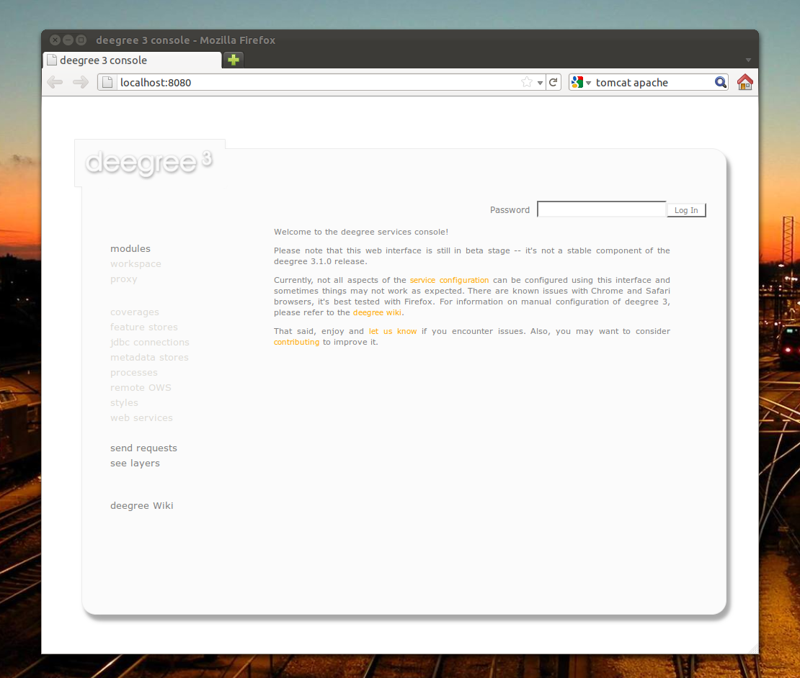

.. _anchor-configuration-featurestore:

===========================
Feature store configuration
===========================

Feature stores are data stores that provide access to stored features. The two most common use cases for feature stores are:

* Accessing via WFS
* Providing of data for feature layers

The remainder of this chapter describes some relevant terms and the feature store configuration files in detail. You can access this configuration level by clicking on the **feature stores** link in the administration console. The configuration files are located in the **datasources/feature/** subdirectory of the active deegree workspace directory.

.. figure:: images/workspace-overview-feature.png
   :figwidth: 80%
   :width: 80%
   :target: _images/workspace-overview-feature.png

   Feature store resources provide access to geo objects

-----------------------------------------------
Features, feature types and application schemas
-----------------------------------------------

Features are abstractions of real-world objects, such as rivers, buildings, streets or state boundaries. They are the geo objects of a particular application domain.

Feature types define classes of features. For example, a feature type ``River`` could define a class of river features that all have the same properties

^^^^^^^^^^^^^^^^^^^^^^^^^^^^^^^^^^^^^^^^^^
Simple vs. rich features and feature types
^^^^^^^^^^^^^^^^^^^^^^^^^^^^^^^^^^^^^^^^^^

Some feature types have a more complex structure than others. Traditionally, GIS software only copes with "simple" feature types:

* Every property is either simple (string, number, date, etc.) or a geometry
* Only a single property with one name is allowed

Basically, a simple feature type is everything that can be represented using a single database table or a single shape file. In contrast, rich feature types additionally allow the following:

* Multiple properties with the same name
* Properties that contain other features
* Properties that reference other features or GML objects
* Properties that contain GML core datatypes which are not geometries (e.g. code types or units of measure)
* Properties that contain generic XML

.. topic:: Example of a rich feature instance encoded in GML

   .. literalinclude:: xml/feature_complex.xml
      :language: xml

.. hint::
   All deegree feature stores support simple feature types, but only the SQL feature store and the memory feature store support complex feature types.

^^^^^^^^^^^^^^^^^^^
Application schemas
^^^^^^^^^^^^^^^^^^^

An application schema defines a hierarchy of (usually complex) feature types for a particular domain. When referring to an application schema, one usually means a GML application schema that defines a hierarchy of complex feature types. The following diagram shows a part of the INSPIRE Annex I application schema:

.. figure:: images/address_schema.png
   :figwidth: 60%
   :width: 50%
   :target: _images/address_schema.png

These kinds of application schemas can be served using the SQL feature store or the memory feature store.

-------------------
Shape feature store
-------------------

The shape feature store serves a feature type from an ESRI shape file. It is currently not transaction capable and only supports simple feature types.

^^^^^^^^^^^^^^^^^^^^^^^^^^^^^
Minimal configuration example
^^^^^^^^^^^^^^^^^^^^^^^^^^^^^

The only mandatory element is ``File``. A minimal valid configuration example looks like this:

.. topic:: Shape Feature Store config (minimal configuration example)

   .. literalinclude:: xml/shapefeaturestore_minimal.xml
      :language: xml

This configuration will set up a feature store based on the shape file ``/tmp/rivers.shp`` with the following settings:

* The feature store offers the feature type ``app:rivers`` (``app`` bound to ``http://www.deegree.org/app``)
* SRS information is taken from file ``/tmp/rivers.prj`` (if it does not exist, ``EPSG:4326`` is assumed)
* The geometry is added as property ``app:GEOMETRY``
* All data columns from file ``/tmp/rivers.dbf`` are used as properties in the feature type
* Encoding of text columns in ``/tmp/rivers.dbf`` is guessed based on actual contents
* An alphanumeric index is created for the dbf to speed up filtering based on non-geometric constraints

^^^^^^^^^^^^^^^^^^^^^^^^^^^^^^^^^^
More complex configuration example 
^^^^^^^^^^^^^^^^^^^^^^^^^^^^^^^^^^

A more complex example that uses all available configuration options:

.. topic:: Shape Feature Store config (more complex configuration example)

   .. literalinclude:: xml/shapefeaturestore_complex.xml
      :language: xml

This configuration will set up a feature store based on the shape file ``/tmp/rivers.shp`` with the following settings:

* SRS of stored geometries is ``EPSG:4326`` (no auto-detection)
* The feature store offers the shape file contents as feature type ``app:River`` (``app`` bound to ``http://www.deegree.org/app``)
* Encoding of text columns in ``/tmp/rivers.dbf`` is ``ISO-8859-1`` (no auto-detection)
* No alphanumeric index is created for the dbf (filtering based on non-geometric constraints has to be performed in-memory)
* The mapping between the shape file columns and the feature type properties is customized.
* Property ``objectid`` corresponds to column ``OBJECTID`` of the shape file
* Property ``geometry`` corresponds to the geometry of the shape file

^^^^^^^^^^^^^^^^^^^^^
Configuration options
^^^^^^^^^^^^^^^^^^^^^

The configuration format for the deegree shape feature store is defined by schema file http://schemas.deegree.org/datasource/feature/shape/3.1.0/shape.xsd. The following table lists all available configuration options. When specifiying them, their order must be respected.

.. table:: Options for ``ShapeFeatureStore`` configuration files

+-----------------------------+-------------+---------+------------------------------------------------------------------------------+
| Option                      | Cardinality | Value   | Description                                                                  |
+=============================+=============+=========+==============================================================================+
| StorageCRS                  | 0..1        | String  | CRS of stored geometries                                                     |
+-----------------------------+-------------+---------+------------------------------------------------------------------------------+
| FeatureTypeName             | 0..n        | String  | Local name of the feature type (defaults to base name of shape file)         |
+-----------------------------+-------------+---------+------------------------------------------------------------------------------+
| FeatureTypeNamespace        | 0..1        | String  | Namespace of the feature type (defaults to "http://www.deegree.org/app")     |
+-----------------------------+-------------+---------+------------------------------------------------------------------------------+
| FeatureTypePrefix           | 0..1        | String  | Prefix of the feature type (defaults to "app")                               |
+-----------------------------+-------------+---------+------------------------------------------------------------------------------+
| File                        | 1..1        | String  | Path to shape file (can be relative)                                         |
+-----------------------------+-------------+---------+------------------------------------------------------------------------------+
| Encoding                    | 0..1        | Integer | Encoding of text fields in dbf file                                          |
+-----------------------------+-------------+---------+------------------------------------------------------------------------------+
| GenerateAlphanumericIndexes | 0..1        | Boolean | Set to true, if an index for alphanumeric fields should be generated         |
+-----------------------------+-------------+---------+------------------------------------------------------------------------------+
| Mapping                     | 0..1        | Complex | Customized mapping between dbf column names and property names               |
+-----------------------------+-------------+---------+------------------------------------------------------------------------------+

--------------------
Memory feature store
--------------------

The memory feature store serves feature types that are defined by a GML application schema and are stored in memory. It is transaction capable and supports rich GML application schemas.

^^^^^^^^^^^^^^^^^^^^^^^^^^^^^
Minimal configuration example
^^^^^^^^^^^^^^^^^^^^^^^^^^^^^

The only mandatory element is ``GMLSchema``. A minimal valid configuration example looks like this:

.. topic:: Memory Feature Store config (minimal configuration example)

   .. literalinclude:: xml/memoryfeaturestore_minimal.xml
      :language: xml

This configuration will set up a memory feature store with the following settings:

* The GML 3.2 application schema from file ``../../appschemas/inspire/annex1/addresses.xsd`` is used as application schema (i.e. scanned for feature type definitions)
* No GML datasets are loaded on startup, so the feature store will be empty unless an insertion is performed (e.g. via WFS-T)

^^^^^^^^^^^^^^^^^^^^^^^^^^^^^^^^^^
More complex configuration example 
^^^^^^^^^^^^^^^^^^^^^^^^^^^^^^^^^^

A more complex example that uses all available configuration options:

.. topic:: Memory Feature Store config (more complex configuration example)

   .. literalinclude:: xml/memoryfeaturestore_complex.xml
      :language: xml

This configuration will set up a memory feature store with the following settings:

* Directory ``../../appschemas/inspire/annex1/`` is scanned for ``*.xsd`` files. All found files are loaded as a GML 3.2 application schema (i.e. analyzed for feature type definitions).
* Dataset file ``../../data/gml/address.gml`` is loaded on startup. This must be a GML 3.2 file that contains a feature collection with features that validates against the application schema.
* Dataset file ``../../data/gml/parcels.gml`` is loaded on startup. This must be a GML 3.2 file that contains a feature collection with features that validates against the application schema.
* The geometries of loaded features are converted to ``urn:ogc:def:crs:EPSG::4258``.

^^^^^^^^^^^^^^^^^^^^^
Configuration options
^^^^^^^^^^^^^^^^^^^^^

The configuration format for the deegree memory feature store is defined by schema file http://schemas.deegree.org/datasource/feature/memory/3.0.0/memory.xsd. The following table lists all available configuration options (the complex ones contain nested options themselves). When specifiying them, their order must be respected.

.. table:: Options for ``Memory Feature Store`` configuration files

+-----------------------------+-------------+---------+------------------------------------------------------------------------------+
| Option                      | Cardinality | Value   | Description                                                                  |
+=============================+=============+=========+==============================================================================+
| StorageCRS                  | 0..1        | String  | CRS of stored geometries                                                     |
+-----------------------------+-------------+---------+------------------------------------------------------------------------------+
| GMLSchema                   | 1..n        | String  | Path/URL to GML application schema files/dirs to read feature types from     |
+-----------------------------+-------------+---------+------------------------------------------------------------------------------+
| GMLFeatureCollection        | 0..n        | Complex | Path/URL to GML feature collections documents to read features from          |
+-----------------------------+-------------+---------+------------------------------------------------------------------------------+

------------------------
Simple SQL feature store
------------------------

The simple SQL feature store serves simple feature types that are stored in a spatially-enabled database. However, it's not suited for mapping rich GML application schemas and does not support transactions. If you need these capabilities, use the SQL feature store instead.

^^^^^^^^^^^^^^^^^^^^^^^^^^^^^
Minimal configuration example
^^^^^^^^^^^^^^^^^^^^^^^^^^^^^

There are three mandatory elements: ``JDBCConnId``, ``SQLStatement`` and ``BBoxStatement``. A minimal configuration example looks like this:

.. topic:: Simple SQL feature store config (minimal configuration example)

   .. literalinclude:: xml/simplesqlfeaturestore_minimal.xml
      :language: xml

^^^^^^^^^^^^^^^^^^^^^^^^^^^^^^^^^^
More complex configuration example 
^^^^^^^^^^^^^^^^^^^^^^^^^^^^^^^^^^

.. topic:: Simple SQL feature store config (more complex configuration example)

   .. literalinclude:: xml/simplesqlfeaturestore_complex.xml
      :language: xml

^^^^^^^^^^^^^^^^^^^^^
Configuration options
^^^^^^^^^^^^^^^^^^^^^

The configuration format is defined by schema file http://schemas.deegree.org/datasource/feature/simplesql/3.0.1/simplesql.xsd. The following table lists all available configuration options (the complex ones contain nested options themselves). When specifiying them, their order must be respected.

.. table:: Options for ``Simple SQL feature store`` configuration files

+-----------------------------+-------------+---------+------------------------------------------------------------------------------+
| Option                      | Cardinality | Value   | Description                                                                  |
+=============================+=============+=========+==============================================================================+
| StorageCRS                  | 0..1        | String  | CRS of stored geometries                                                     |
+-----------------------------+-------------+---------+------------------------------------------------------------------------------+
| FeatureTypeName             | 0..n        | String  | Local name of the feature type (defaults to table name)                      |
+-----------------------------+-------------+---------+------------------------------------------------------------------------------+
| FeatureTypeNamespace        | 0..1        | String  | Namespace of the feature type (defaults to "http://www.deegree.org/app")     |
+-----------------------------+-------------+---------+------------------------------------------------------------------------------+
| FeatureTypePrefix           | 0..1        | String  | Prefix of the feature type (defaults to "app")                               |
+-----------------------------+-------------+---------+------------------------------------------------------------------------------+
| JDBCConnId                  | 1..1        | String  | Identifier of the database connection                                        |
+-----------------------------+-------------+---------+------------------------------------------------------------------------------+
| SQLStatement                | 1..1        | String  | SELECT statement that defines the feature type                               |
+-----------------------------+-------------+---------+------------------------------------------------------------------------------+
| BBoxStatement               | 1..1        | String  | SELECT statement for the bounding box of the feature type                    |
+-----------------------------+-------------+---------+------------------------------------------------------------------------------+
| LODStatement                | 0..n        | Complex | Statements for specific WMS scale ranges                                     |
+-----------------------------+-------------+---------+------------------------------------------------------------------------------+

.. _anchor-configuration-sqlfeaturestore:

-----------------
SQL feature store
-----------------

The SQL feature store allows to configure highly flexible mappings between feature types and database tables. It can be used for simple mapping tasks (mapping a single database table to a feature type) as well as sophisticated ones (mapping a complete INSPIRE Data Theme to dozens or hundreds of database tables). As an alternative to relational decomposition setups, it additionally offers the so-called BLOB-mode which can store features of arbitrary complexity in a single table with almost zero configuration. In contrast to the simple SQL feature store, the SQL feature store is transaction capable (even for complex mappings) and very well suited for mapping rich GML application schemas. It currently supports the following backends:

* PostgreSQL (8.3, 8.4, 9.0, 9.1) with PostGIS extension (1.4, 1.5, 2.0)
* Oracle Spatial (10g, 11g)

^^^^^^^^^^^^^^^^^^^^^^^^^^^^^
Minimal configuration example
^^^^^^^^^^^^^^^^^^^^^^^^^^^^^

A very minimal valid configuration example looks like this:

.. topic:: SQL feature store: Minimal configuration

   .. literalinclude:: xml/sqlfeaturestore_tabledriven1.xml
      :language: xml

This configuration maps a single table as a feature type. See blabla for more details of the behaviour.

^^^^^^^^^^^^^^^^^^^^^^^^^^^^^^^^^^
More complex configuration example
^^^^^^^^^^^^^^^^^^^^^^^^^^^^^^^^^^

A more complex example:

.. topic:: SQL feature store: More complex configuration

   .. literalinclude:: xml/sqlfeaturestore_tabledriven4.xml
      :language: xml

This configuration maps two feature types from an GML application schema to a relational model with joined tables. See blabla for more details of the behaviour.

^^^^^^^^^^^^^^^^^^^^^
Configuration options
^^^^^^^^^^^^^^^^^^^^^

The SQL feature store configuration format is defined by schema file http://schemas.deegree.org/datasource/feature/sql/3.2.0/sql.xsd. The following table lists all available configuration options (the complex ones contain nested options themselves). When specifying them, their order must be respected.

.. table:: Options for ``SQL feature store`` configuration files

+-----------------------------+-------------+---------+------------------------------------------------------------------------------+
| Option                      | Cardinality | Value   | Description                                                                  |
+=============================+=============+=========+==============================================================================+
| JDBCConnId                  | 1..1        | String  | Identifier of the database connection                                        |
+-----------------------------+-------------+---------+------------------------------------------------------------------------------+
| DisablePostFiltering        | 0..1        | Empty   | TBD                                                                          |
+-----------------------------+-------------+---------+------------------------------------------------------------------------------+
| JoinTableDeletePropagation  | 0..1        | String  | TBD                                                                          |
+-----------------------------+-------------+---------+------------------------------------------------------------------------------+
| VoidEscalationPolicy        | 0..1        | String  | TBD                                                                          |
+-----------------------------+-------------+---------+------------------------------------------------------------------------------+
| CustomReferenceResolver     | 0..n        | String  | TBD                                                                          |
+-----------------------------+-------------+---------+------------------------------------------------------------------------------+
| StorageCRS                  | 0..1        | Complex | CRS of stored geometries                                                     |
+-----------------------------+-------------+---------+------------------------------------------------------------------------------+
| GMLSchema                   | 0..n        | String  | Path/URL to GML application schema files/dirs to read feature types from     |
+-----------------------------+-------------+---------+------------------------------------------------------------------------------+
| BLOBMapping                 | 0..1        | Complex | Controls special mapping mode that uses BLOBs for storing features           |
+-----------------------------+-------------+---------+------------------------------------------------------------------------------+
| FeatureTypeMapping          | 0..n        | Complex | Mapping between a feature type and a database table                          |
+-----------------------------+-------------+---------+------------------------------------------------------------------------------+
| Inspectors                  | 0..n        | Complex | TBD                                                                          |
+-----------------------------+-------------+---------+------------------------------------------------------------------------------+
| FeatureCache                | 0..n        | Complex | TBD                                                                          |
+-----------------------------+-------------+---------+------------------------------------------------------------------------------+

These options are explained in the remaining sections of this chapter.

^^^^^^^^^^^^^^^^^^^^^^^^^^^^^^^
Mapping tables to feature types
^^^^^^^^^^^^^^^^^^^^^^^^^^^^^^^

This section describes how to define the mapping of database tables to feature types. Each *FeatureTypeMapping* element defines the mapping between one table and one feature type:

.. topic:: SQL feature store: Mapping a single table

   .. literalinclude:: xml/sqlfeaturestore_tabledriven1.xml
      :language: xml

This example assumes that the database contains a table named ``country``, which is located within the default database schema (for PostgreSQL ``public``). Alternatively you can fully qualify the table name such as ``public.country``. The feature store will try to automatically determine the columns of the table and derive a suitable feature type model:

* Feature type name: ``app:country`` (app=http://www.deegree.org/app)
* Feature id (``gml:id``) based on primary key column of table ``country``
* Every primitive column (number, string, date) is used as a primitive property
* Every geometry column is used as a geometry property

A single config file may map more than one table. The following example defines two feature types, based on tables ``country`` and ``cities``.

.. topic:: SQL feature store: Mapping two tables

   .. literalinclude:: xml/sqlfeaturestore_tabledriven2.xml
      :language: xml

There are several optional attributes and elements that give you more control over the derived feature type definition. The ``name`` attribute allows to set the feature type name explicity. In the following example, it will be ``app:Land`` (Land is German for country).

.. topic:: SQL feature store: Customizing the feature type name

   .. literalinclude:: xml/sqlfeaturestore_tabledriven3.xml
      :language: xml

Use standard XML namespace binding mechanisms to control the namespace and prefix of the feature type:

.. topic:: SQL feature store: Customizing the feature type namespace and prefix

   .. literalinclude:: xml/sqlfeaturestore_tabledriven4.xml
      :language: xml

^^^^^^^^^^^^^^^^^^^^^^
Mapping the feature id
^^^^^^^^^^^^^^^^^^^^^^

In order to customize the mapping of the feature id (gml:id attribute) to a key column of the feature type table, use the *FIDMapping* element. It is the first child option of every *FeatureTypeMapping* element:

.. topic:: SQL feature store (schema-driven mode): FeatureTypeMapping elements

   .. literalinclude:: xml/sqlfeaturestore_featuretypemapping1.xml
      :language: xml

.. hint::
   After providing a correct FIDMapping, a feature type is already queryable, e.g. you can perform a ``GetFeature`` requests against a WFS that uses this feature store. When creating a configuration manually for an existing database, it is a good idea to do this as a first step. This way you test if everything works so far (although no properties will be returned).

^^^^^^^^^^^^^^^^^^^^^^^^^^^^^
Mapping columns to properties
^^^^^^^^^^^^^^^^^^^^^^^^^^^^^

In order to customize the mapping between table columns and the properties of a feature type, the following mapping elements are available:

* **Primitive**: Maps a primitive property, a text node or an attribute node.
* **Geometry**: Maps a geometry property.
* **Feature**: Maps a referenced or inlined subfeature property.
* **Complex**: Maps a complex element that is neither a geometry nor a feature. It is a generic container for mapping nested element structures.

.. hint::
   The *Feature* and *Complex* mappings are only usable if you specify a GML application schema using the *GMLSchema* option. Their usage is described later in section

^^^^^^^^^^^^
Transactions
^^^^^^^^^^^^

When new features are inserted into a SQL feature store (for example via a WFS transaction), the user can choose between different id generation modes. These modes control whether feature ids (the values in the gml:id attribute) have to be re-generated by the feature store. There are three id generation modes available, which stem from the WFS 1.1.0 specification:

* **UseExisting**: The feature store will store the original gml:id values that have been provided in the input. This may lead to errors if the provided ids are already in use or if the format of the id does not match the configuration.
* **GenerateNew**: The feature store will discard the original gml:id values and use the configured generator to produce new and unique identifiers. References in the input (xlink:href) that point to a feature with an reassigned id are fixed as well, so reference consistency is ensured.
* **ReplaceDuplicate**: The feature store will try to use the original gml:id values that have been provided in the input. If a certain identifier already exists in the database, the configured generator is used to produce a new and unique identifier. NOTE: Support for this mode is not implemented yet.

.. hint::
   In a WFS 1.1.0 insert, the id generation mode is controlled by attribute *idGenMode*. WFS 1.0.0 and WFS 2.0.0 don't support to specify it on a request basis. However, in the deegree WFS configuration you can control it in the option *EnableTransactions*.

In order to generate the required ids for the *GenerateNew*, you can choose between different generators. These can be configured in the *FIDMapping* child element of *FeatureTypeMapping*.

"""""""""""""""""
Auto id generator
"""""""""""""""""

The auto id generator depends on the database to provide new values for the feature id column(s) on insert. This requires that the used feature id columns are configured appropriately in the database (e.g. that they have a trigger or a suitable column type such as ``SERIAL`` in PostgreSQL).

.. topic:: SQL feature store: Auto id generator example

   .. literalinclude:: xml/sqlfeaturestore_idgenerator1.xml
      :language: xml

This snippet defines the feature id mapping and the id generation behaviour for a feature type called ``ad:Address``

* When querying, the prefix ``AD_ADDRESS_`` is prepended to column ``attr_gml_id`` to create the exported feature id. If ``attr_gml_id`` contains the value ``42`` in the database, the feature instance that is created from this row will have the value ``AD_ADDRESS_42``.
* On insert (mode=UseExisting), provided gml:id values must have the format ``AD_ADDRESS_$``. The prefix ``AD_ADDRESS_`` is removed and the remaining part of the identifier is stored in column ``attr_gml_id``.
* On insert (mode=GenerateNew), the database must automatically create a new value for column ``attr_gml_id`` which will be the postfix of the newly assigned feature id.

""""""""""""""
UUID generator
""""""""""""""

The UUID generator generator uses Java's UUID implementation to generate new and unique identifiers. This requires that the database column for the id is a character column that can store strings with a length of 36 characters and that the database does not perform any kind of insertion value generation for this column (e.g triggers).

.. topic:: SQL feature store: UUID generator example

   .. literalinclude:: xml/sqlfeaturestore_idgenerator2.xml
      :language: xml

This snippet defines the feature id mapping and the id generation behaviour for a feature type called ``ad:Address``

* When querying, the prefix ``AD_ADDRESS_`` is prepended to column ``attr_gml_id`` to create the exported feature id. If ``attr_gml_id`` contains the value ``550e8400-e29b-11d4-a716-446655440000`` in the database, the feature instance that is created from this row will have the value ``AD_ADDRESS_550e8400-e29b-11d4-a716-446655440000``.
* On insert (mode=UseExisting), provided gml:id values must have the format ``AD_ADDRESS_$``. The prefix ``AD_ADDRESS_`` is removed and the remaining part of the identifier is stored in column ``attr_gml_id``.
* On insert (mode=GenerateNew), a new UUID is generated and stored in column ``attr_gml_id``.

"""""""""""""""""""""
Sequence id generator
"""""""""""""""""""""

The sequence id generator queries a database sequence to generate new and unique identifiers. This requires that the database column for the id is compatible with the values generated by the sequence and that the database does not perform any kind of automatical value insertion for this column (e.g triggers).

.. topic:: SQL feature store: Database sequence generator example

   .. literalinclude:: xml/sqlfeaturestore_idgenerator3.xml
      :language: xml

This snippet defines the feature id mapping and the id generation behaviour for a feature type called ``ad:Address``

* When querying, the prefix ``AD_ADDRESS_`` is prepended to column ``attr_gml_id`` to create the exported feature id. If ``attr_gml_id`` contains the value ``42`` in the database, the feature instance that is created from this row will have the value ``AD_ADDRESS_42``.
* On insert (mode=UseExisting), provided gml:id values must have the format ``AD_ADDRESS_$``. The prefix ``AD_ADDRESS_`` is removed and the remaining part of the identifier is stored in column ``attr_gml_id``.
* On insert (mode=GenerateNew), the database sequence ``SEQ_FID`` is queried for new values to be stored in column ``attr_gml_id``.

^^^^^^^^^^^^^^^^^^^^^^^^^^^^^^^^
Mapping a GML application schema
^^^^^^^^^^^^^^^^^^^^^^^^^^^^^^^^

The former sections assumed a mapping configuration that didn't specify a GML application schema. If a GML application schema is specified in the SQL feature store configuration, the mapping possibilities are extended further. Although configuration with a GML application schema is similar, there are some differences as described in the following table:

.. table:: Blabla

+------------------------------+----------------------------+---------------------------------+
|                              | Without GML app schema     | With GML app schema             |
+==============================+============================+=================================+
| GML application schema       | Derived from tables        | Must be provided                |
+------------------------------+----------------------------+---------------------------------+
| Feature type definitions     | Derived from tables        | Derived from GML app schema     |
+------------------------------+----------------------------+---------------------------------+
| GML version                  | Any (GML 2, 3.0, 3.1, 3.2) | Fixed to version of app schema  |
+------------------------------+----------------------------+---------------------------------+
| Mapping principle            | Property to table column   | XPath-based or BLOB-based       |
+------------------------------+----------------------------+---------------------------------+
| Supported mapping complexity | Low                        | Very high                       |
+------------------------------+----------------------------+---------------------------------+

.. hint::
  If you want to create a configuration for an existing GML application schema (e.g. INSPIRE Data Themes, GeoSciML, CityGML, XPlanung, AAA) always provide this schema in the configuration. Otherwise, try if table-driven meets your mapping requirements. If your table structures turn out to be too complex to be usable with table-driven mode, you will need to create a matching GML application schema manually and use schema-driven mode.

In schema-driven mode, the SQL feature store always retrieves feature type definitions and property declarations from a GML application schema (e.g. INSPIRE Addresses, GeoSciML, CityGML, XPlanung, AAA) specified in the configuration. A basic configuration for schema-driven mode defines the JDBC connection id, the CRS of the stored geometries and one or more GML schema files that make up the application schema:

.. topic:: SQL FeatureStore (Schema-driven mode): Skeleton config

   .. literalinclude:: xml/sqlfeaturestore_schemadriven1.xml
      :language: xml

As in table-driven mode, the mapping of a feature type is defined using a ``FeatureTypeMapping`` element:

.. topic:: SQL FeatureStore (Schema-driven mode): Relational skeleton config

   .. literalinclude:: xml/sqlfeaturestore_schemadriven2.xml
      :language: xml

The ``FeatureTypeMapping`` element has the following attributes:

* ``name``: Qualified name of the feature type to map. Use standard XML namespace mechanisms (``xmlns``) for binding namespace prefixes.
* ``table``: Name of the base table that stores the feature type. Properties may be mapped to related tables, but the base table must at least contain the columns that constitute the unique feature id (gml:id).

.. hint::
   In schema-driven mode, every mapped feature type must be defined in the referenced GML schema file. It is however not necessary to map all feature types defined in the schema. Unmapped feature types will be known to the feature store (e.g. a WFS will list them in a GetCapabilities response), but not queryable.

""""""""""""""""""""
Recommended workflow
""""""""""""""""""""

Manually tailoring an SQL feature store configuration for a rich GML application schema may appear to be a dauting task at first sight. Especially when you are still trying to figure out how the configuration concepts work, you will be using a trial-and-error strategy. Here are some general practices to make this as painless as possible.

* Map one feature type at a time. Only when you're satisfied with the mapping, move on to the next feature type.
* When changing the configuration file, make sure that the status of the feature store stays green. If an exclamation mark occurs, you have an error in your configuration.
* Use the "Reload" link of the services console to activate your changes.

Start with a single **FeatureTypeMapping**. Provide the table name and the mapping for the feature identifier. If there's no error, you can already query the feature type! Here's a minimal configuration example:

.. topic:: SQL FeatureStore (schema-driven mode): Start configuration

   .. literalinclude:: xml/sqlfeaturestore_schemadriven1.xml
      :language: xml

It's very useful to have an active WFS configuration, so you can use WFS GetFeature-requests to check whether your feature mapping works as expected. You can use your web browser for that. After each configuration change, perform a GetFeature-request to see the effect. Suitable WFS requests depend on the WFS version, the GML version and the name of the feature type.

* WFS 1.0.0 (GML 2): http://localhost:8080/services?service=WFS&version=1.0.0&request=GetFeature&typeName=ad:Address&maxFeatures=5
* WFS 1.1.0 (GML 3.1): http://localhost:8080/services?service=WFS&version=1.1.0&request=GetFeature&typeName=ad:Address&maxFeatures=5
* WFS 2.0.0 (GML 3.2): http://localhost:8080/services?service=WFS&version=2.0.0&request=GetFeature&typeName=ad:Address&count=5

In order to successfully create a mapping of a feature type from a GML application schema, you have to understand the structure and the data types of the feature type. For example, if you want to map the **ad:Address** feature type from INSPIRE Annex I, you have to know that it has a required property called **ad:inspireId** that has a child element with name **base:Identifier**. Ultimately, this structure is given by the corresponding GML application schema files, so you can analyze these files to find that out. Internally, deegree does the same to find out about feature types. Here's a full list of possible options to help with this task:

* Manually (or with the help of a generic XML tool such as XMLSpy) analyze the the structure of the feature type you want to map
* Use the services console to auto-generate a mapping configuration. It should reflect the structure and datatypes correctly and will be a good starting point to. Adapt it to your own database tables and columns. Auto-generate the mapping, create a copy of the file and again start with a minimal version (feature type by feature type).
* Use the deegree support options (mailing lists, commercial support) to get help.

.. hint::
   The deegree project aims for a full user-interface to help with all steps of creating mapping configurations. If you are interested in working on this (or funding it), don't hesitate to contact the project bodies.

""""""""""""""""""
Mapping properties
""""""""""""""""""

In order to add mappings for properties of the feature type, the following mapping elements are available:

* **Primitive**: Maps a primitive property, a text node or an attribute node.
* **Geometry**: Maps a geometry property.
* **Feature**: Maps a referenced or inlined subfeature property.
* **Complex**: Maps a complex element that is neither a geometry nor a feature. It is a generic container for mapping nested element structures.

Mapping the actual content of a feature works by associating XML nodes with columns in the database. In the beginning of the feature type mapping, the current node is the root element of the feature ``ad:Address`` and the current table is ``ad_address``.

""""""""""""""""""""""""""
Changing the table context
""""""""""""""""""""""""""

When mapping a rich GML application schema to a database, you usually have to map data from multiple tables to a single feature type. The configuration offers the **Join** element to change the current table context, i.e. to move to another table in the relational model.

At the beginning of a **FeatureTypeMapping**, the current table context is the one specified by the **table** attribute. In the following example snippet, this would be table **ad_address**.

.. topic:: SQL FeatureStore: Initial table context

   .. literalinclude:: xml/sqlfeaturestore_tablecontext.xml
      :language: xml

Note that all mapped columns stem from table **ad_address**. This is fine, as each feature can only have a single **gml:identifier** property. However, when mapping a property that may occur any number of times, we will have to access the values for this property in a separate table. 

.. topic:: SQL FeatureStore: Changing the table context

   .. literalinclude:: xml/sqlfeaturestore_join1.xml
      :language: xml

In this example, property **gml:identifier** is mapped as before (the data values stem from table **ad_address**). In contrast to that, the property **ad:position** can occur any number of times for a single **ad_address** feature instance. In order to reflect that in the relational model, the values for this property have to be taken from/stored in a separate table. The feature type table (ad_address) must have a 1:n relation to this table.

The **Join** element is used to define such a change in the table context (in other words: a relation/join between two tables). A **Join** element may only occur as the first child element of any of the mapping elements (Primitive, Geometry, Feature or Complex). It changes from the current table context to another one. In the example, the table context in the mapping of property **ad:position** is changed from **ad_address** to **ad_address_ad_position**. All mapping instructions that follow the **Join** element refer to the new table context. For example, the geometry value is taken from **ad_address_ad_position.ad_geographicposition_ad_geometry_value**.

The following table lists all available options for **Join** elements.

.. table:: Options for **Join** elements

+-----------------------------+-------------+---------+---------------------------------------------------------------------------------------------------+
| Option                      | Cardinality | Value   | Description                                                                                       |
+=============================+=============+=========+===================================================================================================+
| @table                      | 1..1        | String  | Name of the target table to change to.                                                            |
+-----------------------------+-------------+---------+---------------------------------------------------------------------------------------------------+
| @fromColumns                | 1..1        | String  | One or more columns that define the join key in the source table.                                 |
+-----------------------------+-------------+---------+---------------------------------------------------------------------------------------------------+
| @toColumns                  | 1..1        | String  | One or more columns that define the join key in the target table.                                 |
+-----------------------------+-------------+---------+---------------------------------------------------------------------------------------------------+
| @orderColumns               | 0..1        | String  | One or more columns hat define the order of the joined rows.                                      |
+-----------------------------+-------------+---------+---------------------------------------------------------------------------------------------------+
| @numbered                   | 0..1        | Boolean | Set to true, if orderColumns refers to a single column that contains natural numbers [1,2,3,...]. |
+-----------------------------+-------------+---------+---------------------------------------------------------------------------------------------------+
| AutoKeyColumn               | 0..n        | Complex | Columns in the target table that store autogenerated keys (only required for transactions).       |
+-----------------------------+-------------+---------+---------------------------------------------------------------------------------------------------+

Attributes **fromColumns**, **toColumns** and **orderColumns** may each contain one or more columns. When specifying multiple columns, they must be given as a whitespace-separated list. **orderColumns** is used to force a specific ordering on the joined table rows. If this attribute is omitted, the order of joined rows is not defined and reconstructed feature instances may vary each time they are fetched from the database. In the above example, this would mean that the multiple **ad:position** properties of an **ad:Address** feature may change their order.

In case that the order column stores the child index of the XML element, the **numbered** attribute should be set to **true**. In this special case, filtering on property names with child indexes will be correctly mapped to SQL WHERE clauses as in the following WFS example request.

.. topic:: SQL FeatureStore: WFS query with child index

   .. literalinclude:: xml/sqlfeaturestore_indexquery.xml
      :language: xml

In the above example, only those **ad:Address** features will be returned where the geometry in the third **ad:position** property has an intersection with the specified bounding box. If only other **ad:position** properties (e.g. the first one) matches this constraint, they will not be included in the output.

The **AutoKeyColumn** configuration option is only required when you want to use transactions on your feature store and your relational model is non-canonical. Ideally, the mapping will only change the table context in case the feature type model allows for multiple child elements at that point. In other words: if the XML schema has **maxOccurs** set to **unbounded** for an element, the relational model should have a corresponding 1:n relation. For a 1:n relation, the target table of the context change should have a foreign key column that points to the primary key column of the source table of the context change. This is important, as the SQL feature store has to propagate keys from the source table to the target table and store them there as well.

If the joined table is the origin of other joins, than it is important that the SQL feature store can generate primary keys for the join table. If not configured otherwise, it is assumed that column **id** stores the primary key and that the database will auto-generate values on insert using database mechanisms such as sequences or triggers.

If this is not the case, use the **AutoKeyColumn** options to define the columns that make up the primary key in the join table and how the values for these columns should be generated on insert. Here's an example:

.. topic:: SQL FeatureStore: Key propagation for transactions

   .. literalinclude:: xml/sqlfeaturestore_join2.xml
      :language: xml

In this example snippet, the primary key for table **B** is stored in column **pk1** and values for this column are generated using the UUID generator. There's another change in the table context from B to C. Rows in table C have a key stored in column **parentfk** that corresponds to the **B.pk1**. On insert, values generated for **B.pk1** will be propagated and stored for new rows in this table as well. The following table lists the options for **AutoKeyColumn** elements.

Inside a **AutoKeyColumn** element, you may use the same key generators that are available for feature id generation (see above).

""""""""""""
BLOB mapping
""""""""""""

An alternative approach to schema-driven relational mapping is schema-driven BLOB mapping.

""""""""""""""""""""""""""""""""""""""""""""""""""
Auto-generating a mapping configuration and tables
""""""""""""""""""""""""""""""""""""""""""""""""""

Although it may not always result in usable configurations, the services console can be used to automatically derive a mapping configuration and set up tables from an existing GML application schema. If you don't have an existing database structure that you want to use, you can try this possibility to create a working set up a very quickly.

.. hint::
   As every (optional) attribute and element will be considered in the mapping, you may easily end up with hundreds of tables or columns.

Here's a walkthrough based on the INSPIRE workspace, but you should be able to use these instructions with other GML application schemas as well. Make sure that the INSPIRE workspace has been downloaded and activated as described in :ref:`anchor-workspace-inspire`. As a prerequisite, you will have to create an empty, spatially-enabled PostGIS or Oracle database that you can connect to from your deegree installation.

As a first step, create a JDBC connection to your database:

   Creating a JDBC connection

Click on "server connections -> jdbc", enter "inspire" (or an other identifier) as the connection id and click on "Create new":

   Creating a JDBC connection

Ensure that deegree can connect to the database:

   Testing the JDBC connection

Now, change to "data stores -> feature". We will have to delete the existing (memory-based) feature store. Click on "Delete".

   Deleting the memory-based feature store

Enter "inspire" as name for the new feature store, select SQL and click on "Create new":

   Creating a new SQL feature store configuration

Select "Create tables from GML application schema" and click "Next":

   Mapping a new SQL feature store configuration

You can now select the GML application schema files to be used. For this walkthrough, just tick the Addresses.xsd file, which contains the Addresses Data Theme (if you select all files, hundreds of feature types from INPIRE Annex I will be mapped). Scroll down and click "Next".

.. hint::
   This view presents any .xsd files that are located below the **appschemas** directory of your deegree workspace. If you want to map any other GML application schema (such as GeoSciML or CityGML), place a copy of the application schema files into the **appschemas** directory (using your favorite method, e.g. a file browser) and click on "Rescan". You should now have the option to select the files of this application schema in the services console view.

   Mapping a new SQL feature store configuration

You will be presented with a rough analysis of the feature types contained in the selected GML application schema files.

