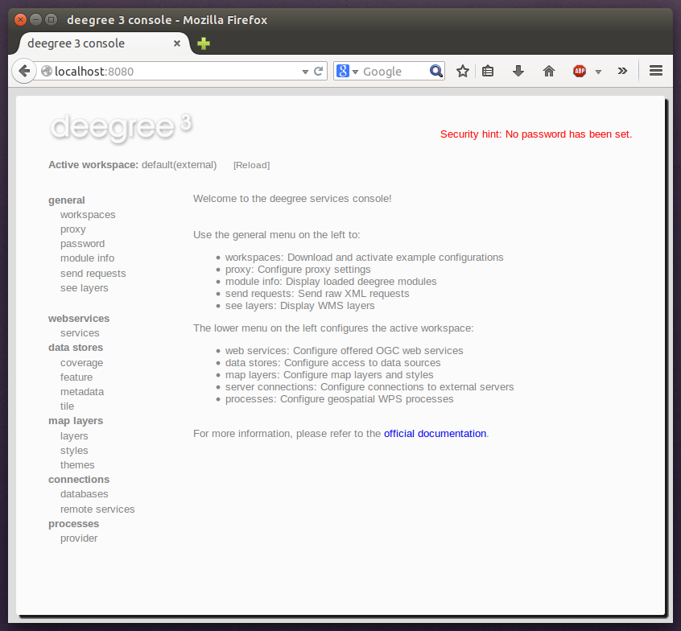

.. _anchor-installation:

============
Installation
============

-------------------
System requirements
-------------------

deegree webservices work on any platform with a compatible Java SE 8 installation, including:

* Microsoft Windows
* Linux
* Apple macOS

Supported Java SE 8 versions are `Oracle JDK 8 <http://www.oracle.com/technetwork/java/javase/downloads/index.html>`_ [#f1]_, `OpenJDK 8 <http://openjdk.java.net>`_ [#f2]_. Newer Java SE versions may work, but are not officially supported by the deegree development team.

-----------
Downloading
-----------

deegree webservices downloads are available on the `deegree home page <http://www.deegree.org>`_. You have the choice between:

* *Docker* : Docker Image with deegree webservices on OpenJDK and Apache Tomcat [#f3]_
* *WAR*: Generic Java Web Archive for deployment in an existing Java Servlet container [#f4]_
* *ZIP*: Distribution bundle with Apache Tomcat [#f5]_

.. tip::
  If you are confused by the two options and unsure which version to pick, use the ZIP. All variants contain exactly the same deegree webservices webapp, they only differ in packaging.

---------------------
Starting and stopping
---------------------

In order to run the ZIP version, extract it into a local directory of your choice. Afterwards, change to the directory ``deegree-webservices-tomcat-bundle-3.4.x/apache-tomcat-8.x.y/bin`` and fire up the included start script for your operating system:

* Microsoft Windows: ``startup.bat``
* Linux/macOS: ``startup.sh`` (when starting via a Desktop Environment, choose "Run in terminal" and you may need to grant permission to execute the scripts with ``chmod a+x *.sh`` before)

You should now see a terminal window on your screen with a lot of log messages: 

.. figure:: images/terminal.png
   :figwidth: 60%
   :width: 50%
   :target: _images/terminal.png

   deegree webservices starting up

.. tip::
  If you don't see this terminal window, make sure that the ``java`` command is on the system path. You can verify this by entering ``java -version`` at the command prompt. Also ensure that ``JAVA_HOME`` system environment variable points to the correct installation directory of a compatible JDK.

You may minimize this window, but don't close it as long as you want to be able to use the deegree webservices. In order to check if the services are actually running, open http://localhost:8080 in your browser. You should see the following page:

   deegree webservices administration console

To shut deegree webservices down, switch back to the terminal window and press ``CTRL+C`` or simply close it. 

.. tip::
  If you want to run deegree webservices on system startup automatically, consider installing `Apache Tomcat 8 <http://tomcat.apache.org>`_ as a system service. Afterwards, download the WAR version of deegree webservices and deploy it into your Tomcat installation (e.g. by copying the WAR file into the ``webapps`` folder). Consult the `Tomcat documentation <https://tomcat.apache.org/tomcat-8.5-doc/index.html>`_ for more information and options.

.. rubric:: Footnotes

.. [#f1] Oracle JDK 7 and earlier versions are not supported anymore, be aware that those versions are out of maintenance and reached End-of-life.
.. [#f2] OpenJDK binaries are provided by `Azul Systems <https://www.azul.com/downloads/zulu/>`_ or `AdoptOpenJDK <https://adoptopenjdk.net>`_.
.. [#f3] Requires an installation of Docker Community or Enterprise Edition, download Docker from `www.docker.com <https://www.docker.com/>`_.
.. [#f4] A Java Servlet 2.5 compliant container is required. We recommend using the latest `Apache Tomcat 8 <http://tomcat.apache.org/>`_ release.
.. [#f5] As of deegree 3.4.0 the ZIP distribution bundle is deprecated and the download links are removed from the website. Download the ZIP from the `Nexus repository <http://repo.deegree.org/content/groups/public/org/deegree/deegree-webservices-tomcat-bundle/>`_ instead.
