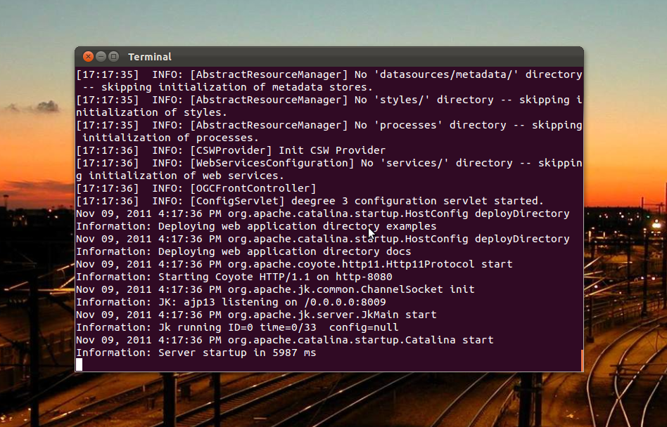
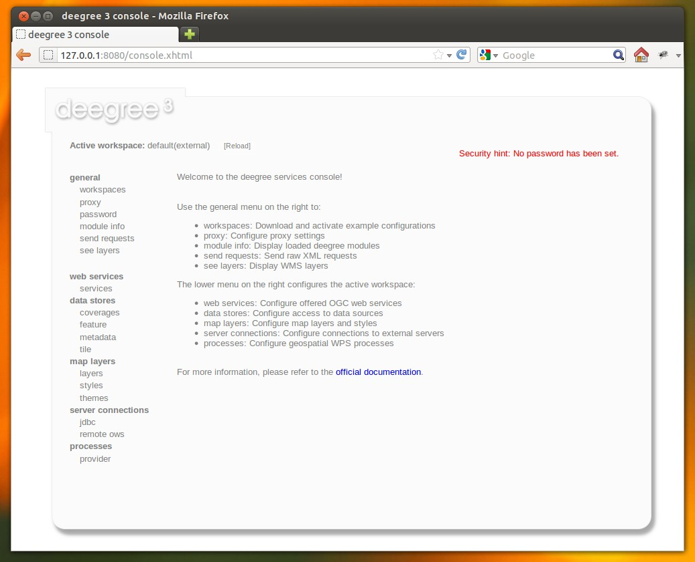

.. _anchor-installation:

============
Installation
============

-------------------
System requirements
-------------------

deegree webservices work on any platform with a compatible `Java <http://www.java.com>`_ installation, including:

* Microsoft Windows
* Linux
* Mac OS X
* Solaris

In order to run deegree webservices on your machine, we recommend OpenJDK 7. Alternatively, using Java 6 (Update 4 or better) or Java 7 from Oracle is also supported. Other Java versions may work, but are not officially supported by the deegree development team.

-----------
Downloading
-----------

deegree webservices 3.2 downloads are available on the `deegree home page <http://www.deegree.org>`_. You have the choice of two flavors:

* *ZIP*: Multi-operating system package bundles with Apache Tomcat
* *WAR*: Plain Java Web Archive for deployment in an existing servlet container [#f1]_

If you are confused by the two options and unsure which version to pick, use the ZIP. Both variants contain exactly the same deegree software, they only differ in packaging.

---------------------
Starting and stopping
---------------------

.. attention::
  Make sure that the ``java`` command is on the system path. You can verify this by entering ``java -version`` at the command prompt. Also ensure that ``JAVA_HOME`` system environment variable points to the installation directory of your JDK.

In order to run the ZIP version, extract it into a directory of your choice. Afterwards, fire up the included start script for your operating system:

* Microsoft Windows: ``start-deegree.bat`` 
* Linux/Solaris: ``start-deegree.sh`` (when starting from a Desktop Environment such as Gnome, choose "Run in terminal")
* Mac OS X: ``start-deegree.sh`` (needs to be invoked from the terminal at the moment)

You should now have a terminal window on your screen with a lot of log messages: 

   deegree webservices starting up

You may minimize this window, but don't close it as long as you want to be able to use the deegree webservices. In order to check if the services are actually running, open http://localhost:8080 in your browser. You should see the following page:

   deegree webservices administration console

To shut the services down, switch back to the terminal window and press ``CTRL+C`` or simply close it. 

.. tip::
  If you want to run deegree webservices on system startup automatically, consider installing `Apache Tomcat 7 <http://tomcat.apache.org>`_ as a system service. Afterwards, download the WAR version of deegree webservices and deploy it into your Tomcat installation (e.g. by copying the WAR file into the ``webapps`` folder). Consult the Tomcat documentation for more information and options.

.. rubric:: Footnotes

.. [#f1] A Servlet 2.5 compliant web container is required. We recommend using the latest Apache Tomcat 7 release.
