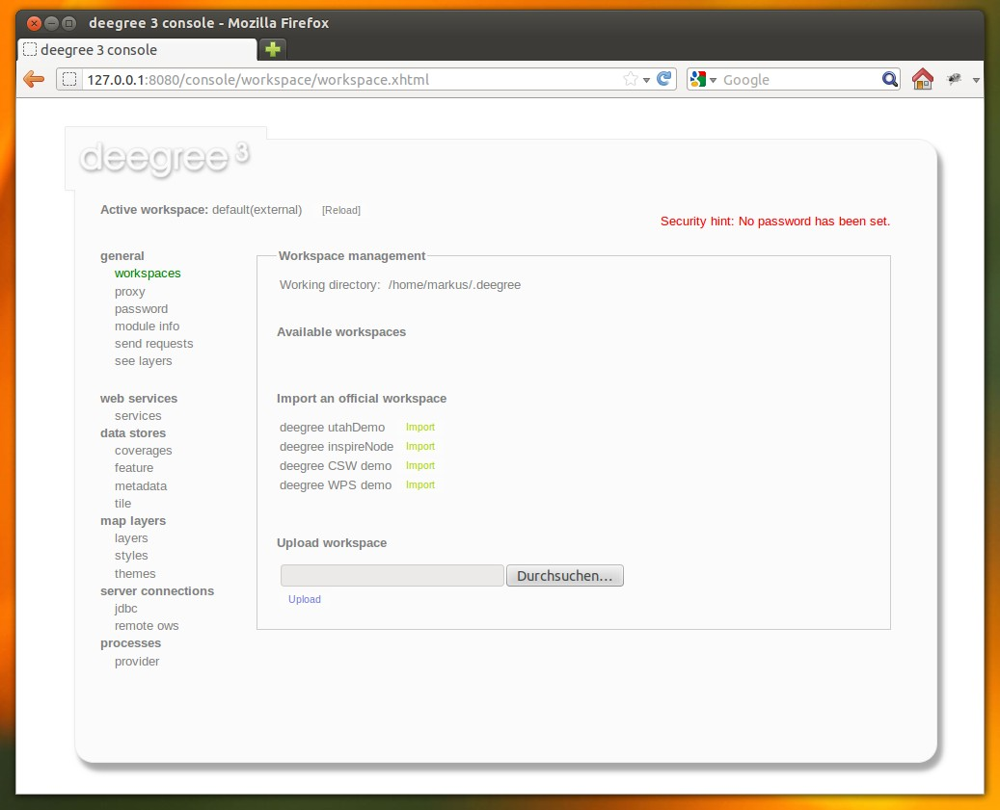
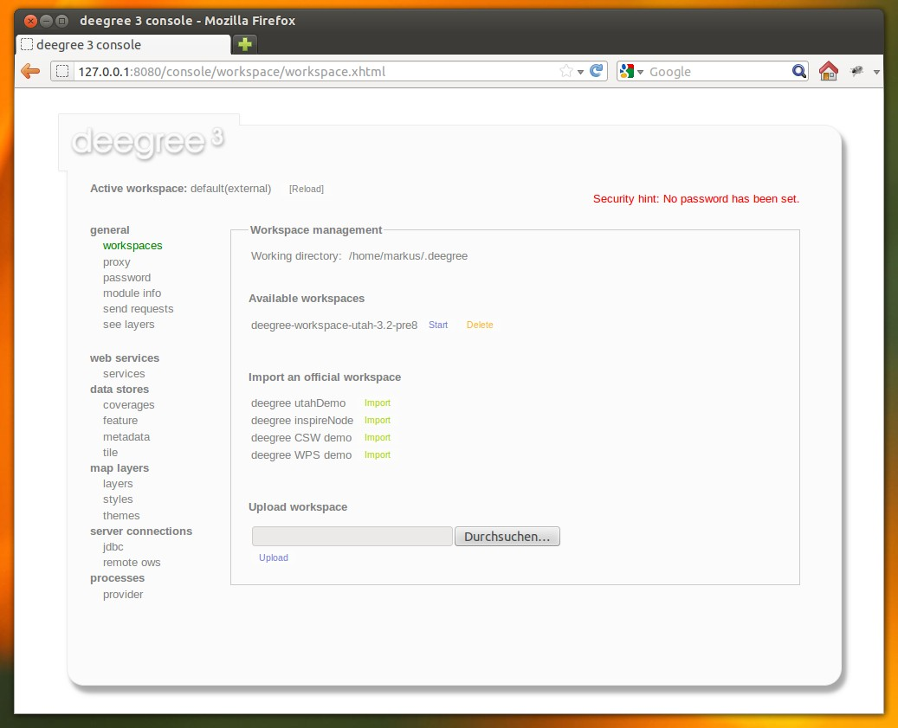
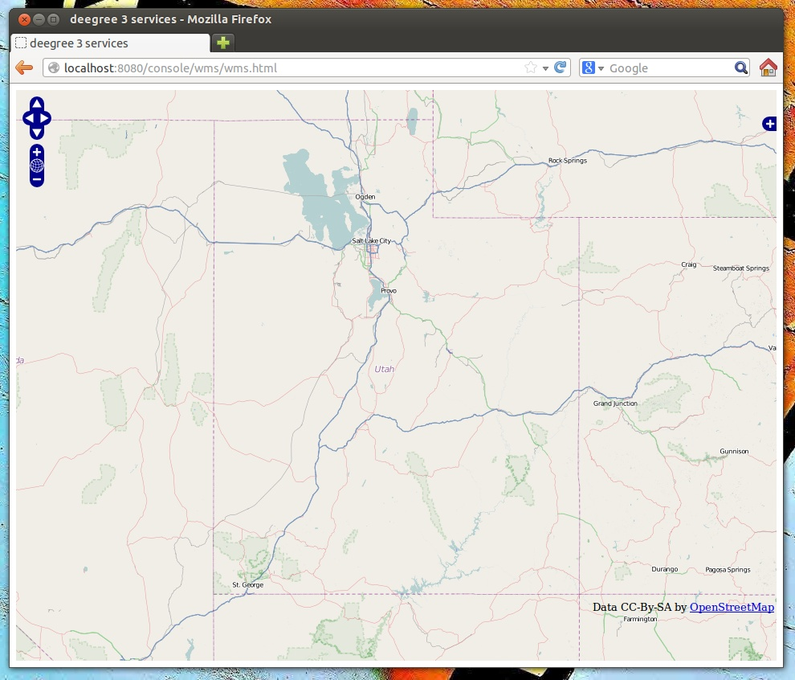
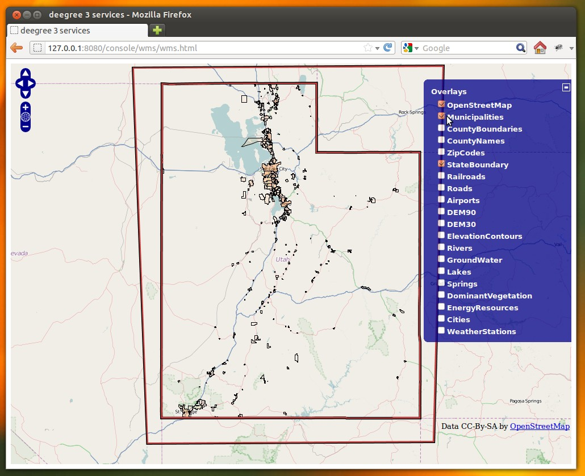
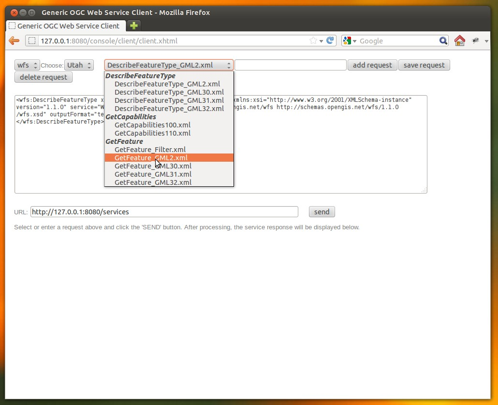
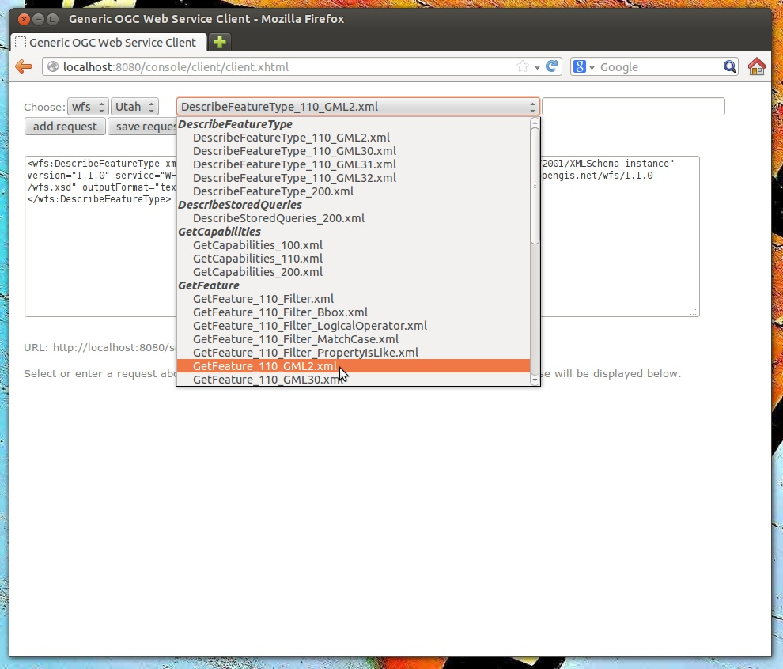
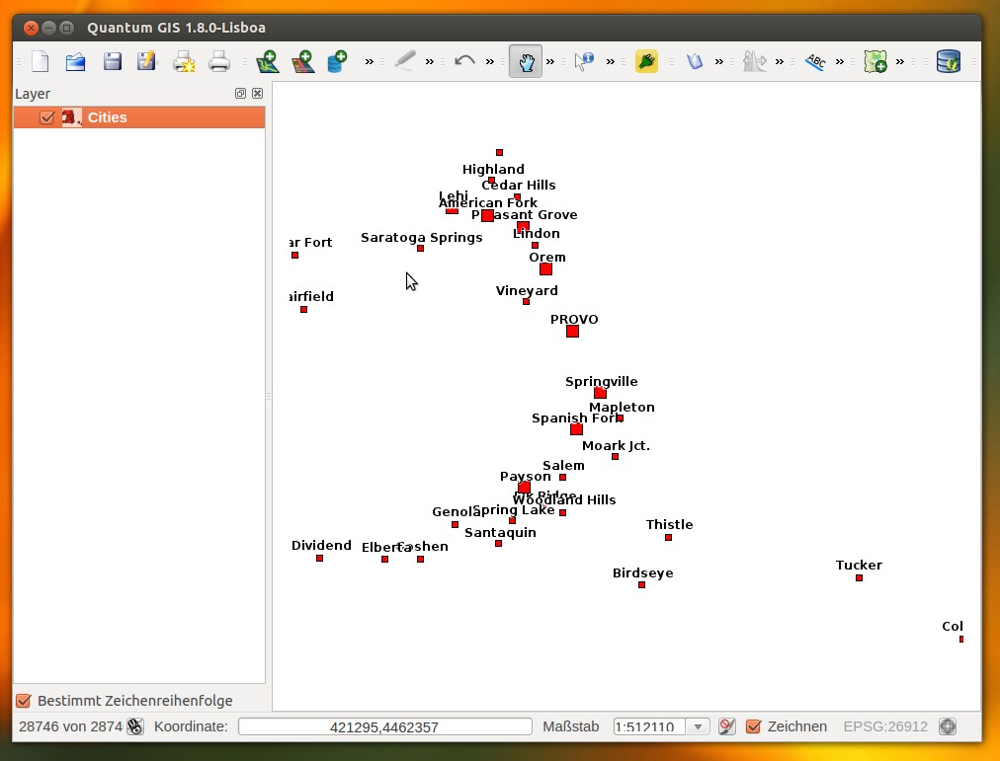

.. _anchor-lightly:

===============
Getting started
===============

In the previous chapter, you learned how to install and start deegree webservices. In this chapter, we will introduce the deegree service console and learn how to perform basic tasks such as downloading and activating example configurations. The service console provides a way to configure the different aspects of a deegree installation (active web services, data access, layers, etc). In deegree terminology, a complete configuration for a deegree instance is called a "deegree workspace":

.. figure:: images/workspace-overview.png
   :figwidth: 90%
   :width: 90%
   :target: _images/workspace-overview.png

   Configuration aspects of a deegree workspace

The next chapter describes the structure and the aspects of deegree workspaces in more detail, but for the remainder of this chapter, it is sufficient to know that it is a complete configuration of a deegree webservice instance.

-----------------------------------
Accessing deegree's service console
-----------------------------------

The service console is a web-based administration interface for configuring your deegree webservices installation. If deegree webservices are running on your machine, you can usually access the console from your browser via http://localhost:8080

.. figure:: images/console_start.jpg
   :figwidth: 60%
   :width: 50%
   :target: _images/console_start.jpg

   deegree webservices administration console

.. tip::
  If you're not running the ZIP version, but deployed the WAR version into a web container, you most probably will have to use a different URL for accessing the console, e.g. http://localhost:8080/deegree-webservices-3.2-pre8. The port number and webapp name depend on your installation/deployment.

.. tip::
  You can access the service console from other machines on your network by exchanging *localhost* with the name or IP address of the machine that runs deegree webservices.

For the remainder of the chapter, only the **general** section is relevant. The menu items in this section:

* **workspaces**: Download and activate example configurations
* **proxy**: Configure proxy settings
* **module info**: Display loaded deegree modules
* **send requests**: Send raw XML requests
* **see layers**: Display WMS layers

.. tip::
  If the machine running deegree webservices uses a proxy to access the internet and you have trouble downloading example configurations, you will probably have to configure the proxy settings. Ask your network administrator for details.

^^^^^^^^^^^^^^^^^^^^^^^^^^^^^
Activating example workspaces
^^^^^^^^^^^^^^^^^^^^^^^^^^^^^

Click on the *workspaces* link:

   Workspace section

The bottom of the workspace view lists the available example workspace. You should see following:

* **deegree utahDemo**
* **deegree inspireNode**
* **deegree CSW demo**
* **deegree WPS demo**

If you click on **Import**, the corresponding example workspace will be fetched from deegree's official workspace repository and extracted in your deegree configuration folder. Depending on the workspace and your internet connection, this may take a few minutes (the Utah demo workspace is about 70 MB in size).

After downloading has completed, the workspace will be shown under "Available workspaces":

   Added inactive workspace

You can now activate the downloaded workspace by clicking on "Start". Again, this may take some time, as it may require some initialization (e.g. building of indexes). The workspace will be removed from the list of inactive workspaces, instead, the workspace will be marked as "Active" (at the top of the view). Your deegree instance is now running the service configuration that is contained in the downloaded workspace.

.. _anchor-workspace-utah:

----------------------------------------
Example workspace 1: Webmapping for Utah
----------------------------------------

This workspace contains a web mapping setup based on data from Utah. It contains a WMS with some raster and vector layers and some nice render styles. Raster data is read from GeoTIFF files, vector data is backed by shapefiles. Additionally, a WFS is configured that allows to access the raw vector data in GML format.

After downloading and activating the "deegree utahDemo" workspace, you can click on the "see layers" link, which opens a simple web map client that displays a base map (not rendered by deegree, but loaded from the OpenStreetMap servers).

   Map client showing base map

Click on the "+" icon on the right side to see a list of available layers. Tick one (e.g. Municipalities) to enable it in the client. It will be generated by your deegree instance.

   Selecting WMS layers to be displayed

.. tip::
You can drag the map by holding the mouse button and moving your mouse. Zooming can be done by the controls on the left or using the mouse wheel. 
Alternatively, you can open a rectangle by holding the SHIFT key and clicking the mouse button in the map area.

In order to send some requests against the WFS, you may use the "send requests" link in the service console (go back first to the console). A simple interface for sending XML requests will open up. This interface is meant for testing the behaviour of your web service on the protocol level and contains some reasonable example requests.

   Sending example requests

You may select example requests from the drop-down menu and click on the "Send" button. The server response will be displayed.

   Sending example requests

.. tip::
  Instead of using the built-in layer preview or the generic XML client, you may use any compliant OGC client for accessing the WMS and WFS. Successfully tested desktop clients include Quantum GIS (install WFS plugin for accessing WFS), uDig, OpenJUMP and deegree iGeoDesktop. The service address to enter in your client is: http://localhost:8080/services.

   Quantum GIS displaying a WMS layer from the utahDemo

.. _anchor-workspace-inspire:

--------------------------------------
Example workspace 2: INSPIRE in action
--------------------------------------

This workspace is a basic INSPIRE View and Discovery Service setup. It contains a transactional WFS configured for all Annex I Data Themes and a WMS that is configured to display some of the Data Theme layers. The workspace is configured to store the INSPIRE features in memory, but can easily be changed to use PostGIS or Oracle as storage backend (TBD describe this).

After downloading and activating the "deegree inspireNode" workspace, you can click on the "see layers" link, which opens a simple web map client that displays a base map (not rendered by deegree, but loaded from the OpenStreetMap servers).

.. figure:: images/browser.png
   :figwidth: 60%
   :width: 50%
   :target: _images/browser.png

   Map client showing base map

You can now activate the INSPIRE layers, but nothing will be rendered, as the configured storage (memory) doesn't contain any features yet.

.. figure:: images/browser.png
   :figwidth: 60%
   :width: 50%
   :target: _images/browser.png

   INSPIRE layers are empty

In order to insert some INSPIRE features, use the "send requests" link in the service console:

.. figure:: images/browser.png
   :figwidth: 60%
   :width: 50%
   :target: _images/browser.png

   INSPIRE layers are empty

Use the right-most drop-down menu to select an example request. The last entry "blabla.xml" can be used to insert a small number of INSPIRE Address features using a WFS-T insert request:

.. figure:: images/browser.png
   :figwidth: 60%
   :width: 50%
   :target: _images/browser.png

   Insert request

After successful insertion (click "Send"), the internal storage contains some addresses, and you may move back to the layer overview ("see layers"). After activating the Address layer, you should see some addresses painted by the deegree WMS.

The example requests also contain a lot of examples for the query possibilities of the deegree WFS, e.g. the requesting of INSPIRE Addresses by street name:

.. figure:: images/browser.png
   :figwidth: 60%
   :width: 50%
   :target: _images/browser.png

   Query examples

.. _anchor-workspace-csw:

-------------------------------------------
Example workspace 3: An ISO catalogue setup
-------------------------------------------

This workspace contains a catalogue service setup that is compliant to the ISO Application Profile. After downloading and starting it, you will have to setup tables in a PostGIS database first (TBD describe Oracle). You will need to have an empty and spatially-enabled PostGIS database handy that can be accessed from the machine that runs the deegree webservices.

As a first step, you will have to create a JDBC connection to your PostGIS database:

.. figure:: images/browser.png
   :figwidth: 60%
   :width: 50%
   :target: _images/browser.png

   Creating a JDBC connection

Click on "server connections -> jdbc", enter "iso" as the connection id and click on "Create new":

.. figure:: images/browser.png
   :figwidth: 60%
   :width: 50%
   :target: _images/browser.png

   Creating a JDBC connection

You will now be prompted to enter the connection parameters for your database. Make sure to enter the correct connection information (use "Test connection" to check it) and click "OK". You now have a working connection to your database, but we need to create the required database tables as well. Change to the metadata store view ("data stores -> metadata") and click the "Setup tables" link:

.. figure:: images/browser.png
   :figwidth: 60%
   :width: 50%
   :target: _images/browser.png

   Creating the tables for the ISO catalogue

Click "Create". If all went well, you should now have a working CSW setup. You can connect to the CSW with any compliant client (TBD tested?) or use the "send requests" link to send some raw CSW requests to the service.

Use the right-most drop-down menu to select an example request. The last entry "blabla.xml" can be used to insert some ISO records using a CSW transaction request:

.. figure:: images/browser.png
   :figwidth: 60%
   :width: 50%
   :target: _images/browser.png

   Insert request

After successful insertion (click "Send"), some records will be inserted into the PostGIS database. You may explore the other example requests as well.

.. _anchor-workspace-wps:

---------------------------------------
Example workspace 4: Processing service
---------------------------------------

This workspace contains a WPS setup with some simple example processes. After downloading and starting it, you can click on "send requests" in order to fire some example requests to the WPS. Use the right-most drop-down menu to select an example request and click "Send" to send it to the WPS:

.. figure:: images/browser.png
   :figwidth: 60%
   :width: 50%
   :target: _images/browser.png

   WPS example requests

TBD pointers to chapters for adding your own processes
