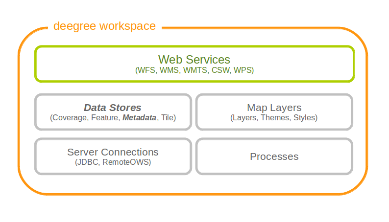

.. _anchor-configuration-metadatastore:

===============
Metadata stores
===============

Metadata stores are data stores that provide access to metadata records. The two common use cases for metadata stores are:

* Accessing via CSW
* Providing of metadata for web service resources (TBD)

The remainder of this chapter describes some relevant terms and the metadata store configuration files in detail. You can access this configuration level by clicking on the **metadata stores** link in the administration console. The configuration files are located in the **datasources/metadata/** directory of the deegree workspace.

   Metadata store resources provide access to metadata records

----------------------------
Memory ISO Metadata store 
----------------------------
The memory ISO metadata store implementation is transactional and works file based.

The memory metadata store configuration is defined by schema file http://schemas.deegree.org/datasource/metadata/iso19139/3.2.0/memory.xsd

.. topic:: Memory ISO Metadatastore config (skeleton)

   .. literalinclude:: xml/metadatastore_iso_memory.xml
      :language: xml
      
The root element has to be ``ISOMemoryMetadataStore`` and the config attribute must be ``3.2.0``. The only mandatory element is:

* ``ISORecordDirectory``: A list of directories containing records loaded in the store during start of the store.  

To allow insert transactions one optional element must be declared:

* ``InsertDirectory``: Directory to store inserted records, can be one of the directories declared in the element ``ISORecordDirectory``.  

------------------------
SQL ISO Metadata store 
------------------------
The SQL ISO metadata store implementation currently supports the following backends:

* PostgreSQL (8.3, 8.4, 9.0, 9.1, 9.2) with PostGIS extension (1.4, 1.5, 2.0)
* Oracle Spatial (10g, 11g)
* Microsoft SQL Server (2008, 2012)

.. tip::
  If you want to use the SQL ISO metadata store with Oracle or Microsoft SQL Server, you will need to add additional modules first. This is described in :ref:`anchor-db-libraries`.

The SQL metadata store configuration is defined by schema file http://schemas.deegree.org/datasource/metadata/iso19115/3.2.0/iso19115.xsd

.. topic:: SQL ISO Metadatastore config (skeleton)

   .. literalinclude:: xml/metadatastore_iso_sql.xml
      :language: xml

The root element has to be ``ISOMetadataStore`` and the config attribute must be ``3.2.0``. The only mandatory element is:

* ``JDBCConnId``: Id of the JDBC connection to use (see ...)

The optional elements are:

* ``Inspectors``: List of inspectors inspecting a metadataset before inserting. Known inspectors are:

  * FileIdentifierInspector
  * InspireInspector
  * CoupledResourceInspector
  * SchemaValidator
  * NamespaceNormalizer
* ``AnyText``: Configuration of the values searchable by the queryable property ``AnyText``, possible values are:

  * All: all values
  * Core: the core queryable properties (default)
  * Custom: a custom set of properties defined as xpath expressions
* ``QueryableProperties``: Configuration of additional query properties. Detailed informations can be found in the following example:

     .. literalinclude:: xml/metadatastore_iso_sql_qp.snippet
        :language: xml

.. hint::
  If a new queryable property is added or the AnyText value changed the inserted metadata records are not adjusted to this changes! This means for the example above that an existing record with SpatialRepresentationType 'raster' is not found by searching for all records with this type until the record is inserted or updated again!   

-----------------------------
SQL EBRIM/EO Metadata store
-----------------------------

TBD
