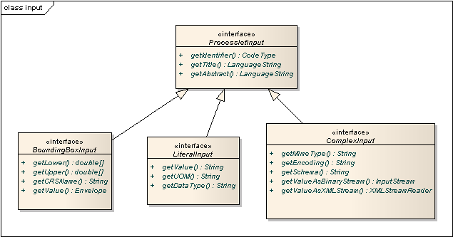

.. _anchor-configuration-processproviders:

=================
Process providers
=================

Process providers plug geospatial processes into the :ref:`anchor-configuration-wps`.

The remainder of this chapter describes some relevant terms and the process provider configuration files in detail. You can access this configuration level by clicking on the **processes** link in the administration console. The corresponding configuration files are located in the **processes/** subdirectory of the active deegree workspace directory.

.. figure:: images/workspace-overview-process.png
   :figwidth: 80%
   :width: 80%
   :target: _images/workspace-overview-process.png

   Process providers plug geospatial processes into the WPS

---------------------
Java process provider
---------------------

A Java process provider injects processes written in the Java programming language. In order to set up a working Java process provider resource, two things are required:

* A Java process provider configuration file
* A *Processlet*: The Java class with the actual process code

The first item is an XML resource configuration file like any other deegree resource configuration. The second is special to this kind of resource. It provides the byte code with the process logic and has to be accessible by deegree's classloader. There are several options to make custom Java code available to deegree webservices (see :ref:`anchor-adding-jars` for details), but the most common options are:

* Putting class files into the ``classes/`` directory of the workspace
* Putting JAR files into the ``modules/`` directory of the workspace

^^^^^^^^^^^^^^^^^^^^^^^^^^^^^
Minimal configuration example
^^^^^^^^^^^^^^^^^^^^^^^^^^^^^

A very minimal valid configuration example looks like this:

.. topic:: Java process provider: Minimal example (resource configuration)

   .. literalinclude:: xml/java_processprovider_minimal.xml
      :language: xml

This example defines a bogus process with the following properties:

* Identifier: ``Process42`` 
* Bound to Java code from class ``Processlet42``
* Title **Calculates the answer to life, the universe and everything** (returned in WPS responses)
* No input parameters
* Single output parameter with identifier ``Answer`` and title **The universal answer**

In order to make this configuration work, a matching Processlet is required:

.. topic:: Java process provider: Minimal example (Java code)

   .. literalinclude:: java/java_processprovider_minimal.java
      :language: java

^^^^^^^^^^^^^^^^^^^^^^^^^^^^^^^^^^
More complex configuration example 
^^^^^^^^^^^^^^^^^^^^^^^^^^^^^^^^^^

A more complex configuration example looks like this:

.. topic:: Java process provider: More complex example (resource configuration)

   .. literalinclude:: xml/java_processprovider_complex.xml
      :language: xml

^^^^^^^^^^^^^^^^^^^^^
Configuration options
^^^^^^^^^^^^^^^^^^^^^

The configuration format for the Java process provider is defined by schema file http://schemas.deegree.org/processes/java/3.0.0/java.xsd. The following table lists all available configuration options. When specifiying them, their order must be respected.

.. table:: Options for ``ProcessDefinition`` configuration files

+------------------+-------------+---------+------------------------------------------------------------------------------+
| Option           | Cardinality | Value   | Description                                                                  |
+==================+=============+=========+==============================================================================+
| @processVersion  | 1           | String  | Release version of this process (metadata)                                   |
+------------------+-------------+---------+------------------------------------------------------------------------------+
| @storeSupported  | 0..1        | Boolean | If set to true, asynchronous execution will become available                 |
+------------------+-------------+---------+------------------------------------------------------------------------------+
| @statusSupported | 0..1        | Boolean | If set to true, process code provides status information                     |
+------------------+-------------+---------+------------------------------------------------------------------------------+
| Identifier       | 1           | Complex | Identifier of the process                                                    |
+------------------+-------------+---------+------------------------------------------------------------------------------+
| JavaClass        | 1           | String  | Fully qualified name of the Java class that implements the process logic     |
+------------------+-------------+---------+------------------------------------------------------------------------------+
| Title            | 1           | Complex | Short and meaningful title (metadata)                                        |
+------------------+-------------+---------+------------------------------------------------------------------------------+
| Abstract         | 0..1        | Complex | Short, human readable description (metadata)                                 |
+------------------+-------------+---------+------------------------------------------------------------------------------+
| Metadata         | 0..n        | String  | Additional metadata                                                          |
+------------------+-------------+---------+------------------------------------------------------------------------------+
| Profile          | 0..n        | String  | Profile to which the WPS process complies (metadata)                         |
+------------------+-------------+---------+------------------------------------------------------------------------------+
| WSDL             | 0..1        | String  | URL of a WSDL document which describes this process (metadata)               |
+------------------+-------------+---------+------------------------------------------------------------------------------+
| InputParameters  | 0..1        | Complex | Definition and metadata of the input parameters                              |
+------------------+-------------+---------+------------------------------------------------------------------------------+
| OutputParameters | 1           | Complex | Definition and metadata of the output parameters                             |
+------------------+-------------+---------+------------------------------------------------------------------------------+

The following sections describe these options and their sub-options in detail.

^^^^^^^^^^^^^^^
General options
^^^^^^^^^^^^^^^

* ``processVersion``: The processVersion attribute has to be managed by the process developer and describes the version of the process implementation. This parameter is usually increased when changes to the implementation of a process apply. Reported by the WPS to clients.
* ``Identifier``: The Identifier element must contain an appropriate unambiguous identifier. Reported by the WPS to clients.
* ``Title``: Short and meaningful title. Reported by the WPS to clients.
* ``Abstract``: Short, human readable description. Reported by the WPS to clients.
* ``Metadata``: Additional metadata
* ``Profile``: Profile to which the WPS process complies. Reported by the WPS to clients.
* ``WSDL``: URL of a WSDL document which describes this process. Reported by the WPS to clients.

^^^^^^^^^^^^^^^^^^^^
The processlet class
^^^^^^^^^^^^^^^^^^^^

Option ``JavaClass`` specifies the fully qualified name of a Java class. This class has to implement deegree's ``Processlet`` Java interface (qualified name: ``org.deegree.services.wps.Processlet``):

.. topic:: Java process provider: Processlet interface

   .. literalinclude:: java/Processlet.java
      :language: java

As you can see, this interface defines three methods that every processlet must implement:

* ``init()``: Called once when the workspace initializes the Java process provider resource that references the class.
* ``destroy()``: Called once when the workspace destroys the Java process provider resource that references the class.
* ``process(...)``: Called every time an Execute request is sent to the WPS that targets this process. It usually reads the input parameters, performs the actual computation and writes the output parameters.

.. tip::
  The Java process provider instantiates the referenced process class only once. Multiple simultaneous executions of a process can occur (e.g. when parallel Execute-requests are sent to a WPS), and therefore, the process class must be implemented in a thread-safe manner. This behaviour is identical to the well-known Java Servlet interface (hence the name Processlet).

""""""""""""""""""""""
Processlet compilation
""""""""""""""""""""""

In order to succesfully compile a ``Processlet`` implementation, you will need to make the required dependencies available to the compiler (such as deegree's ``Processlet`` interface). Generally, this means that the Java module ``deegree-services-wps`` (and it's dependencies) have to be on the build path. We suggest to use Apache Maven for this. Here's an example POM for your convenience:

.. topic:: Java process provider: Example for Maven POM for writing processlets

   .. literalinclude:: xml/java_processprovider_pom.xml
      :language: xml

.. tip::
  You can use this POM to compile the example Processlets above to create a JAR file that you can put into the ``modules`` directory of the deegree workspace. Just create an empty directory somewhere and save the Example POM as ``pom.xml``. Place the Processlet Java files into subdirectory ``src/main/java/`` (as files ``Processlet42.java`` / ``AdditionProcesslet.java``). On the command line, change to the project directory and use ``mvn package`` (Apache Maven 3.0 and a compatible Java JDK have to be installed). Subdirectory ``target`` should now contain a JAR file that you can copy into the ``modules`` directory of the deegree workspace. 

"""""""""""""""""""""""""""""""""""""""
Invoking processlets using WPS requests
"""""""""""""""""""""""""""""""""""""""

.. hint::
  In order to perform WPS request to access your processlet, you will need to have an active :ref:`anchor-configuration-wps` resource in your workspace (which handles the WPS protocol and forwards the request to the process provider and the processlet).

The general idea of the WPS specification is that a client connects to a WPS server and invokes processes offered by the server to perform a computation. However, in some cases, you may just want to send raw WPS requests to a server and check the response (e.g. for testing the behaviour of your processlet). The `WPS 1.0.0 specification <http://www.opengeospatial.org/standards/wps>`_ defines KVP, XML and SOAP-encoded requests. All encodings are supported by the deegree WPS, so you can choose the most appropriate one for your use-case. For sending KVP-requests, you can simply use your web browser (or command line tools like wget or curl). XML or SOAP requests can be send using deegree's generic client.

.. tip::
  :ref:`anchor-workspace-wps` contains XML example requests which demonstrate many of the features of the WPS protocol, such as input parameter passing (inline or by reference), return parameters (inline or by reference), response variants and asynchronous execution.
  
^^^^^^^^^^^^^^^^^^^^^^^^^^^
Input and output parameters
^^^^^^^^^^^^^^^^^^^^^^^^^^^

Besides the process logic, the most crucial topic of Processlet implementation is the definition and handling of input and output parameters. The deegree WPS and the Java process provider support all parameter types that are defined by the `WPS 1.0.0 specification <http://www.opengeospatial.org/standards/wps>`_:

* LiteralInput / LiteralOutput: Simple parameters with literal values, that are given as a simple string e.g. "red", "42", "highway 101"
* BoundingBoxInput / BoundingBoxOutput: A geo-referenced bounding box given in a specified or a default CRS
* ComplexInput / ComplexOutput: Either an XML structure (e.g. GML encoded features) or binary data (e.g. coverage data as a GeoTIFF)

In order to create your own process, first find out which input and output parameters you want it to have. During implementation, each parameter has to be considered twice:

* It has to be defined in the resource configuration file
* It has to be read or written in the Processlet

The definition in the resource configuration is used to specify the metadata (identifier, title, abstract, datatype) of the parameter. The WPS will report it in response to ``DescribeProcess`` requests. When performing ``Execute`` requests, the deegree WPS will also perform a basic check of the validity of the input parameters (identifier, occurence, type) and issue an ``ExceptionReport`` if the constraints are not met.

""""""""""""""""""""""""""""""""""""""""""""""
Basics of defining input and output parameters
""""""""""""""""""""""""""""""""""""""""""""""

In order to define a parameter of a process, create a new child element in your process provider configuration:

* Input: Add a ``LiteralInput``, ``BoundingBoxInput`` or ``ComplexInput`` element to section ``InputParameters``
* Output: Add a ``LiteralOutput``, ``BoundingBoxOutput`` or ``ComplexOutput`` element to section ``OutputParameters``

Here's an ``InputParameters`` example that defines four parameters:

.. topic:: Java process provider: Example for ``InputParameters`` section

   .. literalinclude:: xml/java_processprovider_inputs.xml
      :language: xml

Here's an ``OutputParameters`` example that defines four parameters:

.. topic:: Java process provider: Example for ``OutputParameters`` section

   .. literalinclude:: xml/java_processprovider_outputs.xml
      :language: xml

Each parameter definition element (LiteralInput/LiteralOutput, BoundingBoxInput/BoundingBoxOutput, ComplexInput/ComplexOutput) has the following common options:

.. table:: Common options for defining input and output parameters

+------------------+-------------+---------+------------------------------------------------------------------------------+
| Option           | Cardinality | Value   | Description                                                                  |
+==================+=============+=========+==============================================================================+
| Identifier       | 1           | Complex | Identifier of the parameter                                                  |
+------------------+-------------+---------+------------------------------------------------------------------------------+
| Title            | 1           | Complex | Short and meaningful title (metadata)                                        |
+------------------+-------------+---------+------------------------------------------------------------------------------+
| Abstract         | 0..1        | Complex | Short, human readable description (metadata)                                 |
+------------------+-------------+---------+------------------------------------------------------------------------------+
| Metadata         | 0..n        | String  | Additional metadata                                                          |
+------------------+-------------+---------+------------------------------------------------------------------------------+

Besides the identifier of the parameter, these parameters just define metadata that the WPS reports. Additionally, each input parameter definition element (LiteralInput, BoundingBoxInput, ComplexInput) supports the following two attributes:

.. table:: Additional options for defining input parameters

+------------------+-------------+---------+------------------------------------------------------------------------------+
| Option           | Cardinality | Value   | Description                                                                  |
+==================+=============+=========+==============================================================================+
| @minOccurs       | 0..n        | Integer | Minimum number of times the input has to be present in a request, default: 1 |
+------------------+-------------+---------+------------------------------------------------------------------------------+
| @maxOccurs       | 0..n        | String  | Maximum number of times the input has to be present in a request, default: 1 |
+------------------+-------------+---------+------------------------------------------------------------------------------+

The differences and special options of the individual parameter types (Literal, Bounding Box, Complex) are described in the following sections.

"""""""""""""""""""""""""""""""""""""""""""""""
Basics of accessing input and output parameters
"""""""""""""""""""""""""""""""""""""""""""""""

The first two arguments that of ``Processlet#process(..)`` provide access to the input parameter values and output parameter sinks. The first argument is of type ``ProcessletInputs`` and encapsulates the process input parameters. Here's an example snippet that shows how to access the input parameter with identifier ``LiteralInput``:

.. code-block:: java

   public void process( ProcessletInputs in, ProcessletOutputs out, ProcessletExecutionInfo info )
                        throws ProcessletException {

       ProcessletInput literalInput = in.getParameter( "LiteralInput" );
       [...]
   }

The ``getParameter(...)`` method of ``ProcessletInputs`` takes the identifier of the process parameter as an argument and returns a ``ProcessletInput`` (without the **s**)  object that provides access to the actual value of the process parameter. Type ``ProcessletInput`` is the parent of three Java types that directly correspond to three input parameter types of the process provider configuration:

   ProcessletInput interface and sub types for each parameter type

For example, if your input parameter definition "A" is a ``BoundingBoxInput``, then the Java type for this parameter will be ``BoundingBoxInput`` as well. In your Java code, use a type cast to narrow the return type: 

.. code-block:: java

   public void process( ProcessletInputs in, ProcessletOutputs out, ProcessletExecutionInfo info )
                        throws ProcessletException {

       BoundingBoxInput inputA = (BoundingBoxInput) in.getParameter( "A" );
       [...]
   }

.. tip::
  If an input parameter can occur multiple times (``maxOccurs`` > 1 in the definition), use method ``getParameters(...)`` instead of ``getParameter(...)``.

Output parameters are treated in a similar manner. The second parameter of ``Processlet#process(..)`` provides to output parameter sinks. It is of type ``ProcessletOutputs``. Here's a basic usage example:

.. code-block:: java

   public void process( ProcessletInputs in, ProcessletOutputs out, ProcessletExecutionInfo info )
                        throws ProcessletException {

       ProcessletOutput literalOutput = out.getParameter( "LiteralOutput" );
       [...]
   }

Again, there are three subtypes. Each subtype of ``ProcessletOutput`` corresponds to one output parameter type:

.. figure:: images/java_processprovider_outputtypes.png
   :target: _images/java_processprovider_outputtypes.png

   ProcessletOutput interface and sub types for each parameter type

""""""""""""""""""
Literal parameters
""""""""""""""""""

Literal input and output parameter definitions have the following additional options:

.. table:: Additional options of ``LiteralOutput`` parameters

+---------------------+-------------+---------+------------------------------------------------------------------------------+
| Option              | Cardinality | Value   | Description                                                                  |
+=====================+=============+=========+==============================================================================+
| DataType            | 0..1        | String  | Data Type of this input (or output), default: unspecified (string)           |
+---------------------+-------------+---------+------------------------------------------------------------------------------+
| DefaultUOM          | 0..1        | String  | Default unit of measure, default: unspecified                                |
+---------------------+-------------+---------+------------------------------------------------------------------------------+
| OtherUOM            | 0..n        | String  | Alternative unit of measure                                                  |
+---------------------+-------------+---------+------------------------------------------------------------------------------+
| DefaultValue        | 0..1        | String  | Default value of this input (only for inputs)                                |
+---------------------+-------------+---------+------------------------------------------------------------------------------+
| AllowedValues       | 0..1        | Complex | Constraints based on value sets and ranges (only for inputs)                 |
+---------------------+-------------+---------+------------------------------------------------------------------------------+
| ValidValueReference | 0..1        | Complex | References to externally defined value sets and ranges (only for inputs)     |
+---------------------+-------------+---------+------------------------------------------------------------------------------+

These options basically define the metadata that the WPS publishes to clients. For the sub-options of the ``AllowedValues`` and ``ValidValueReference`` options, please refer to the `WPS 1.0.0 specification <http://www.opengeospatial.org/standards/wps>`_ or the XML schema for the Java process provider configuration format (http://schemas.deegree.org/processes/java/3.0.0/java.xsd).

In order to work with a ``LiteralInput`` parameter in the Processlet code, the corresponding Java type offers the following methods:

.. code-block:: java

    /**
     * Returns the literal value.
     *
     * @see #getUOM()
     * @return the literal value (has to be in the correct UOM)
     */
    public String getValue();

    /**
     * Returns the UOM (unit-of-measure) for the literal value, it is guaranteed that the returned UOM is supported for
     * this parameter (according to the process description).
     *
     * @return the requested UOM (unit-of-measure) for the literal value, may be null if no UOM is specified in the
     *         process description
     */
    public String getUOM();

    /**
     * Returns the (human-readable) literal data type from the process definition, e.g. <code>integer</code>,
     * <code>real</code>, etc).
     *
     * @return the data type, or null if not specified in the process definition
     */
    public String getDataType();

Similarly, the ``LiteralOutput`` type offers the following methods:

.. code-block:: java

    /**
     * Sets the value for this output parameter of the {@link Processlet} execution.
     *
     * @see #getRequestedUOM()
     * @param value
     *            value to be set (in the requested UOM)
     */
    public void setValue( String value );

    /**
     * Returns the requested UOM (unit-of-measure) for the literal value, it is guaranteed that this UOM is supported
     * for this parameter (according to the process description).
     *
     * @return the requested UOM (unit-of-measure) for the literal value, may be null
     */
    public String getRequestedUOM();

    /**
     * Returns the announced literal data type from the process definition (e.g. integer, real, etc) as an URI, such as
     * <code>http://www.w3.org/TR/xmlschema-2/#integer</code>.
     *
     * @return the data type, or null if not specified in the process definition
     */
    public String getDataType();

""""""""""""""""""""""
BoundingBox parameters
""""""""""""""""""""""

BoundingBox input and output parameter definitions have the following additional options:

.. table:: Additional options for ``BoundingBoxInput`` and ``BoundingBoxOutput`` parameters

+---------------------+-------------+---------+------------------------------------------------------------------------------+
| Option              | Cardinality | Value   | Description                                                                  |
+=====================+=============+=========+==============================================================================+
| DefaultCRS          | 1           | String  | Identifier of the default coordinate reference system                        |
+---------------------+-------------+---------+------------------------------------------------------------------------------+
| OtherCRS            | 0..n        | String  | Additionally supported coordinate reference system                           |
+---------------------+-------------+---------+------------------------------------------------------------------------------+

In order to work with a ``BoundingBoxInput`` parameter in the Processlet code, the corresponding Java type offers the following methods:

.. code-block:: java

    /**
     * Returns the lower corner point of the bounding box.
     *
     * @return the lower corner point
     */
    public double[] getLower();

    /**
     * Returns the upper corner point of the bounding box.
     *
     * @return the upper corner point
     */
    public double[] getUpper();

    /**
     * Returns the CRS (coordinate reference system) name of the bounding box.
     *
     * @return the CRS (coordinate reference system) name or null if unspecified
     */
    public String getCRSName();

    /**
     * Returns the bounding box value, it is guaranteed that the CRS (coordinate reference system) of the returned
     * {@link Envelope} is supported for this parameter (according to the process description).
     *
     * @return the value
     */
    public Envelope getValue();

Similarly, the ``BoundingBoxOutput`` type offers the following methods:

.. code-block:: java

    /**
     * Sets the value for this output parameter of the {@link Processlet} execution.
     *
     * @param lowerX
     * @param lowerY
     * @param upperX
     * @param upperY
     * @param crsName
     */
    public void setValue( double lowerX, double lowerY, double upperX, double upperY, String crsName );

    /**
     * Sets the value for this output parameter of the {@link Processlet} execution.
     *
     * @param lower
     * @param upper
     * @param crsName
     */
    public void setValue( double[] lower, double[] upper, String crsName );

    /**
     * Sets the value for this output parameter of the {@link Processlet} execution.
     *
     * @param value
     *            value to be set
     */
    public void setValue( Envelope value );

""""""""""""""""""
Complex parameters
""""""""""""""""""

Complex input and output parameter definitions have the following additional options:

.. table:: Additional options for ``ComplexInput`` and ``ComplexOutput`` parameters

+---------------------+-------------+---------+------------------------------------------------------------------------------+
| Option              | Cardinality | Value   | Description                                                                  |
+=====================+=============+=========+==============================================================================+
| @maximumMegabytes   | 0..n        | Integer | Maximum file size, in megabytes (only for inputs)                            |
+---------------------+-------------+---------+------------------------------------------------------------------------------+
| DefaultFormat       | 1           | Complex | Definition of the default XML or binary format                               |
+---------------------+-------------+---------+------------------------------------------------------------------------------+
| OtherFormats        | 0..n        | Complex | Definition of an alternative XML or binary format                            |
+---------------------+-------------+---------+------------------------------------------------------------------------------+

A complex format (``DefaultFormat``/``OtherFormat``) is defined via three attributes (compare with the `WPS 1.0.0 specification <http://www.opengeospatial.org/standards/wps>`_):

.. table:: Attributes for format definitions

+---------------------+-------------+---------+------------------------------------------------------------------------------+
| Option              | Cardinality | Value   | Description                                                                  |
+=====================+=============+=========+==============================================================================+
| @mimeType           | 0..1        | String  | Mime type of the content, default: unspecified                               |
+---------------------+-------------+---------+------------------------------------------------------------------------------+
| @encoding           | 0..1        | String  | Encoding of the content, default: unspecified                                |
+---------------------+-------------+---------+------------------------------------------------------------------------------+
| @schema             | 0..1        | String  | XML schema of the content, default: unspecified                              |
+---------------------+-------------+---------+------------------------------------------------------------------------------+

In order to work with a ``ComplexInput`` parameter in the Processlet code, the corresponding Java type offers the following methods:

.. code-block:: java

    /**
     * Returns the mime type of the input.
     * 
     * @return the mime type of the input, may be <code>null</code>
     */
    public String getMimeType();

    /**
     * Returns the encoding information supplied with the input.
     * 
     * @return the encoding information supplied with the input, may be <code>null</code>
     */
    public String getEncoding();

    /**
     * Returns the schema URL supplied with the input.
     * 
     * @return the schema URL supplied with the input, may be <code>null</code>
     */
    public String getSchema();

    /**
     * Returns an {@link InputStream} for accessing the complex value as a raw stream of bytes (usually for binary
     * input).
     * 

     * NOTE: Never use this method if the input parameter is encoded in XML -- use {@link #getValueAsXMLStream()}
     * instead. Otherwise erroneous behaviour has to be expected (if the input value is given embedded in the execute
     * request document).
     * 

     * 
     * @see #getValueAsXMLStream()
     * @return the input value as a raw stream of bytes
     * @throws IOException
     *             if accessing the value fails
     */
    public InputStream getValueAsBinaryStream()
                            throws IOException;

    /**
     * Returns an {@link XMLStreamReader} for accessing the complex value as an XML event stream.
     * 

     * NOTE: Never use this method if the input parameter is a binary value -- use {@link #getValueAsBinaryStream()}
     * instead.
     * 

     * The returned stream will point at the first START_ELEMENT event of the data.
     * 
     * @return the input value as an XML event stream, current event is START_ELEMENT (the root element of the data
     *         object)
     * @throws IOException
     *             if accessing the value fails
     * @throws XMLStreamException
     */
    public XMLStreamReader getValueAsXMLStream()
                            throws IOException, XMLStreamException;

Similarly, the ``ComplexOutput`` type offers the following methods:

.. code-block:: java

    /**
     * Returns a stream for writing binary output.
     * 
     * @return stream for writing binary output, never <code>null</code>
     */
    public OutputStream getBinaryOutputStream();

    /**
     * Returns a stream for for writing XML output. The stream is already initialized with a
     * {@link XMLStreamWriter#writeStartDocument()}.
     * 
     * @return a stream for writing XML output, never <code>null</code>
     * @throws XMLStreamException
     */
    public XMLStreamWriter getXMLStreamWriter()
                            throws XMLStreamException;

    /**
     * Returns the requested mime type for the complex value, it is guaranteed that the mime type is supported for this
     * parameter (according to the process description).
     * 
     * @return the requested mime type, never <code>null</code> (as each complex output format has a default mime type)
     */
    public String getRequestedMimeType();

    /**
     * Returns the requested XML format for the complex value (specified by a schema URL), it is guaranteed that the
     * format is supported for this parameter (according to the process description).
     * 
     * @return the requested schema (XML format), may be <code>null</code> (as a complex output format may omit schema
     *         information)
     */
    public String getRequestedSchema();

    /**
     * Returns the requested encoding for the complex value, it is guaranteed that the encoding is supported for this
     * parameter (according to the process description).
     * 
     * @return the requested encoding, may be <code>null</code> (as a complex output format may omit encoding
     *         information)
     */
    public String getRequestedEncoding();

^^^^^^^^^^^^^^^^^^^^^^^^^^^^^^^^^^^^^^^^^^^^^
Asynchronous execution and status information
^^^^^^^^^^^^^^^^^^^^^^^^^^^^^^^^^^^^^^^^^^^^^

* ``storeSupported``: When the storeSupported attribute is set to "true", asynchronous process execution will be available. Note that this doesn't add any requirements to the actual process code, this is taken care of by deegree automatically. See the advanced topics section for more information.
* ``statusSupported``: If statusSupported is set to true, the process class is declared to provide status information, i.e. execution percentage. See the advanced topics section for more information.

