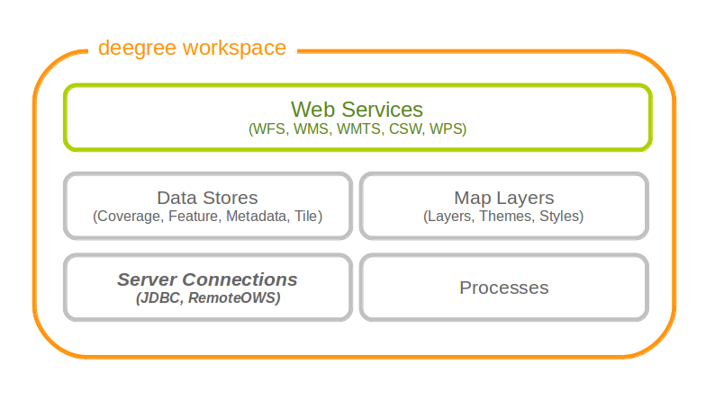

.. _anchor-configuration-serverconnections:

==================
Server connections
==================

Server connections are workspace resources that provide connections to remote services. These connections can then be used by other workspace resources. Some common example use cases:

* JDBC connection: Used by SQL feature stores to access the database that stores the feature data
* JDBC connection: Used by SQL ISO metadata stores to access the database that stores the metadata records
* WMS connection: Used by remote WMS layers to access remote WMS
* WMS connection: Used by remote WMS tile stores to access remote WMS
* WMTS connection: Used by remote WMTS tile stores to access remote WMTS

There are currently two categories of server connection resources, JDBC connections (to connect to SQL databases) and remote OWS connections (to connect to other OGC webservices).

   Server connection resources define how to obtain a connection to a remote server

.. _anchor-configuration-jdbc:

----------------
JDBC connections
----------------

These resources define connections to SQL databases, such as PostgreSQL/PostGIS, Oracle Spatial or Microsoft SQL Server.

.. hint::
   By default, deegree webservices includes JDBC drivers for connecting to PostgreSQL and Derby databases. If you want to make a connection to other SQL databases (e.g. Oracle), you will need to add a compatible JDBC driver manually. This is described in :ref:`anchor-oraclejars`.

^^^^^^^^^^^^^^^^^^^^^^^^^^^^^^^^^^^^^^^^^^
Minimal configuration example (PostgreSQL)
^^^^^^^^^^^^^^^^^^^^^^^^^^^^^^^^^^^^^^^^^^

This example defines a basic connection pool for a PostgreSQL/PostGIS database:

.. code-block:: xml

  <DataSourceConnectionProvider configVersion="3.4.0"
    xmlns="http://www.deegree.org/connectionprovider/datasource" xmlns:xsi="http://www.w3.org/2001/XMLSchema-instance"
    xsi:schemaLocation="http://www.deegree.org/connectionprovider/datasource http://schemas.deegree.org/jdbc/datasource/3.4.0/datasource.xsd">
  
    <!-- Creation / lookup of javax.sql.DataSource instance -->
    <DataSource javaClass="org.apache.commons.dbcp.BasicDataSource" />
  
    <!-- Configuration of DataSource properties -->
    <Property name="driverClassName" value="org.postgresql.Driver" />
    <Property name="url" value="jdbc:postgresql://localhost/deegree-db" />
    <Property name="username" value="kelvin" />
    <Property name="password" value="s3cr3t" />
    <Property name="maxActive" value="10" />
    
  </DataSourceConnectionProvider>

* The DataSource object uses Java class ``org.apache.commons.dbcp.BasicDataSource`` (a connection pool class provided by `Apache Commons DBCP <http://commons.apache.org/proper/commons-dbcp/index.html>`_.). If you don't know what this means, then this is most likely what you want to use.
* The JDBC driver class is ``org.postgresql.Driver`` (this is the Java class name to use for PostgreSQL/PostGIS databases).
* The JDBC URL is ``jdbc:postgresql://localhost:5432/deegree-db``. This means that PostgreSQL is running on the same machine, port 5432 (default). The database identifier is ``deegree-db``. Adapt these values to match to your setup.
* The database username is ``kelvin``, password is ``s3cr3t``. Adapt these parameters to match your setup.
* The maximum number of simultaneous connections is 10.

.. hint::
   There are additional properties that can be tweaked and which may improve performance. See :ref:`anchor-configuration-jdbc-properties`.

^^^^^^^^^^^^^^^^^^^^^^^^^^^^^^
Configuration example (Oracle)
^^^^^^^^^^^^^^^^^^^^^^^^^^^^^^

.. hint::
   By default, deegree webservices includes JDBC drivers for connecting to PostgreSQL and Derby databases. In order to connect to Oracle databases, you need to add a compatible JDBC driver manually. This is described in :ref:`anchor-oraclejars`.

This example defines a connection pool for an Oracle database:

.. code-block:: xml

  <DataSourceConnectionProvider configVersion="3.4.0"
    xmlns="http://www.deegree.org/connectionprovider/datasource" xmlns:xsi="http://www.w3.org/2001/XMLSchema-instance"
    xsi:schemaLocation="http://www.deegree.org/connectionprovider/datasource http://schemas.deegree.org/jdbc/datasource/3.4.0/datasource.xsd">
  
    <!-- Creation / lookup of javax.sql.DataSource instance -->
    <DataSource javaClass="org.apache.commons.dbcp.BasicDataSource" />
  
    <!-- Configuration of DataSource properties -->
    <Property name="driverClassName" value="org.postgresql.Driver" />
    <Property name="url" value="jdbc:postgresql://localhost/deegree-db" />
    <Property name="username" value="kelvin" />
    <Property name="password" value="s3cr3t" />
    <Property name="poolPreparedStatements" value="true" />
    <Property name="maxActive" value="10" />
    <Property name="maxIdle" value="10" />
  
  </DataSourceConnectionProvider>

This defines a database connection with the following properties:

* The DataSource object uses the Java class ``org.apache.commons.dbcp.BasicDataSource`` (a connection pool class provided by Apache DBCP). If you are not familiar with J2EE containers, this is most likely what you want to use.
* The JDBC driver class is ``org.postgresql.Driver``. This is the Java class name to use for PostgreSQL/PostGIS.
* The so-called JDBC URL is ``jdbc:postgresql://localhost:5432/deegree-db``. This means that PostgreSQL is running on the local machine, port 5432 (adapt host name and port as required). The database identifier is ``deegree-db``.
* The database username is ``kelvin``, password is ``s3cr3t``.
* The maximum number of simultaneous connections is 10.

^^^^^^^^^^^^^^^^^^^^^^^^^^^^^^^^^^^^^^^^^^^^
Configuration example (Microsoft SQL Server)
^^^^^^^^^^^^^^^^^^^^^^^^^^^^^^^^^^^^^^^^^^^^

.. hint::
   By default, deegree webservices includes JDBC drivers for connecting to PostgreSQL and Derby databases. In order to connect to Microsoft SQL Server, you need to add a compatible JDBC driver manually. This is described in :ref:`anchor-oraclejars`.

This example defines a connection pool for a Microsoft SQL Server:

.. code-block:: xml

  <DataSourceConnectionProvider configVersion="3.4.0"
    xmlns="http://www.deegree.org/connectionprovider/datasource" xmlns:xsi="http://www.w3.org/2001/XMLSchema-instance"
    xsi:schemaLocation="http://www.deegree.org/connectionprovider/datasource http://schemas.deegree.org/jdbc/datasource/3.4.0/datasource.xsd">
  
    <!-- Creation / lookup of javax.sql.DataSource instance -->
    <DataSource javaClass="org.apache.commons.dbcp.BasicDataSource" />
  
    <!-- Configuration of DataSource properties -->
    <Property name="driverClassName" value="org.postgresql.Driver" />
    <Property name="url" value="jdbc:postgresql://localhost/deegree-db" />
    <Property name="username" value="kelvin" />
    <Property name="password" value="s3cr3t" />
    <Property name="poolPreparedStatements" value="true" />
    <Property name="maxActive" value="10" />
    <Property name="maxIdle" value="10" />
  
  </DataSourceConnectionProvider>

This defines a database connection with the following properties:

* The DataSource object uses the Java class ``org.apache.commons.dbcp.BasicDataSource`` (a connection pool class provided by Apache DBCP). If you are not familiar with J2EE containers, this is most likely what you want to use.
* The JDBC driver class is ``org.postgresql.Driver``. This is the Java class name to use for PostgreSQL/PostGIS.
* The so-called JDBC URL is ``jdbc:postgresql://localhost:5432/deegree-db``. This means that PostgreSQL is running on the local machine, port 5432 (adapt host name and port as required). The database identifier is ``deegree-db``.
* The database username is ``kelvin``, password is ``s3cr3t``.
* The maximum number of simultaneous connections is 10.

^^^^^^^^^^^^^^^^^^^^^^^^^^^^
Configuration example (JNDI)
^^^^^^^^^^^^^^^^^^^^^^^^^^^^

This example uses a connection pool that is defined externally by the servlet container that runs deegree webservices (e.g. Apache Tomcat):

.. code-block:: xml

  <DataSourceConnectionProvider configVersion="3.4.0"
    xmlns="http://www.deegree.org/connectionprovider/datasource" xmlns:xsi="http://www.w3.org/2001/XMLSchema-instance"
    xsi:schemaLocation="http://www.deegree.org/connectionprovider/datasource http://schemas.deegree.org/jdbc/datasource/3.4.0/datasource.xsd">
  
    <!-- Creation / lookup of javax.sql.DataSource instance -->
    <DataSource javaClass="org.deegree.db.datasource.JndiLookup" factoryMethod="lookup">
      <Argument value="java:comp/env/jdbc/DatabaseName" javaClass="java.lang.String" />
    </DataSource>
  
  </DataSourceConnectionProvider>

* The DataSource object is retrieved using Java method ``lookup`` of class ``org.deegree.db.datasource.JndiLookup``. This is the correct value for retrieving a JNDI-defined connection pool.
* The JNDI name to look for is ``java:comp/env/jdbc/DatabaseName``. Adapt this value to match your setup.

^^^^^^^^^^^^^^^^^^^^^^^^^^^^^^^^^^
Configuration example (Oracle UCP)
^^^^^^^^^^^^^^^^^^^^^^^^^^^^^^^^^^

.. hint::
   By default, deegree webservices includes JDBC drivers for connecting to PostgreSQL and Derby databases. In order to connect to Oracle databases, you need to add a compatible JDBC driver manually. This is described in :ref:`anchor-oraclejars`.

This example uses a connection pool based on Oracle UCP (Universal Connection Pool):

.. code-block:: xml

  <DataSourceConnectionProvider configVersion="3.4.0"
    xmlns="http://www.deegree.org/connectionprovider/datasource" xmlns:xsi="http://www.w3.org/2001/XMLSchema-instance"
    xsi:schemaLocation="http://www.deegree.org/connectionprovider/datasource http://schemas.deegree.org/jdbc/datasource/3.4.0/datasource.xsd">
  
    <!-- Creation / lookup of javax.sql.DataSource instance -->
    <DataSource javaClass="oracle.ucp.jdbc.PoolDataSourceFactory" factoryMethod="getPoolDataSource" />
  
    <!-- Configuration of DataSource properties -->
    <Property name="connectionFactoryClassName" value="oracle.jdbc.pool.OracleDataSource" />
    <Property name="URL" value="jdbc:oracle:thin:@//localhost:1521/XE" />
    <Property name="user" value="kelvin" />
    <Property name="password" value="s3cr3t" />
    <Property name="initialPoolSize" value="5" />
    <Property name="minPoolSize" value="5" />
    <Property name="maxPoolSize" value="10" />
    <Property name="maxStatements" value="50" />
  
  </DataSourceConnectionProvider>

* The DataSource object is retrieved using Java method ``getPoolDataSource`` of class ``oracle.ucp.jdbc.PoolDataSourceFactory``. This is the correct value for creating an Oracle UCP connection pool.

.. _anchor-configuration-jdbc-properties:

^^^^^^^^^^^^^^^^^^^^^
Configuration options
^^^^^^^^^^^^^^^^^^^^^

The database connection config file format is defined by schema file http://schemas.deegree.org/jdbc/datasource/3.4.0/datasource.xsd. The root element is ``DataSourceConnectionProvider`` and the config attribute must be ``3.4.0``. The following table lists the available configuration options. When specifiying them, their order must be respected.

.. table:: Options for ``DataSourceConnectionProvider``

+------------+-------------+---------+--------------------------------------------------+
| Option     | Cardinality | Value   | Description                                      |
+============+=============+=========+==================================================+
| DataSource | 1..1        | Complex | Creation/lookup of javax.sql.DataSource object   |
+------------+-------------+---------+--------------------------------------------------+
| Property   | 0..n        | Complex | Configuration of javax.sql.DataSource object     |
+------------+-------------+---------+--------------------------------------------------+

Technically, the ``DataSource`` element defines how the ``javax.sql.DataSource`` object is retrieved. The retrieved object provides the actual database connections. The ``DataSource`` element allows for the following options:

+---------------+-------------+---------+-----------------------------------------------------------------+
| Option        | Cardinality | Value   | Description                                                     |
+===============+=============+=========+=================================================================+
| javaClass     | 1..1        | String  | Java class to use for instantiation/creation                    |
+---------------+-------------+---------+-----------------------------------------------------------------+
| factoryMethod | 0..1        | String  | If present, this static method is used (instead of constructor) |
+---------------+-------------+---------+-----------------------------------------------------------------+
| destroyMethod | 0..1        | String  | Configuration of javax.sql.DataSource object                    |
+---------------+-------------+---------+-----------------------------------------------------------------+
| Argument      | 0..1        | Complex | Argument to use for instantiation/method call                   |
+---------------+-------------+---------+-----------------------------------------------------------------+

Depending on the presence of attribute ``factoryMethod``, either the constructor of the specified ``javaClass`` will be invoked, or the static method of this class will be called. Here are two example snippets for clarification:

.. code-block:: xml

  ... 
  <DataSource javaClass="org.apache.commons.dbcp.BasicDataSource" />
  ...

In this snippet, no ``factoryMethod`` attribute is present. Therefore, the constructor of Java class ``org.apache.commons.dbcp.BasicDataSource`` is invoked. The returned instance must be an implementation of ``javax.sql.DataSource``, and this is guaranteed, because the class implements this interface. There are no arguments passed to the constructor.

.. code-block:: xml

  ... 
  <DataSource javaClass="org.deegree.db.datasource.JndiLookup" factoryMethod="lookup">
    <Argument value="java:comp/env/jdbc/DatabaseName" javaClass="java.lang.String" />
  </DataSource>
  ...

In this snippet, a ``factoryMethod`` attribute is present (``lookup``). Therefore, the static method of Java class ``org.deegree.db.datasource.JndiLookup`` is called. The value returned by this method must be a ``javax.sql.DataSource`` object, which is guaranteed by the implementation. A single String-valued argument with value ``java:comp/env/jdbc/DatabaseName`` is passed to the method.

For completeness, here's the list of configuration options of element ``Attribute``:

+------------+-------------+---------+----------------------------------------------------+
| Option     | Cardinality | Value   | Description                                        |
+============+=============+=========+====================================================+
| javaClass  | 1..1        | String  | Java class of the argument (e.g. java.lang.String) |
+------------+-------------+---------+----------------------------------------------------+
| value      | 1..1        | String  | Argument value                                     |
+------------+-------------+---------+----------------------------------------------------+

The ``Property`` child elements of element ``DataSourceConnectionProvider`` are used to configure properties of the ``javax.sql.DataSource`` instance:

.. code-block:: xml

  ... 
  <Property name="driverClassName" value="org.postgresql.Driver" />
  <Property name="url" value="jdbc:postgresql://localhost/deegree-db" />
  <Property name="username" value="kelvin" />
  <Property name="password" value="s3cr3t" />
  <Property name="poolPreparedStatements" value="true" />
  <Property name="maxActive" value="10" />
  <Property name="maxIdle" value="10" />
  ...

The properties available for configuration depend on the implementation of ``javax.sql.DataSource``:

* Apache Commons DBCP: See http://commons.apache.org/proper/commons-dbcp/api-1.4/org/apache/commons/dbcp/BasicDataSource.html
* Oracle UCP: http://docs.oracle.com/cd/E11882_01/java.112/e12826/oracle/ucp/jdbc/PoolDataSource.html

For completeness, here's the list of options of element ``Property``:

+--------+-------------+---------+----------------------+
| Option | Cardinality | Value   | Description          |
+========+=============+=========+======================+
| name   | 1..1        | String  | Name of the property |
+--------+-------------+---------+----------------------+
| value  | 1..1        | String  | Property value       |
+--------+-------------+---------+----------------------+

^^^^^^^^^^^^^^^^^^^^^^^^^^^
Legacy configuration format
^^^^^^^^^^^^^^^^^^^^^^^^^^^

Prior to deegree webservices release 3.4, a simpler (but limited) configuration format was used. Here's an example that connects to a PostgreSQL database on localhost, port 5432. The database to connect to is called 'inspire', the database user is 'postgres' and password is 'postgres'.

.. code-block:: xml

  <JDBCConnection configVersion="3.0.0" xmlns="http://www.deegree.org/jdbc" xmlns:xsi="http://www.w3.org/2001/XMLSchema-instance"
                  xsi:schemaLocation="http://www.deegree.org/jdbc http://schemas.deegree.org/jdbc/3.0.0/jdbc.xsd">
    <Url>jdbc:postgresql://localhost:5432/inspire</Url>
    <User>postgres</User>
    <Password>postgres</Password>
  </JDBCConnection>

The legacy connection config file format is defined by schema file http://schemas.deegree.org/jdbc/3.0.0/jdbc.xsd. The root element is ``JDBCConnection`` and the config attribute must be ``3.0.0``. The following table lists the available configuration options. When specifiying them, their order must be respected.

.. table:: Options for ``JDBCConnection``

+----------+-------------+--------+----------------------------------------+
| Option   | Cardinality | Value  | Description                            |
+==========+=============+========+========================================+
| Url      | 1..1        | String | JDBC URL (without username / password) |
+----------+-------------+--------+----------------------------------------+
| User     | 1..n        | String | DB username                            |
+----------+-------------+--------+----------------------------------------+
| Password | 1..1        | String | DB password                            |
+----------+-------------+--------+----------------------------------------+

----------------------
Remote OWS connections
----------------------

Remote OWS connections are typically configured with a capabilities document reference and optionally some HTTP request parameters (such as timeouts etc.). Contrary to earlier experiments these resources only define the actual connection to the service, not what is requested. This resource is all about *how* to request, not *what* to request. Other resources (such as a remote WMS tile store) which make use of such a server connection typically define *what* to request.

^^^^^^^^^^^^^^^^^^^^^
Remote WMS connection
^^^^^^^^^^^^^^^^^^^^^

The remote WMS connection can be used to connect to OGC WMS services. Versions 1.1.1 and 1.3.0 (with limitations) are supported.

Let's have a look at an example:

.. code-block:: xml

  <RemoteWMS xmlns="http://www.deegree.org/remoteows/wms" configVersion="3.1.0">
    <CapabilitiesDocumentLocation
      location="http://deegree3-demo.deegree.org/utah-workspace/services?request=GetCapabilities&amp;service=WMS&amp;version=1.1.1" />
    <ConnectionTimeout>10</ConnectionTimeout>
    <RequestTimeout>30</RequestTimeout>
    <HTTPBasicAuthentication>
      <Username>hans</Username>
      <Password>moleman</Password>
    </HTTPBasicAuthentication>
  </RemoteWMS>

* The capabilities document location is the only mandatory option. You can also use a relative path to a local copy of the capabilities document to improve startup time.
* The connection timeout defines (in seconds) how long to wait for a connection before throwing an error. Default is 5 seconds.
* The request timeout defines (in seconds) how long to wait for data before throwing an error. Default is 60 seconds.
* The http basic authentication options can be used to provide authentication credentials to use a HTTP basic protected service. Default is not to authenticate.

The WMS version will be detected from the capabilities document version. When using 1.3.0, there are some limitations (eg. GetFeatureInfo is not supported), and it is tested to a lesser extent compared with the 1.1.1 version.

^^^^^^^^^^^^^^^^^^^^^^
Remote WMTS connection
^^^^^^^^^^^^^^^^^^^^^^

The remote WMTS connection can be used to connect to a OGC WMTS service. Version 1.0.0 is supported. The configuration format is almost identical to the remote WMS configuration.

Let's have a look at an example:

.. code-block:: xml

  <RemoteWMTS xmlns="http://www.deegree.org/remoteows/wmts" configVersion="3.2.0">
    <CapabilitiesDocumentLocation
      location="http://deegree3-testing.deegree.org/utah-workspace/services?request=GetCapabilities&amp;service=WMTS&amp;version=1.0.0" />
    <ConnectionTimeout>10</ConnectionTimeout>
    <RequestTimeout>30</RequestTimeout>
    <HTTPBasicAuthentication>
      <Username>hans</Username>
      <Password>moleman</Password>
    </HTTPBasicAuthentication>
  </RemoteWMTS>

* The capabilities document location is the only mandatory option. You can also use a relative path to a local copy of the capabilities document to improve startup time.
* The connection timeout defines (in seconds) how long to wait for a connection before throwing an error. Default is 5 seconds.
* The request timeout defines (in seconds) how long to wait for data before throwing an error. Default is 60 seconds.
* The http basic authentication options can be used to provide authentication credentials to use a HTTP basic protected service. Default is not to authenticate.

GetTile and GetFeatureInfo operations are supported for remote WMTS resources.

