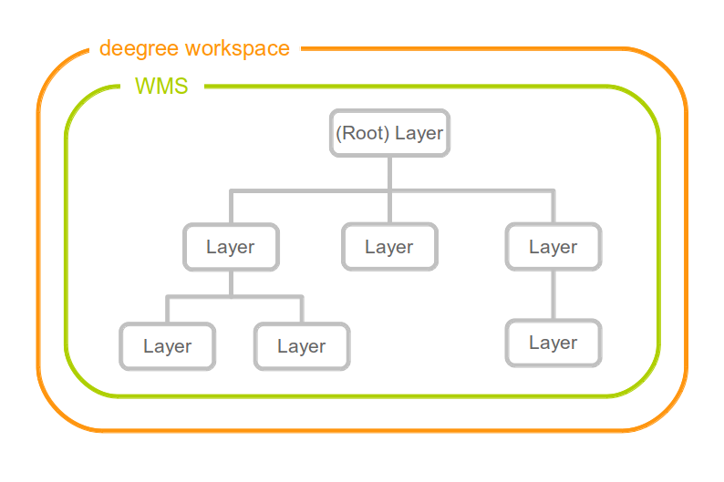
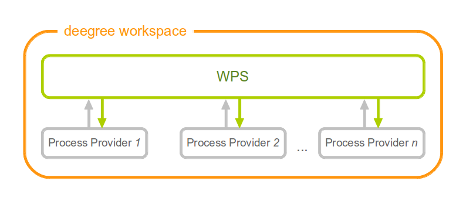

========================
Webservice configuration
========================

This chapter describes the deegree webservices configuration files. You can access this configuration level by clicking on the **web services** link in the administration console. The corresponding configuration files are located in the ``services/`` subdirectory of the active deegree workspace directory.

.. figure:: images/workspace-overview-services.png
   :figwidth: 80%
   :width: 80%
   :target: _images/workspace-overview-services.png

   Web services are the top-level resources of the deegree workspace

.. tip::
  Webservice configuration files are ordinary deegree workspace resources, but the identifier of a webservice resource (config file name without suffix) serves a special purpose. If your deegree instance can be reached at ``http://localhost:8080/deegree-webservices``, the common endpoint for connecting to your services is ``http://localhost:8080/deegree-webservices/services``. However, if you define multiple services of the same type in your workspace (e.g. two WMS instances with identifiers ``wms1`` and ``wms2``), you cannot use the common URL, as deegree cannot determine the targeted WMS instance from the request. In this case, simply append the webservice identifier to the common endpoint URL (e.g. ``http://localhost:8080/deegree-webservices/services/wms2``) to choose the service instance that you want to connect to explicitly.

.. _anchor-configuration-wfs:

-------------------------
Web Feature Service (WFS)
-------------------------

A deegree WFS configuration consists of a WFS configuration file and any number of feature store configuration files. Feature stores provide access to the actual feature data (which may be stored in any of the supported backends, e.g. in shapefiles or spatial databases such as PostGIS or Oracle Spatial). In transactional mode (WFS-T), feature stores are also used for modification of stored features:

.. figure:: images/workspace-wfs.png
   :figwidth: 80%
   :width: 80%
   :target: _images/workspace-wfs.png

   A WFS resource is connected to any number of feature store resources

.. tip::
  In order to fully master deegree WFS configuration, you will have to understand :ref:`anchor-configuration-featurestore` as well.

The only mandatory option is ``QueryCRS``, therefore, a minimal WFS configuration example looks like this:

.. topic:: WFS config example 1: Minimal configuration

   .. literalinclude:: xml/wfs_basic.xml
      :language: xml

This will create a deegree WFS with the feature types from all configured feature stores in the workspace and ``urn:ogc:def:crs:EPSG::4258`` as coordinate system for returned GML geometries. A more complex configuration that restricts the offered WFS protocol versions, enables transactions, has multiple coordinate reference systems and limits GML output to 3.2 looks like this:

.. topic:: WFS config example 2: More complex configuration

   .. literalinclude:: xml/wfs_complex.xml
      :language: xml

The deegree WFS config file format is defined by schema file http://schemas.deegree.org/services/wfs/3.2.0/wfs_configuration.xsd. The root element is ``deegreeWFS`` and the config attribute must be ``3.2.0``. The following table lists all available configuration options (complex ones contain nested options themselves). When specifiying them, their order must be respected.

.. table:: Options for ``deegreeWFS``

+-------------------------+-------------+---------+------------------------------------------------------------------+
| Option                  | Cardinality | Value   | Description                                                      |
+=========================+=============+=========+==================================================================+
| SupportedVersions       | 0..1        | Complex | Activated OGC protocol versions, default: all                    |
+-------------------------+-------------+---------+------------------------------------------------------------------+
| FeatureStoreId          | 0..n        | String  | Feature stores to attach, default: all                           |
+-------------------------+-------------+---------+------------------------------------------------------------------+
| EnableTransactions      | 0..1        | Complex | Enable transactions (WFS-T operations), default: false           |
+-------------------------+-------------+---------+------------------------------------------------------------------+
| EnableResponseBuffering | 0..1        | Boolean | Enable response buffering (expensive), default: false            |
+-------------------------+-------------+---------+------------------------------------------------------------------+
| QueryCRS                | 1..n        | String  | Announced CRS, first element is the default CRS                  |
+-------------------------+-------------+---------+------------------------------------------------------------------+
| QueryMaxFeatures        | 0..1        | Integer | Limit of features returned in a response, default: 15000         |
+-------------------------+-------------+---------+------------------------------------------------------------------+
| QueryCheckAreaOfUse     | 0..1        | Boolean | Check spatial query constraints against CRS area, default: false |
+-------------------------+-------------+---------+------------------------------------------------------------------+
| StoredQuery             | 0..n        | String  | File name of StoredQueryDefinition                               |
+-------------------------+-------------+---------+------------------------------------------------------------------+
| GMLFormat               | 0..n        | Complex | GML format configuration                                         |
+-------------------------+-------------+---------+------------------------------------------------------------------+
| CustomFormat            | 0..n        | Complex | Custom format configuration                                      |
+-------------------------+-------------+---------+------------------------------------------------------------------+
| MetadataURLTemplate     | 0..1        | String  | Template for generating URLs to feature type metadata            |
+-------------------------+-------------+---------+------------------------------------------------------------------+
| FeatureTypeMetadata     | 0..n        | Complex | Metadata for feature types reported in GetCapabilities response  |
+-------------------------+-------------+---------+------------------------------------------------------------------+
| ExtendedCapabilities    | 0..n        | Complex | Extended Metadata reported in GetCapabilities response           |
+-------------------------+-------------+---------+------------------------------------------------------------------+

The remainder of this section describes these options and their sub-options in detail.

^^^^^^^^^^^^^
Basic options
^^^^^^^^^^^^^

* ``SupportedVersions``: By default, all implemented WFS protocol versions (1.0.0, 1.1.0 and 2.0.0) are activated. You can control offered WFS protocol versions using element ``SupportedVersions``. This element allows any combination of the child elements ``<Version>1.0.0</Version>``, ``<Version>1.1.0</Version>`` and ``<Version>2.0.0</Version>``.
* ``FeatureStoreId``: By default, all feature stores in your deegree workspace  will be used for serving feature types. In some cases, this may not be what you want, e.g. because you have two different WFS instances running, or you don't want all feature types used in your WMS for rendering to be available via your WFS. Use the ``FeatureStoreId`` option to explicitly set the feature stores that this WFS should use.
* ``EnableTransactions``: By default, WFS-T requests will be rejected. Setting this element to ``true`` will enable support for transactions in the WFS. Note that not all feature store implementations implement transactions, so you may encounter that transactions are rejected, even though you activated them in the WFS configuration.
* ``EnableResponseBuffering``: By default, WFS responses are directly streamed to the client. This is very much recommended and even a requirement for transferring large responses efficiently. The only drawback happens if exceptions occur, after a partial response has already been transferred. In this case, the client will receive part payload and part exception report. By specifying ``false`` here, you can explicitly force buffering of the full response, before it is written to the client. Only if the full response could be generated successfully, it will be transferred. If an exception happens at any time the buffer will be discarded, and an exception report will be sent to the client. Buffering is performed in memory, but switches to a temp file in case the buffer grows bigger than 1 MiB.
* ``QueryCRS``: Coordinate reference systems for returned geometries. This element can be specified multiple times, and the WFS will announce all CRS in the GetCapabilities response (except for WFS 1.0.0 which does not officially support using multiple coordinate reference systems). The first element always specifies the default CRS (used when no CRS parameter is present in a request).
* ``QueryMaxFeatures``: By default, a maximum number of 15000 features will be returned for a single ``GetFeature`` request. Use this option to override this setting. A value of ``-1`` means unlimited.
* ``QueryCheckAreaOfUse``: By default, spatial query constraints are not checked with regard to the area of validity of the CRS. Set this option to ``true`` to enforce this check.

^^^^^^^^^^^^^^^^^^^^^^^^^^^
Adapting GML output formats
^^^^^^^^^^^^^^^^^^^^^^^^^^^

By default, a deegree WFS will offer GML 2, 3.0, 3.1, and 3.2 as output formats and announce those formats in the GetCapabilities responses (except for WFS 1.0.0, as this version of the standard has no means of announcing other formats than GML 2). The element for GetFeature responses is ``wfs:FeatureCollection``, as mandated by the WFS specification.

In some cases, you may want to alter aspects of the offered output formats. For example, if you want your WFS to serve a specific application schema (e.g. INSPIRE Data Themes), you should restrict the announced GML versions to the one used for the application schema. These and other output-format related aspects can be controlled by element ``GMLFormat``.

.. topic:: Example for WFS config option ``GMLFormat``

   .. literalinclude:: xml/wfs_gmlformat.xml
      :language: xml

The ``GMLFormat`` option has the following sub-options:

+------------------------------+--------------+---------+------------------------------------------------------------------------------+
| Option                       | Cardinality  | Value   | Description                                                                  |
+==============================+==============+=========+==============================================================================+
| @gmlVersion                  | 1..1         | String  | GML version (GML_2, GML_30, GML_31 or GML_32)                                |
+------------------------------+--------------+---------+------------------------------------------------------------------------------+
| MimeType                     | 1..n         | String  | Mime types associated with this format configuration                         |
+------------------------------+--------------+---------+------------------------------------------------------------------------------+
| GenerateBoundedByForFeatures | 0..1         | Boolean | Forces output of gml:boundedBy property for every feature                    |
+------------------------------+--------------+---------+------------------------------------------------------------------------------+
| GetFeatureResponse           | 0..1         | Complex | Options for controlling GetFeature responses                                 |
+------------------------------+--------------+---------+------------------------------------------------------------------------------+
| DecimalCoordinateFormatter/  | 0..1         | Complex | Controls the formatting of geometry coordinates                              |
| CustomCoordinateFormatter    |              |         |                                                                              |
+------------------------------+--------------+---------+------------------------------------------------------------------------------+

""""""""""""""""""""""""
Basic GML format options
""""""""""""""""""""""""

* ``@gmlVersion``: This attribute defines the GML version (GML_2, GML_30, GML_31 or GML_32)
* ``MimeType``: Mime types associated with this format configuration (and announced in GetCapabilities)
* ``GenerateBoundedByForFeatures``: By default, the ``gml:boundedBy`` property will only be exported for the member features if the feature store provides it. By setting this option to ``true``, the WFS will calculate the envelope and include it as a ``gml:boundedBy`` property. Please note that this setting does not affect the inclusion of the ``gml:boundedBy`` property for on the feature collection level (see DisableStreaming for that).

""""""""""""""""""""""""""""
GetFeature response settings
""""""""""""""""""""""""""""

Option ``GetFeatureResponse`` has the following sub-options:

+--------------------------+--------------+-----------+------------------------------------------------------------------------------+
| Option                   | Cardinality  | Value     | Description                                                                  |
+==========================+==============+===========+==============================================================================+
| ContainerElement         | 0..1         | QName     | Qualified root element name                                                  |
+--------------------------+--------------+-----------+------------------------------------------------------------------------------+
| FeatureMemberElement     | 0..1         | QName     | Qualified feature member element name                                        |
+--------------------------+--------------+-----------+------------------------------------------------------------------------------+
| AdditionalSchemaLocation | 0..1         | String    | Value to add to xsi:schemaLocation attribute                                 |
+--------------------------+--------------+-----------+------------------------------------------------------------------------------+
| DisableDynamicSchema     | 0..1         | Complex   |                                                                              |
+--------------------------+--------------+-----------+------------------------------------------------------------------------------+
| DisableStreaming         | 0..1         | Boolean   | Disables output streaming, include numberOfFeature information/gml:boundedBy |
+--------------------------+--------------+-----------+------------------------------------------------------------------------------+

* ``ContainerElement``: By default, the container element of a GetFeature response is ``wfs:FeatureCollection``. Using this option, you can specify an alternative element name. In order to bind the namespace prefix, use standard XML namespace mechanisms (xmlns attribute). This option is ignored for WFS 2.0.0.
* ``FeatureMemberElement``: By default, the member features are included in ``gml:featureMember`` (WFS 1.0.0/1.1.0) or ``wfs:member`` elements (WFS 2.0.0). Using this option, you can specify an alternative element name. In order to bind the namespace prefix, use standard XML namespace mechanisms (xmlns attribute). This option is ignored for WFS 2.0.0.
* ``AdditionalSchemaLocation``: By default, the ``xsi:schemaLocation`` attribute in a GetFeature response is auto-generated and refers to all schemas necessary for validation of the response. Using this option, you can add additional namespace/URL pairs for adding additional schemas. This may be required when you override the returned container or feature member elements in order to achieve schema-valid output.
* ``DisableDynamicSchema``: By default, the GML application schema referenced in the ``xsi:schemaLocation`` (and returned in DescribeFeature reponses) will be generated dynamically from the internal feature type representation. This allows generation of application schemas for the different GML versions and is fine for most simple feature models (e.g. feature types served from shapefiles or flat database tables). However, valid re-encoding of complex GML application schema (such as INSPIRE Data Themes) is technically not possible. In these cases, you will have to set this option to ``false``, so the WFS will return the original schema files used for configuring the feature store. If you want to make the xsi:schemaLocation refer to an external copy of your GML application schema files (instead of pointing back to the deegree WFS), use the optional attribute ``baseURL`` that this element provides.
* ``DisableStreaming``: By default, returned features are not collected in memory, but directly streamed from the backend (e.g. an SQL database) and individually encoded as GML. This enables the querying of huge numbers of features with only minimal memory footprint. However, by using this strategy, the number of features and their bounding box is not known when the WFS starts to write out the response. Therefore, this information is omitted from the response (which is perfectly valid according to WFS 1.0.0 and 1.1.0, and a change request for WFS 2.0.0 has been accepted). If you find that your WFS client has problems with the response, you may set this option to ``false``. Features will be collected in memory first and the generated response will include numberOfFeature information and gml:boundedBy for the collection. However, for huge response and heavy server load, this is not recommended as it introduces significant overhead and may result in out-of-memory errors.

"""""""""""""""""""""
Coordinate formatters
"""""""""""""""""""""

By default, GML geometries will be encoded using 6 decimal places for CRS with degree axes and 3 places for CRS with metric axes. In order to override this, two options are available:

* ``DecimalCoordinatesFormatter``: Empty element, attribute ``places`` specifies the number of decimal places.
* ``CustomCoordinateFormatter``: By specifiying this element, an implementation of Java interface ``org.deegree.geometry.io.CoordinateFormatter`` can be instantiated. Child element ``JavaClass`` contains the qualified name of the Java class (which must be on the classpath).

^^^^^^^^^^^^^^^^^^^^^^^^^^^^
Adding custom output formats
^^^^^^^^^^^^^^^^^^^^^^^^^^^^

Using option element ``CustomFormat``, it possible to plug-in your own Java classes to generate the output for a specific mime type (e.g. a binary format)

+-----------+-------------+---------+------------------------------------------------------+
| Option    | Cardinality | Value   | Description                                          |
+===========+=============+=========+======================================================+
| MimeType  | 1..n        | String  | Mime types associated with this format configuration |
+-----------+-------------+---------+------------------------------------------------------+
| JavaClass | 1..1        | String  | Qualified Java class name                            |
+-----------+-------------+---------+------------------------------------------------------+
| Config    | 0..1        | Complex | Value to add to xsi:schemaLocation attribute         |
+-----------+-------------+---------+------------------------------------------------------+

* ``MimeType``: Mime types associated with this format configuration (and announced in GetCapabilities)
* ``JavaClass``: Therefore, an implementation of interface ``org.deegree.services.wfs.format.CustomFormat`` must be present on the classpath.
* ``Config``:

^^^^^^^^^^^^^^^^^^^^
Controlling Metadata
^^^^^^^^^^^^^^^^^^^^

These settings affect the metadata returned in the GetCapabilities response.

* ``MetadataURLTemplate``:
* ``FeatureTypeMetadata``:

* ``ExtendedCapabilities``: By default, the GetCapabilites response does not contain any extended capabilities elements in the OperationsMetadata section. The child elements of this option will be included in the OperationMetadata section to provide these extended capabilities, e.g. an ``inspire_ds:ExtendedCapabilities`` element. The attribute ``wfsVersions`` is as white-space separated list of WFS versions (1.0.0, 1.1.0 or 2.0.0) for which the extended capabilities shall be returned.

.. topic:: Example for ``ExtendedCapabilities`` option

   .. literalinclude:: xml/wfs_extendedcapabilities.xml
      :language: xml

^^^^^^^^^^^^^^
Stored queries
^^^^^^^^^^^^^^

Besides standard (or ad hoc) queries, WFS 2.0.0 introduces so-called stored queries. When WFS 2.0.0 support is activated, your WFS will automatically support the well-known stored query ``urn:ogc:def:storedQuery:OGC-WFS::GetFeatureById`` (defined in the WFS 2.0.0 specification). It can be used to query a feature instance by specifying it's gml:id (similar to GetGmlObject requests in WFS 1.1.0). In order to define custom stored queries, use the ``StoredQuery`` element to specify the file name of a StoredQueryDefinition file. The given file name (can be relative) must point to a valid WFS 2.0.0 StoredQueryDefinition file. Here's an example:

.. topic:: Example for a WFS 2.0.0 StoredQueryDefinition file

   .. literalinclude:: xml/wfs_storedquerydefinition.xml
      :language: xml

This example is actually usable if your WFS is set up to serve the ad:Address feature type from INSPIRE Annex I. It defines the stored query ``urn:x-inspire:storedQuery:GetAddressesForStreet`` for retrieving ad:Address features that are located in the specified street. The street name is passed using parameter ``streetName``. If your WFS instance can be reached at ``http://localhost:8080/services``, you could use the request ``http://localhost:8080/services?request=GetFeature&storedquery_id=urn:x-inspire:storedQuery:GetAddressesForStreet&streetName=Madame%20Curiestraat`` to fetch the ad:Address features in street Madame Curiestraat.

.. tip::
  deegree WFS supports the execution of stored queries using ``GetFeature`` and ``GetPropertyValue`` requests. It also implements the ``ListStoredQueries`` and the ``DescribeStoredQueries`` operations. However, there is no support for ``CreateStoredQuery`` and ``DropStoredQuery`` at the moment.

.. _anchor-configuration-wms:

---------------------
Web Map Service (WMS)
---------------------

In deegree terminology, a deegree WMS renders maps from data stored in feature, coverage and tile stores. The WMS is configured using a layer structure, called a *theme*. A theme can be thought of as a collection of layers, organized in a tree structure. *What* the layers show is configured in a layer configuration, and *how* it is shown is configured in a style file. Supported style languages are StyledLayerDescriptor (SLD) and Symbology Encoding (SE).

   A WMS resource is connected to exactly one theme resource

.. tip::
  In order to fully understand deegree WMS configuration, you will have to learn configuration of other workspace aspects as well. Chapter :ref:`anchor-configuration-renderstyles` describes the creation of layers and styling rules. Chapter :ref:`anchor-configuration-featurestore` describes the configuration of vector data access and chapter :ref:`anchor-configuration-coveragestore` describes the configuration of raster data access.

^^^^^^^^^^^^^^^^^^^^^^^^^^^
A word on layers and themes
^^^^^^^^^^^^^^^^^^^^^^^^^^^

Readers familiar with the WMS protocol might be wondering why layers can not be configured directly in the WMS configuration file. Inspired by WMTS 1.0.0 we found the idea to separate structure and content very appealing. Thinking of a layer store that just offers a set of layers is an easy concept. Thinking of a theme as a structure that may contain layers at certain points also makes sense. But when thinking of WMS the terms begin clashing. We suggest to avoid confusion as much as possible by using the same name for each corresponding theme, layer and possibly even tile/feature/coverage data sources. We believe that once you work a little with the concept of themes, and seeing them exported as WMS layer trees, the concepts fit well enough so you can appreciate the clean cut.

^^^^^^^^^^^^^^^^^^^^^^
Configuration overview
^^^^^^^^^^^^^^^^^^^^^^

The configuration can be split up in six sections. Readers familiar with other deegree service configurations may recognize some similarities, but we'll describe the options anyway, because there may be subtle differences. A document template looks like this:

.. code-block:: xml

  <?xml version='1.0'?>
  <deegreeWMS xmlns='http://www.deegree.org/services/wms'>
    <!-- actual configuration goes here -->
  </deegreeWMS>

The following table shows what top level options are available.

.. table:: Options for ``deegreeWMS``

+--------------------------+--------------+---------+------------------------------------------------------------------------------+
| Option                   | Cardinality  | Value   | Description                                                                  |
+==========================+==============+=========+==============================================================================+
| SupportedVersions        | 0..1         | Complex | Limits active OGC protocol versions                                          |
+--------------------------+--------------+---------+------------------------------------------------------------------------------+
| MetadataStoreId          | 0..1         | String  | Configures a metadata store to check if metadata ids for layers exist        |
+--------------------------+--------------+---------+------------------------------------------------------------------------------+
| MetadataURLTemplate      | 0..1         | String  | Template for generating URLs to feature type metadata                        |
+--------------------------+--------------+---------+------------------------------------------------------------------------------+
| ServiceConfiguration     | 1            | Complex | Configures service content                                                   |
+--------------------------+--------------+---------+------------------------------------------------------------------------------+
| FeatureInfoFormats       | 0..1         | Complex | Configures additional feature info output formats                            |
+--------------------------+--------------+---------+------------------------------------------------------------------------------+
| ExtendedCapabilities     | 0..n         | Complex | Extended Metadata reported in GetCapabilities response                       |
+--------------------------+--------------+---------+------------------------------------------------------------------------------+

^^^^^^^^^^^^^
Basic options
^^^^^^^^^^^^^

* ``SupportedVersions``: By default, all implemented WMS protocol versions (1.1.1 and 1.3.0) are activated. You can control offered WMS protocol versions using the element ``SupportedVersions``. This element allows any of the child elements ``<Version>1.1.1</Version>`` and ``<Version>1.3.0</Version>``.
* ``MetadataStoreId``: If set to a valid metadata store, the store is queried upon startup with all configured layer metadata set ids. If a metadata set does not exist in the metadata store, it will not be exported as metadata URL in the capabilties. This is a useful option if you want to automatically check for configuration errors/typos. By default, no checking is done.
* ``MetadataURLTemplate``: By default, no metadata URLs are generated for layers in the capabilities. You can set this option either to a unique URL, which will be exported as is, or to a template with a placeholder. In any case, a metadata URL will only be exported if the layer has a metadata set id set. A template looks like this: http://discovery.eu/csw?service=CSW&amp;request=GetRecordById&amp;version=2.0.2&amp;id=${metadataSetId}&amp;outputSchema=http://www.isotc211.org/2005/gmd&amp;elementSetName=full. Please note that you'll need to escape the & symbols with &amp; as shown in the example. The ${metadataSetId} will be replaced with the metadata set id from each layer.

Here is a snippet for quick copy & paste::

.. code-block:: xml

  <SupportedVersions>
    <SupportedVersion>1.1.1</SupportedVersion>
  </SupportedVersions>
  <MetadataStoreId>mdstore</MetadataStoreId>
  <MetadataURLTemplate>http://discovery.eu/csw?service=CSW&amp;request=GetRecordById&amp;version=2.0.2&amp;id=${metadataSetId}&amp;outputSchema=http://www.isotc211.org/2005/gmd&amp;elementSetName=full</MetadataURLTemplate>

^^^^^^^^^^^^^^^^^^^^^^^^^^^^^
Service content configuration
^^^^^^^^^^^^^^^^^^^^^^^^^^^^^

You can configure the behaviour of layers using the ``DefaultLayerOptions`` element.

Have a look at the layer options and their values:

.. table:: Layer options

+------------------------+-------------------+-----------+---------------------------------------------------------------------------------------------------+
| Option                 | Cardinality       | String    | Description                                                                                       |
+========================+===================+===========+===================================================================================================+
| Antialiasing           | 0..1              | String    | Whether to antialias NONE, TEXT, IMAGE or BOTH, default is BOTH                                   |
+------------------------+-------------------+-----------+---------------------------------------------------------------------------------------------------+
| RenderingQuality       | 0..1              | String    | Whether to render LOW, NORMAL or HIGH quality, default is HIGH                                    |
+------------------------+-------------------+-----------+---------------------------------------------------------------------------------------------------+
| Interpolation          | 0..1              | String    | Whether to use BILINEAR, NEAREST_NEIGHBOUR or BICUBIC interpolation, default is NEAREST_NEIGHBOUR |
+------------------------+-------------------+-----------+---------------------------------------------------------------------------------------------------+
| MaxFeatures            | 0..1              | Integer   | Maximum number of features to render at once, default is 10000                                    |
+------------------------+-------------------+-----------+---------------------------------------------------------------------------------------------------+
| FeatureInfoRadius      | 0..1              | Integer   | Number of pixels to consider when doing GetFeatureInfo, default is 1                              |
+------------------------+-------------------+-----------+---------------------------------------------------------------------------------------------------+

You can configure the WMS to use one or more preconfigured themes. In WMS terms, each theme is mapped to a layer in the WMS capabilities. So if you use one theme, the WMS root layer corresponds to the root theme. If you use multiple themes, a synthetic root layer is exported in the capabilities, with one child layer corresponding to each root theme. The themes are configured using the ``ThemeId`` element.

Here is an example snippet of the content section:

.. code-block:: xml

  <ServiceConfiguration>

    <DefaultLayerOptions>
      <Antialiasing>NONE</Antialiasing>
    </DefaultLayerOptions>

    <ThemeId>mytheme</ThemeId>

  </ServiceConfiguration>

.. _anchor-featureinfo-configuration:

^^^^^^^^^^^^^^^^^^^^^^^^^^^
Custom feature info formats
^^^^^^^^^^^^^^^^^^^^^^^^^^^

Any mime type can be configured to be available as response format for GetFeatureInfo requests, although the most commonly used is probably ``text/html``. There are two alternative ways of controlling how the output is generated (besides using the default HTML output). One involves a deegree specific templating mechanism, the other involves writing an XSLT script. The deegree specific mechanism has the advantage of being considerably less verbose, making common use cases very easy, while the XSLT approach gives you all the freedom.

This is how the configuration section looks like for configuring a deegree templating based format:

.. code-block:: xml

  <FeatureInfoFormats>
    <GetFeatureInfoFormat>
      <File>../customformat.gfi</File>
      <Format>text/html</Format>
    </GetFeatureInfoFormat>
  </FeatureInfoFormats>

The configuration for the XSLT approach looks like this:

.. code-block:: xml

  <FeatureInfoFormats>
    <GetFeatureInfoFormat>
      <XSLTFile gmlVersion="GML_32">../customformat.xsl</XSLTFile>
      <Format>text/html</Format>
    </GetFeatureInfoFormat>
  </FeatureInfoFormats>

Of course it is possible to define as many custom formats as you want, as long as you use a different mime type for each (just duplicate the ``GetFeatureInfoFormat`` element). If you use one of the default formats, the default output will be overridden with your configuration.

In order to write your XSLT script, you'll need to develop it against a specific GML version (namespaces between GML versions may differ, GML output itself will differ). The default is GML 3.2, you can override it by specifying the ``gmlVersion`` attribute on the ``XSLTFile`` element. Valid GML version strings are ``GML_2``, ``GML_30``, ``GML_31`` and ``GML_32``.

If you want to learn more about the templating format, read the following sections.

^^^^^^^^^^^^^^^^^^^^^^^^^^^^^
FeatureInfo templating format
^^^^^^^^^^^^^^^^^^^^^^^^^^^^^

The templating format can be used to create text based output formats for featureinfo output. It uses a number of definitions, rules and special constructs to replace content with other content based on feature and property values. Please note that you should make sure your file is UTF-8 encoded if you're using umlauts.

""""""""""""""""""""
Introduction/Example
""""""""""""""""""""

This section gives a quick overview how the format works and demonstrates the development of a small sample HTML output.

On top level, you can have a number of *template definitions*. A template always has a name, and there always needs to be a template named ``start`` (yes, it's the one we start with).

A simple valid templating file that does not actually depend on the features coming in looks like this:

.. code-block:: xml

  <?template start>
  <html>
  <body>
    
Hello

  </body>
  </html>

A featureinfo request will now always yield the body of this template. In order to use the features coming in, you need to define other templates, and call them from a template. So let's add another template, and call it from the ``start`` template:

.. code-block:: xml

  <?template start>
  <html>
  <body>
  <ul>
  <?feature *:myfeaturetemplate>
  </ul>
  </body>
  </html>

  <?template myfeaturetemplate>
  <li>I have a feature</li>

What happens now is that first the body of the ``start`` template is being output. In that output, the ``<?feature *:myfeaturetemplate>`` is replaced with the content of the ``myfeaturetemplate`` template for each feature in the feature collection. So if your query hits five features, you'll get five ``li`` tags like in the template. The asterisk is used to select all features, it's possible to limit the number of objects matched. See below in the reference section for a detailed explanation on how it works.

Within the ``myfeaturetemplate`` template you have switched context. In the ``start`` template your context is the feature collection, and you can call *feature templates*. In the ``myfeaturetemplate`` you 'went down' the tree and are now in a feature context, where you can call *property templates*. So what can we do in a feature context? Let's start simple by writing out the feature type name. Change the ``myfeaturetemplate`` like this:

.. code-block:: xml

  <?template myfeaturetemplate>
  <li>I have a <?name> feature</li>

What happens now is that for each use of the ``myfeaturetemplate`` the ``<?name>`` part is being replaced with the name of the feature type of the feature you hit. So if you hit two features, each of a different type, you get two different ``li`` tags in the document, each with its name written in it.

So deegree only replaces the *template call* in the ``start`` template with its replacement once the special constructs in the *called* template are all replaced, and all the special constructs/calls within *that* template are all replaced, ... and so on.

Let's take it to the next level. What's you really want to do in featureinfo responses is of course get the value of the features' properties. So let's add another template, and call it from the ``myfeaturetemplate`` template:

.. code-block:: xml

  <?template myfeaturetemplate>
  <li>I have a <?name> feature and properties: <?property *:mypropertytemplate></li>

  <?template mypropertytemplate>
  <?name>=<?value>

Now you also get all property names and values in the ``li`` item. Note that again you switched the context in the template, now you are at property level. The ``<?name>`` and ``<?value>`` special constructs yield the property name and value, respectively (remember, we're at property level here).

While that's already nice, people often put non human readable values in properties, even property names are sometimes not human readable. In order to fix that, you often have code lists mapping the codes to proper text. To use these, there's a special kind of template called a *map*. A map is like a simple property file. Let's have a look at how to define one:

.. code-block:: xml

  <?map mycodelistmap>
  code1=Street
  code2=Highway
  code3=Railway

  <?map mynamecodelistmap>
  tp=Type of way

Looks simple enough. Instead of ``template`` we use map, after that comes the name. Then we just map codes to values. So how do we use this? Instead of just using the ``<?name>`` or ``<?value>`` we push it through the map:

.. code-block:: xml

  <?template mypropertytemplate>
  <?name:map mynamecodelistmap>=<?value:map mycodelistmap>

Here the name of the property is replaced with values from the ``mynamecodelistmap``, the value is replaced with values from the ``mycodelistmap``. If the map does not contain a fitting mapping, the original value is used instead.

That concludes the introduction, the next section explains all available special constructs in detail.

"""""""""""""""""""""""""""""
Templating special constructs
"""""""""""""""""""""""""""""

This section shows all available special constructs. The selectors are explained in the table below. The validity describes in which context the construct can be used (and where the description applies). The validity can be one of *top level* (which means it's the definition of something), *featurecollection* (the ``start`` template), *feature* (a template on feature level), *property* (a template on property level) or *map* (a map definition).

+-------------------------------+-------------------+-------------------------------------------------------------------------------------------------+
| Construct                     | Validity          | Description                                                                                     |
+===============================+===================+=================================================================================================+
| <?template *name*>            | top level         | defines a template with name *name*                                                             |
+-------------------------------+-------------------+-------------------------------------------------------------------------------------------------+
| <?map *name*>                 | top level         | defines a map with name *name*                                                                  |
+-------------------------------+-------------------+-------------------------------------------------------------------------------------------------+
| <?feature *selector*:*name*>  | featurecollection | calls the template with name *name* for features matching the selector *selector*               |
+-------------------------------+-------------------+-------------------------------------------------------------------------------------------------+
| <?property *selector*:*name*> | feature           | calls the template with name *name* for properties matching the selector *selector*             |
+-------------------------------+-------------------+-------------------------------------------------------------------------------------------------+
| <?name>                       | feature           | evaluates to the feature type name                                                              |
+-------------------------------+-------------------+-------------------------------------------------------------------------------------------------+
| <?name>                       | property          | evaluates to the property name                                                                  |
+-------------------------------+-------------------+-------------------------------------------------------------------------------------------------+
| <?name:map *name*>            | feature           | uses the map *name* to map the feature type name to a value                                     |
+-------------------------------+-------------------+-------------------------------------------------------------------------------------------------+
| <?name:map *name*>            | property          | uses the map *name* to map the property name to a value                                         |
+-------------------------------+-------------------+-------------------------------------------------------------------------------------------------+
| <?value>                      | property          | evaluates to the property's value                                                               |
+-------------------------------+-------------------+-------------------------------------------------------------------------------------------------+
| <?value:map *name*>           | property          | uses the map *name* to map the property's value to another value                                |
+-------------------------------+-------------------+-------------------------------------------------------------------------------------------------+
| <?index>                      | feature           | evaluates to the index of the feature (in the list of matches from the previous template call)  |
+-------------------------------+-------------------+-------------------------------------------------------------------------------------------------+
| <?index>                      | property          | evaluates to the index of the property (in the list of matches from the previous template call) |
+-------------------------------+-------------------+-------------------------------------------------------------------------------------------------+
| <?gmlid>                      | feature           | evaluates to the feature's gml:id                                                               |
+-------------------------------+-------------------+-------------------------------------------------------------------------------------------------+
| <?odd:*name*>                 | feature           | calls the *name* template if the index of the current feature is odd                            |
+-------------------------------+-------------------+-------------------------------------------------------------------------------------------------+
| <?odd:*name*>                 | property          | calls the *name* template if the index of the current property is odd                           |
+-------------------------------+-------------------+-------------------------------------------------------------------------------------------------+
| <?even:*name*>                | feature           | calls the *name* template if the index of the current feature is even                           |
+-------------------------------+-------------------+-------------------------------------------------------------------------------------------------+
| <?even:*name*>                | property          | calls the *name* template if the index of the current property is even                          |
+-------------------------------+-------------------+-------------------------------------------------------------------------------------------------+
| <?link>                       | property          | evaluates to a HTML <a href> link with the value of the property as target and text             |
+-------------------------------+-------------------+-------------------------------------------------------------------------------------------------+
| <?link:*prefix*>              | property          | if the value of the property is not an absolute link, the prefix is prepended                   |
+-------------------------------+-------------------+-------------------------------------------------------------------------------------------------+
| <?link:*prefix*:*text*>       | property          | the text of the link will be *text* instead of the link address                                 |
+-------------------------------+-------------------+-------------------------------------------------------------------------------------------------+

The selector for properties and features is a kind of pattern matching on the object's name.

+--------------------------+----------------------------------------------------------+
| Selector                 | Description                                              |
+==========================+==========================================================+
| \*                       | matches all objects                                      |
+--------------------------+----------------------------------------------------------+
| \* *text*                | matches all objects with names ending in *text*          |
+--------------------------+----------------------------------------------------------+
| *text* \*                | matches all objects with names starting with *text*      |
+--------------------------+----------------------------------------------------------+
| not(*selector*)          | matches all objects not matching the selector *selector* |
+--------------------------+----------------------------------------------------------+
| *selector1*, *selector2* | matches all objects matching *selector1* and *selector2* |
+--------------------------+----------------------------------------------------------+

^^^^^^^^^^^^^^^^^^^^^
Extended capabilities
^^^^^^^^^^^^^^^^^^^^^

Important for applications like INSPIRE, it is often desirable to include predefined blocks of XML in the extended capabilities section of the WMS' capabilities output. This can be achieved simply by adding these blocks to the extended capabilities element of the configuration:

.. code-block:: xml

  <ExtendedCapabilities>
    <MyCustomOutput xmlns="http://www.custom.org/output">
      ...
    </MyCustomOutput>
  </ExtendedCapabilities>

^^^^^^^^^^^^^^^^^^^^^^^^^^
Vendor specific parameters
^^^^^^^^^^^^^^^^^^^^^^^^^^

The deegree WMS supports a number of vendor specific parameters. Some parameters are supported on a per layer basis while some are applied to the whole request. Most of the parameters correspond to the layer options above.

The parameters which are supported on a per layer basis can be used to set an option globally, eg. ...&REQUEST=GetMap&ANTIALIAS=BOTH&..., or for each layer separately (using a comma separated list): ...&REQUEST=GetMap&ANTIALIAS=BOTH,TEXT,NONE&LAYERS=layer1,layer2,layer3&... Most of the layer options have a corresponding parameter with a similar name: ANTIALIAS, INTERPOLATION, QUALITY and MAX_FEATURES. The feature info radius can currently not be set dynamically.

The PIXELSIZE parameter can be used to dynamically adjust the resolution of the resulting image. The default is the WMS default of 0.28 mm. So to achieve a double resolution, you can double the WIDTH/HEIGHT parameter values and set the PIXELSIZE parameter to 0.14.

Using the QUERYBOXSIZE parameter you can include features when rendering that would normally not intersect the envelope specified in the BBOX parameter. That can be useful if you have labels at point symbols out of the envelope which would be rendered partly inside the map. Normal GetMap behaviour will exclude such a label. With the QUERYBOXSIZE parameter you can specify a factor by which to enlarge the original bounding box, which is used solely for querying the data store (the actual extent returned will not be changed!). Use values like 1.1 to enlarge the envelope by 5% in each direction (this would be 10% in total).

.. _anchor-configuration-wmts:

---------------------------
Web Map Tile Service (WMTS)
---------------------------

In deegree terminology, a deegree WMTS provides access to tiles stored in tile stores. The WMTS is configured using so-called *themes*. A theme can be thought of as a collection of layers, organized in a tree structure.

.. figure:: images/workspace-wmts.png
   :figwidth: 80%
   :width: 80%
   :target: _images/workspace-wmts.png

   A WMTS resource is connected to any number of theme resources (with tile layers)

.. tip::
  In order to fully understand deegree WMTS configuration, you will have to learn configuration of other workspace aspects as well. Chapter :ref:`anchor-configuration-tilestore` describes the configuration of tile data access. Chapter :ref:`anchor-configuration-layers` describes the configuration of layers (only tile layers are usable for the WMTS). Chapter :ref:`anchor-configuration-themes` describes how to create a theme from layers.

The deegree WMTS config file format is defined by schema file http://schemas.deegree.org/services/wmts/3.2.0/wmts.xsd. The root element is ``deegreeWMTS`` and the config attribute must be ``3.2.0``. The only mandatory section is ``ServiceConfiguration`` (which can be empty), therefore, a minimal WMTS configuration example looks like this:

.. topic:: WMTS config example 1: Minimal configuration

   .. literalinclude:: xml/wmts_basic.xml
      :language: xml

This will setup a deegree WMTS with all configured themes in the workspace. A more complex configuration that restricts the offered themes looks like this:

.. topic:: WMTS config example 2: More complex configuration

   .. literalinclude:: xml/wmts_complex.xml
      :language: xml

The following table lists all available configuration options. When specifiying them, their order must be respected.

.. table:: Options for ``deegreeWMTS``

+--------------------------+--------------+---------+------------------------------------------------------------------------------+
| Option                   | Cardinality  | Value   | Description                                                                  |
+==========================+==============+=========+==============================================================================+
| MetadataURLTemplate      | 0..1         | String  | Template for generating URLs to layer metadata                               |
+--------------------------+--------------+---------+------------------------------------------------------------------------------+
| ThemeId                  | 0..n         | String  | Limits themes to use                                                         |
+--------------------------+--------------+---------+------------------------------------------------------------------------------+

Below the ``ServiceConfiguration`` section you can specify custom featureinfo format handlers:

.. code-block:: xml
  ...
  </ServiceConfiguration>
  <FeatureInfoFormats>
  ...
  </FeatureInfoFormats>

Have a look at section :ref:`anchor-featureinfo-configuration` (in the WMS chapter) to see how custom featureinfo formats are configured.

.. _anchor-configuration-csw:

-----------------------------------
Catalogue Service for the Web (CSW)
-----------------------------------

In deegree terminology, a deegree CSW provides access to metadata records stored in a metadata store. If the metadata store is transaction-capable, CSW transactions can be used to modify the stored records.

.. figure:: images/workspace-csw.png
   :figwidth: 80%
   :width: 80%
   :target: _images/workspace-csw.png

   A CSW resource is connected to exactly one metadata store resource

.. tip::
  In order to fully understand deegree CSW configuration, you will have to learn configuration of other workspace aspects as well. Chapter :ref:`anchor-configuration-metadatastore` describes the configuration of metadatastores.

The deegree CSW config file format is defined by schema file http://schemas.deegree.org/services/csw/3.2.0/csw_configuration.xsd. The root element is ``deegreeCSW`` and the config attribute must be ``3.2.0``. There is no mandatory element, therefore a minimal CSW configuration example looks like this:

.. topic:: CSW config example 1: Minimal configuration

   .. literalinclude:: xml/csw_basic.xml
      :language: xml

The following table lists all available configuration options. When specifiying them, their order must be respected.

.. table:: Options for ``deegreeCSW``

+--------------------------+--------------+---------+----------------------------------------------------------------------------------------------+
| Option                   | Cardinality  | Value   | Description                                                                                  |
+==========================+==============+=========+==============================================================================================+
| SupportedVersions        | 0..1         | String  | Supported CSW Version (Default: 2.0.2)                                                       |
+--------------------------+--------------+---------+----------------------------------------------------------------------------------------------+
| MaxMatches               | 0..1         | Integer | Not negative number of matches (Default:0)                                                   |
+--------------------------+--------------+---------+----------------------------------------------------------------------------------------------+
| MetadataStoreId          | 0..1         | String  | Id of the meradatastoreId to use as backenend. By default the only configured store is used. |
+--------------------------+--------------+---------+----------------------------------------------------------------------------------------------+
| EnableTransactions       | 0..1         | Boolean | Enable transactions (CSW operations) default: disabled. (Default: false)                     |
+--------------------------+--------------+---------+----------------------------------------------------------------------------------------------+
| EnableInspireExtensions  | 0..1         |         | Enable the INSPIRE extensions, default: disabled                                             |
+--------------------------+--------------+---------+----------------------------------------------------------------------------------------------+
| ExtendedCapabilities     | 0..1         | anyURI  | Include referenced capabilities section.                                                     |
+--------------------------+--------------+---------+----------------------------------------------------------------------------------------------+
| ElementNames             | 0..1         |         |  List of configured return profiles. See following xml snippet for detailed informations.    |
+--------------------------+--------------+---------+----------------------------------------------------------------------------------------------+

   .. literalinclude:: xml/csw_elementNames.snippet
      :language: xml

^^^^^^^^^^^^^^^^^^^^^^^^^^
Extended Functionality
^^^^^^^^^^^^^^^^^^^^^^^^^^
* deegree3 CSW (up to 3.2-pre11) supports JSON as additional output format. Use *outputFormat="application/json"* in your GetRecords or GetRecordById Request to get the matching records in JSON.

.. _anchor-configuration-wps:

----------------------------
Web Processing Service (WPS)
----------------------------

In deegree terminology, a deegree WPS allows the execution of (usually geospatial) processes from process providers.

   Workspace components involved in a deegree WPS configuration

----------------------
Metadata configuration
----------------------

This section describes the configuration for the different types of metadata that a service reports in the ``GetCapabilities`` response. These options don't affect the data that the service offers or the behaviour of the service. It merely changes the descriptive metadata that the service reports.

^^^^^^^^^^^^^^^^
Service metadata
^^^^^^^^^^^^^^^^

In order to configure the service identification and service provider information that web services return in ``GetCapabilities`` responses, you have two options:

* Create a global ``metadata.xml`` file in the ``services`` directory of the workspace (options apply for all configured web services)
* Create an instance specific ``xyz_metadata.xml`` file (options apply only for web service with configuration file name ``xyz.xml``)

If both files are present, the instance specific file takes precedence. The metadata config file format is defined by schema file http://schemas.deegree.org/services/metadata/3.0.0/metadata.xsd. The root element is ``deegreeServicesMetadata`` and the config attribute must be ``3.0.0``.

.. topic:: Example for ``metadata.xml``

   .. literalinclude:: xml/service_metadata.xml
      :language: xml

^^^^^^^^^^^^^^^^
Dataset metadata
^^^^^^^^^^^^^^^^

This type of metadata is attached to the datasets that a service offers (e.g. layers for the WMS or feature types for the WFS). Please have a look at the service specific section for configuring this type of metadata.

^^^^^^^^^^^^^^^^^^^^^
Extended capabilities
^^^^^^^^^^^^^^^^^^^^^

Extended capabilities are generic metadata sections below the ``OperationsMetadata`` element in the ``GetCapabilities`` response. It is not defined by the OGC specifications, but by extensions, such as the INSPIRE service specifications. deegree treats this section as a generic XML element and does not validate it. Please have a look at the service specific section for configuring this type of metadata.

------------------------
Controller configuration
------------------------

The controller configuration is used to configure various global aspects that affect all services.

Since it's a global configuration file for all services, it's called ``main.xml``, and located in the ``services`` directory. All of the options are optional, if you want the default behaviour, just omit the file completely.

An empty example file looks like follows:

.. code-block:: xml

  <?xml version='1.0'?>
  <deegreeServiceController xmlns='http://www.deegree.org/services/controller' configVersion='3.2.0'>
  </deegreeServiceController>

The following table lists all available configuration options. When specifiying them, their order must be respected.

.. table:: Options for ``deegreeServiceController``

+-------------------------+--------------+---------+----------------------------------------------------------------------------------------------+
| Option                  | Cardinality  | Value   | Description                                                                                  |
+=========================+==============+=========+==============================================================================================+
| ReportedUrls            | 0..1         | Complex | Hardcode reported URLs in service responses                                                  |
+-------------------------+--------------+---------+----------------------------------------------------------------------------------------------+
| PreventClassloaderLeaks | 0..1         | Boolean | TODO                                                                                         |
+-------------------------+--------------+---------+----------------------------------------------------------------------------------------------+
| RequestLogging          | 0..1         | Complex | TODO                                                                                         |
+-------------------------+--------------+---------+----------------------------------------------------------------------------------------------+
| ValidateResponses       | 0..1         | Boolean | TODO                                                                                         |
+-------------------------+--------------+---------+----------------------------------------------------------------------------------------------+

The following sections describe the available options in detail.

^^^^^^^^^^^^^
Reported URLs
^^^^^^^^^^^^^

Web service responses sometimes contain URLs that refer back to the service, for example in capabilities documents (responses to GetCapabilities requests). By default, deegree derives these URLs from the incoming request, so you don't have to think about this, even when your server has multiple network interfaces or hostnames. However, sometimes it is required to override these URLs, for example when using deegree behind a proxy or load balancer.

.. tip::
  If you don't have a proxy setup that requires it, don't configure the reported URLs. In standard setups, the default behaviour works best.

To override the reported URLs, put a fragment like the following into the ``main.xml``:

.. code-block:: xml

  <ReportedUrls>
    <Services>http://www.mygeoportal.com/ows</Services>
    <Resources>http://www.mygeoportal.com/ows-resources</Resources>
  </ReportedUrls>

For this example, deegree would report ``http://www.mygeoportal.com/ows`` as service endpoint URL in capabilities responses, regardless of the real connection details of the deegree server. If a specific service is contacted on the deegree server, for example via a request to ``http://realnameofdeegreemachine:8080/deegree-webservices/services/inspire-wfs-ad``, deegree would report ``http://www.mygeoportal.com/ows/inspire-wfs-ad``.

The URL configured by ``Resources`` relates to the reported URL of the ``resources`` servlet, which allows to access parts of the active deegree workspace via HTTP. Currently, this is only used in WFS DescribeFeatureType responses that access GML application schema directories.

